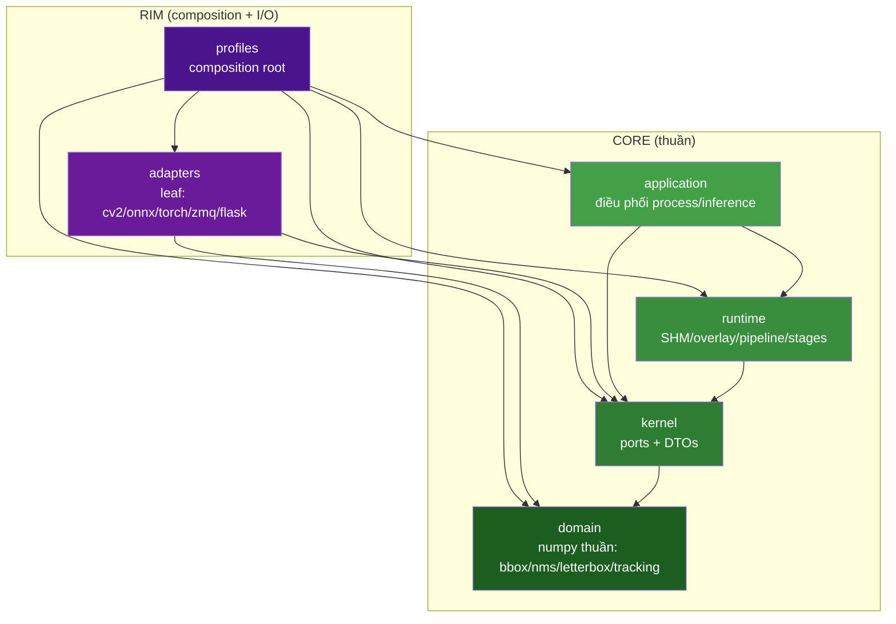
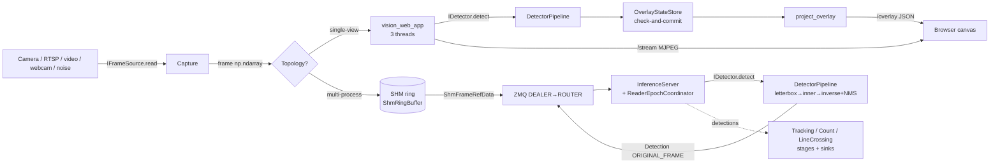
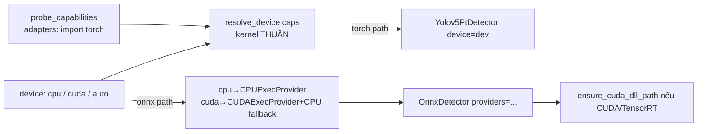

# Tài liệu Thiết kế: Đánh giá Kiến trúc Vision Platform (`architecture-review`)

> **Loại tài liệu:** BẢN ĐÁNH GIÁ KIẾN TRÚC (design-first, cấp chuyên gia). KHÔNG chứa lệnh đổi code —
> chỉ phân tích + thiết kế lại (nếu cần) ở mức nguyên tắc.
> **Ngôn ngữ code trong tài liệu:** Python (khớp codebase thật).
> **Mục tiêu đánh giá:** base có "cực tốt" chưa cho định hướng **dual-use CPU↔GPU thương mại 24/7 multi-camera**.

## 0. Phương pháp & quy ước grounding (đọc trước)

Tài liệu này tuân thủ luật repo (`AGENTS.md §5`): **không bịa**. Mỗi nhận định được gắn một trong ba nhãn:

- **✅ [đã đọc code]** — trích trực tiếp từ file nguồn (có path + tên hàm/lớp). Đây là bằng chứng tĩnh
  (đọc code), KHÔNG phải bằng chứng runtime.
- **🟡 [chưa kiểm]** — suy luận hợp lý từ code/tài liệu nhưng CHƯA chạy lệnh xác thực trong phiên này.
- **🔵 [suy đoán]** — phán đoán kiến trúc chưa có bằng chứng trực tiếp; cần user/thực nghiệm xác nhận.

Phân hạng phát hiện: **🔴 nghiêm trọng** (chặn/khoá mục tiêu dual-use thương mại) · **🟡 cần lưu ý**
(nợ có chủ đích/điểm gãy tiềm ẩn) · **✅ vững** (đúng bản chất, nên giữ).

**Ranh giới trung thực của bản đánh giá này:**
- Toàn bộ nhận định code dưới đây là **đọc-tĩnh** (static read) từ source. Tôi **không** chạy `pytest`,
  `lint-imports`, hay `drift_check.py` trong phiên này.
- Con số baseline user cung cấp (frontier LOG #436, **860 passed / 2 skipped**, **lint 6 kept / 0 broken**,
  **drift PASS**) được ghi nhận là **🟡 [chưa kiểm bởi tôi phiên này]** — user báo cáo, tôi chưa tự chạy lại.
- Các nhãn kỹ thuật đã đóng/mở (K-0xx) trích từ `ai-decision-journal/04-things-to-know.md` — coi là
  **báo cáo của phiên trước**; tôi đã đối chiếu MỘT SỐ với code thật (ghi rõ chỗ nào).

---

## Overview

Bản đánh giá kiến trúc cho Vision Platform (Python, real-time multi-camera CV), mục tiêu **dual-use CPU↔GPU
thương mại 24/7**. Chi tiết tổng quan hệ thống ở **A.1**. Tài liệu chia hai phần: **Phần A (High-Level Design)**
— kiến trúc tầng, luồng dữ liệu, hai topology, mô hình đồng thời, con đường CPU↔GPU; **Phần B (Low-Level
Design)** — hợp đồng port, thuật toán then chốt (letterbox/NMS/switchover/overlay stabilizer), phân tích ký
hiệu. **Phần C** là findings phân hạng theo 7 trục, **Phần D** bảng điểm + kết luận, **Phần E** câu hỏi chốt.

## Architecture

Kiến trúc Hexagonal 6 tầng (4 tầng lõi domain←kernel←runtime←application + 2 vành rim adapters/profiles),
cưỡng chế bằng `import-linter` (6 contracts). Sơ đồ tầng + bảng contracts đầy đủ ở **A.2**; bản đồ thành phần
theo file ở **A.3**; luồng dữ liệu ở **A.4**; hai topology (single-view web ⊥ multi-process full-stack) ở
**A.5**.

## Components and Interfaces

Hợp đồng 5 port (`IDetector`/`IFrameSource`/`IInferenceClient`/`ISink`/`ITracker`) trích nguyên văn ở **B.1**.
Các thành phần cơ chế chính (`ShmRingBuffer`/`RingControlPlane`/`RingPool`/`ReaderEpochCoordinator`/
`InferenceServer`/`ZmqInferenceClient`/`Supervisor`/`OverlayStateStore`/`DetectorPipeline`) phân tích ở
**B.2–B.5**.

## Data Models

DTO thuần ở kernel (frozen dataclass): `Detection`, `InferenceRequest`, `InferenceResponse`, `InferenceError`
(`inference_protocol.py`); `MachineCapabilities` (`capabilities.py`); `ShmFrameRefData` (`shm_frame_ref.py`);
`OverlayViewSnapshot`/`DisplayView`/`RawDetectionSnapshot` (`overlay_view.py`); `BBox`+`CoordinateSpace`
(`domain/bbox.py`). Bất biến toạ độ (mọi `Detection.box` mang `CoordinateSpace` tag) phân tích ở **B.2.1**.

## Correctness Properties

Các bất biến đúng-đắn đã grounded từ code (đây là bản ĐÁNH GIÁ — các property dưới là bất biến *quan sát được
từ code hiện có*, không phải yêu cầu mới).

> ⚠️ **Về nhãn `Validates: Requirements X.Y` dưới đây:** spec này là **design-first** → requirements CHƯA tồn
> tại (sẽ suy ra sau, xem Phần E). Các số requirement là **tham chiếu DỰ KIẾN (provisional)** ánh xạ tới 4 nhóm
> câu hỏi chốt ở Phần E, KHÔNG phải requirement đã ký. Sẽ chốt lại khi tạo `requirements.md`.

### Property 1: Overlay không trộn epoch
`OverlayStateStore.apply_completion` gate epoch/token/version → không bao giờ commit snapshot ghép raw/display
khác epoch (`runtime/overlay_state_store.py`).
**Validates: Requirements 2.1** *(dự kiến — mô hình đồng thời, Phần E nhóm 2)*

### Property 2: Poll idempotent
`snapshot()` chỉ trả reference immutable đã commit; `/overlay` không mutate/lazy-expire → poll lặp cùng state
không đổi `eventRevision`.
**Validates: Requirements 2.2** *(dự kiến — mô hình đồng thời)*

### Property 3: Raw truth ⊥ display
Contract #6 cưỡng chế 4 module hiển thị KHÔNG import analytics (`pyproject.toml`) → hiển thị không thể phụ
thuộc ngược nghiệp vụ.
**Validates: Requirements 1.1** *(dự kiến — ranh giới layer)*

### Property 4: SHM stale-read an toàn
Ref mang `ring_epoch` cũ đến sau switchover → `ShmFrameReader.read_ref` trả `None` (không đọc torn frame) —
`runtime/ipc/shm_frame_ring.py` + `reader_epoch_coordinator.py`.
**Validates: Requirements 5.1** *(dự kiến — chế độ hỏng & phục hồi)*

### Property 5: Drain-before-reuse cưỡng chế
`reset_for_reuse` REFUSE (return False) nếu còn reader hiệu lực (K-015) → không tái dùng ring khi reader đang
copy (`ring_pool.py` + `shm_frame_ring.py`).
**Validates: Requirements 5.2** *(dự kiến — chế độ hỏng & phục hồi)*

### Property 6: Backpressure bảo toàn frame
Bất biến `frames_submitted + frames_dropped_backpressure == frames_captured` đúng vô điều kiện (gộp 3 tầng
drop) — `profiles/vision_fullstack_profile.py`.
**Validates: Requirements 4.1** *(dự kiến — transport & scalability)*

### Property 7: Toạ độ luôn ORIGINAL_FRAME khi xuống downstream
`DetectorPipeline.detect` áp `LetterboxTransform.inverse_box` cho mọi box (`adapters/detector_pipeline.py`).
**Validates: Requirements 3.1** *(dự kiến — dùng-chung CPU↔GPU)*

Chi tiết ở **B.2**, **B.4**, **B.5**.

## Error Handling

Bản đồ failure-mode đầy đủ (crash/hang/backoff/backpressure/drain-guard/malformed-request/client-resilience/
reconnect) ở **bảng B.5**; đánh giá + khoảng trống ở **Trục 5 (C)**.

## Testing Strategy

Đánh giá khả năng test/PBT (import-linter 6 contracts + drift-check 9 tầng + hypothesis PBT + cross-process
spawn thật) + tổng hợp nợ kiến trúc ở **Trục 6 (C)**. Lưu ý grounding: con số baseline (860 passed/2 skipped,
lint 6/0) là user-report — **🟡 [chưa kiểm bởi tôi phiên này]** (xem mục 0 + câu hỏi E.9).

---

# PHẦN A — HIGH-LEVEL DESIGN

## A.1 Tổng quan hệ thống

Vision Platform là hệ thị giác máy tính **real-time, multi-camera**, viết bằng Python thuần (numpy) với các
adapter I/O tuỳ chọn (`cv2`, `onnxruntime`/`onnxruntime-gpu`, `torch`, `zmq`, `flask`/`waitress`). Kiến trúc
theo **Hexagonal (Ports & Adapters)** với 6 tầng được **cưỡng chế bằng máy** qua `import-linter`
(✅ [đã đọc code] `vision-platform/pyproject.toml`, mục `[tool.importlinter]`).

Hệ có **hai hình thái triển khai (topology) rời nhau** cùng dùng chung một lõi domain/kernel:

1. **Single-view web app** (`profiles/vision_web_app.py`) — 1 tiến trình, đa luồng, phục vụ 1 luồng camera
   ra trình duyệt (MJPEG + overlay). Dành cho xem trực tiếp/dev/demo thương mại nhẹ.
2. **Multi-process full-stack** (`profiles/vision_fullstack_profile.py`) — nhiều tiến trình dưới
   `Supervisor` (bulkhead), truyền frame qua **SHM ring** + inference qua **ZMQ**. Dành cho sản phẩm 24/7.

Điểm mạnh cốt lõi của base (xác minh dưới): **lõi quyết định (domain/kernel) thuần, không chạm I/O**, nên
việc chạy CPU hay GPU, single-view hay multi-process, chỉ là **thay adapter/profile ở rim** — KHÔNG đụng lõi.

## A.2 Kiến trúc tầng (6 layer) + hợp đồng import-linter



**6 contracts thật** (✅ [đã đọc code] `pyproject.toml`) — lưu ý cả 6 dùng `type = "forbidden"` (danh sách
cấm tường minh), KHÔNG dùng `type = "layers"`:

| # | Tên contract (nguyên văn) | Bản chất |
|---|---|---|
| 1 | `Domain khong import I/O hay layer ngoai` | domain cấm cv2/torch/zmq/multiprocessing/psutil/msgpack/onnx/yolo + cấm mọi layer khác |
| 2 | `Kernel chi phu thuoc domain (DTO + ports thuan)` | kernel cấm I/O + cấm runtime/application/adapters/profiles (được phép domain) |
| 3 | `Runtime khong import application/adapter/profiles` | runtime chỉ được kernel (+domain bắc cầu) |
| 4 | `Application dung ports, khong import adapter` | application cấm adapters/profiles |
| 5 | `Adapters la leaf` | adapters cấm import ngược runtime/application/profiles |
| 6 | `Overlay display khong import analytics (Property 10)` | 4 module overlay-display cấm import `iou_tracker`/`tracking_protocol`/`crossing_event` |

**Nhận xét grounded (chi tiết ở Finding F1):** 5 contract đầu ánh xạ đúng hướng phụ thuộc hexagonal
(domain là đáy, profiles là rim). Contract #6 KHÔNG phải ranh giới tầng — nó là **anti-corruption nội tầng**
(cấm module hiển thị "chạy ngược" vào analytics) để giữ bất biến *raw truth ⊥ display*.

## A.3 Bản đồ thành phần (grounded theo file)

- **domain/** (numpy thuần): `bbox.py` (`BBox`+`CoordinateSpace`), `nms.py` (`nms_indices` index-based),
  `letterbox_transform.py` (`LetterboxTransform`), `motion_gate.py`/`motion.py`, `detect_cadence.py`
  (`should_detect`), `tracking.py`, `display_smoothing.py`, `geometry.py`.
- **kernel/** (ports + DTO): `ports/` = `IDetector`/`IFrameSource`/`IInferenceClient`/`ISink`/`ITracker`;
  DTO = `inference_protocol.py` (`Detection`/`InferenceRequest`/`InferenceResponse`/`InferenceError`),
  `capabilities.py` (`MachineCapabilities`+`resolve_device`), `backpressure.py` (`BoundedQueue`),
  `shm_frame_ref.py`, `shm_control_plane_layout.py`, `overlay_view.py`, `overlay_config.py`.
- **runtime/** (cơ chế, chỉ phụ thuộc kernel): `ipc/shm_frame_ring.py` (`ShmRingBuffer`/`ShmFrameWriter`/
  `ShmFrameReader`), `ipc/ring_control_plane.py`, `ipc/ring_pool.py`, `overlay_state_store.py`,
  `display_stabilizer.py`, `overlay_expiry_scheduler.py`, `overlay_projection.py`, `pipeline_runner.py`,
  `iou_tracker.py`, `stages/` (detect/count/track/motion_gate/line_crossing).
- **application/** (điều phối): `supervisor.py` (`Supervisor`+`WorkerSpec`), `inference_server.py`,
  `reader_epoch_coordinator.py`, `writer_epoch_coordinator.py`, `ring_supervisor.py`,
  `inline_inference_client.py`, `config_loader.py`.
- **adapters/** (leaf I/O): `onnx_detector.py`, `yolov5_pt_detector.py`, `yolo_postprocess.py`,
  `detector_pipeline.py`, `capability_probe.py`, `cuda_dll_path.py`, `zmq_inference_client.py`,
  `rtsp_frame_source.py`/`video_file_frame_source.py`/`webcam_frame_source.py`/`noise_frame_source.py`,
  `*_event_sink.py`, `wsgi_server.py`, `auth_middleware.py`, `security_headers.py`.
- **profiles/** (composition root): `vision_web_app.py`, `vision_fullstack_profile.py`, `vision_slice_app.py`,
  `vision_demo_app.py`, `pipeline_factory.py`, `demo_pipeline.py`.

## A.4 Luồng dữ liệu tổng thể



Bản chất luồng: **transport frame (nặng)** tách khỏi **analytics (semantic)**. Trong single-view, tách bằng
**thread** + global chia sẻ dưới `_lock`; trong multi-process, tách bằng **SHM ring** (zero-copy vùng nhớ) +
**ZMQ** (control/kết quả). Toạ độ luôn được chuẩn hoá về `ORIGINAL_FRAME` bởi `DetectorPipeline.detect`
(✅ [đã đọc code] `adapters/detector_pipeline.py`) trước khi xuống downstream — đóng "bug production #1"
(lệch toạ độ do vẽ box MODEL_INPUT lên frame gốc).

## A.5 Hai topology (đối chiếu)

```mermaid
graph TB
    subgraph T1["TOPO 1 — Single-view web app (1 process)"]
        direction TB
        V1[Thread _video_loop<br/>read→JPEG→_jpeg] --> L1{{_lock}}
        D1[Thread _detect_loop<br/>_raw→detector→_store] --> L1
        S1[Thread OverlayExpiryScheduler<br/>TimerTick→lease expiry] --> ST1[_store]
        W1[waitress WSGI threads<br/>/stream /overlay /stats] --> L1
        L1 --> G1[global _jpeg/_raw/_store]
    end

    subgraph T2["TOPO 2 — Multi-process full-stack (N process)"]
        direction TB
        SUP[Supervisor<br/>spawn/monitor/cascade] --> CW[camera_worker process]
        SUP --> IW[inference_server process]
        CW -->|WriterEpochCoordinator.write| RING[(RingPool K ring<br/>SHM)]
        IW -->|ReaderEpochCoordinator.read_ref| RING
        CW <-->|ZMQ DEALER/ROUTER| IW
        SUP -.heartbeat mp.Value.-> CW
    end
```

| Tiêu chí | Single-view web app | Multi-process full-stack |
|---|---|---|
| Đơn vị cách ly | Thread (chung GIL, chung địa chỉ) | Process (bulkhead thật) |
| Truyền frame | Global `_raw` dưới `threading.Lock` | SHM ring + `mp.Lock` per-slot |
| Kênh điều khiển/kết quả | Gọi hàm trực tiếp trong process | ZMQ DEALER↔ROUTER + msgpack |
| Số camera | 1 (QĐ hiện tại) | 1 camera + 1 server / pool (v1); N = N pool (Non-goal) |
| Số viewer | Nhiều (MJPEG/poll, HWM ở waitress threads) | Không có UI (artifact file) |
| Chịu lỗi | Lỗi thread → có thể kéo cả process | 1 process chết → Supervisor restart, không lan |
| File | `profiles/vision_web_app.py` | `profiles/vision_fullstack_profile.py` |

Điểm quan trọng: **hai topology KHÔNG hợp nhất** — web app không đi qua SHM/ZMQ; full-stack không có web UI.
Đây là điểm gãy thương mại (F7-🟡): sản phẩm 24/7 muốn *vừa* multi-process bulkhead *vừa* có UI live cho
nhiều camera thì hiện chưa có profile nào wire cả hai.

## A.6 Mô hình đồng thời — web app (trục 2, grounded)

✅ [đã đọc code] `profiles/vision_web_app.py`. Ba luồng nền daemon + luồng phục vụ WSGI (waitress):

- **`_video_loop`**: đọc frame → `cv2.imencode` JPEG → dưới `with _lock:` gán `_raw`, `_raw_ver++`,
  `_raw_acquired_ns`, `_jpeg`, `_vframes++`, `_last_read_ns`.
- **`_detect_loop`**: dưới `with _lock:` đọc snapshot (`frame=_raw; ver=_raw_ver; ...`) rồi **thả lock** →
  chạy detector NGOÀI lock → `OverlayStateStore.apply_completion(...)` (authority riêng, lock riêng).
- **`OverlayExpiryScheduler.serve(_stop)`**: phát `TimerTick` để hết hạn lease box đúng giờ.
- **waitress threads** (`--threads 8` mặc định): phục vụ `/stream` (generator `_mjpeg` đọc `_jpeg` dưới
  `_lock`), `/overlay` (đọc `_store.snapshot()`), `/stats`, `/boxes`.

**Đánh giá thread-safety:**
- ✅ Mẫu **snapshot-under-lock rồi xử-lý-ngoài-lock** đúng bản chất: giữ lock cực ngắn (chỉ gán/đọc tham
  chiếu), việc nặng (encode JPEG, detect) làm ngoài lock. Đây là lý do GIL + `_lock` không trở thành nghẽn
  cho phần nặng.
- ✅ `OverlayStateStore` (✅ [đã đọc code] `runtime/overlay_state_store.py`) là **authority check-and-commit**:
  mọi mutation qua `self._lock`, đọc trả **một `OverlayViewSnapshot` immutable đã commit** (`snapshot()` chỉ
  trả tham chiếu). Endpoint `/overlay` KHÔNG mutate/lazy-expire → poll lặp không đổi state (Property 4). Đây là
  **immutable-swap** đúng chuẩn: reader không bao giờ thấy trạng thái nửa-vời.
- 🟡 **`_raw` reassign-vs-read**: `_raw = frame` (gán tham chiếu) và `frame = _raw` (đọc tham chiếu) đều nằm
  trong `with _lock` → an toàn về mặt *tham chiếu*. Bản thân `frame` (np.ndarray) sau khi lấy ra khỏi lock
  là **object bất biến trên thực tế** vì `_video_loop` LUÔN tạo frame MỚI mỗi vòng (không mutate in-place mảng
  cũ) → detector đọc mảng cũ trong lúc video_loop tạo mảng mới là an toàn. Đây là bất biến *ngầm*
  (copy-on-write bằng quy ước "không mutate"), KHÔNG được cưỡng chế bằng máy → xem Finding F2-🟡.
- Nhãn K-118/#432 (user cung cấp) nói thread-safety "đã verify" → **🟡 [chưa kiểm bởi tôi]**; đọc code thấy
  mẫu khoá đúng, nhưng "đã verify" theo nghĩa chạy test là báo cáo phiên trước.

**Điểm nghẽn GIL:** phần Python thuần chạy tuần tự dưới GIL. Encode JPEG (`cv2.imencode`) và inference
(`onnxruntime`) là C-extension **nhả GIL** trong lúc tính → đó là lý do đa luồng vẫn có ích ở đây. NHƯNG:
detector CPU nặng (ONNX trên CPU) vẫn cạnh tranh **core vật lý** với `_video_loop`; GIL không phải nghẽn
chính, **CPU-bound** mới là (F3-🟡). Đây chính là động lực cho topology multi-process (tách core thật).

## A.7 Con đường CPU↔GPU (trục 3 — tóm tắt cấp cao, chi tiết ở B.3 + F3)



Kết luận cấp cao: **đổi CPU↔GPU KHÔNG đổi kiến trúc** — đổi cấu hình (`device`) + cài gói tương ứng
(`onnxruntime` vs `onnxruntime-gpu`). `OnnxDetector` model-agnostic (DI preprocess/postprocess). NHƯNG có
**bất đối xứng đã xác minh** giữa hai đường (torch dùng `resolve_device`, onnx thì không) → Finding F3-🟡.

---

# PHẦN B — LOW-LEVEL DESIGN

## B.1 Hợp đồng port (kernel/ports — ✅ [đã đọc code])

Tất cả port là `typing.Protocol` thuần (structural typing) — adapter không cần kế thừa, chỉ cần khớp chữ ký.

```python
# kernel/ports/detector.py
class IDetector(Protocol):
    def detect(self, frame: np.ndarray) -> list[Detection]: ...
    def setup(self) -> None: ...      # idempotent, nạp model
    def teardown(self) -> None: ...   # idempotent, giải phóng GPU/model

# kernel/ports/frame_source.py
class IFrameSource(Protocol):
    def setup(self) -> None: ...
    def read(self, timeout_ms: int = 100) -> ReadResult[np.ndarray]: ...   # KHÔNG trả None (ReadResult)
    def teardown(self) -> None: ...
    def __enter__(self) -> "IFrameSource": ...
    def __exit__(self, exc_type, exc, tb) -> bool: ...   # trả False → không nuốt exception
    @property
    def is_finite(self) -> bool: ...      # True=batch (file→EOF), False=stream
    @property
    def source_id(self) -> str: ...

# kernel/ports/inference_client.py  — chung cho Inline (cùng process) + ZMQ (cross-process)
class IInferenceClient(Protocol):
    def infer(self, request: InferenceRequest) -> InferenceResponse: ...   # SYNC blocking + timeout
    def setup(self) -> None: ...
    def teardown(self) -> None: ...

# kernel/ports/sink.py  — outbound: đích xử lý ExecutionResult (print/DB/queue/file)
@runtime_checkable
class ISink(Protocol):
    def setup(self) -> None: ...
    def handle(self, result: ExecutionResult) -> None: ...   # nhận CẢ non-SUCCESS
    def teardown(self) -> None: ...

# kernel/ports/tracker.py  — analytics stateful (có reset, khác detector)
@runtime_checkable
class ITracker(Protocol):
    def update(self, detections: Sequence[Detection]) -> tuple[Track, ...]: ...
    def reset(self) -> None: ...
    @property
    def unique_count(self) -> int: ...
    @property
    def active_count(self) -> int: ...
```

**Đánh giá hợp đồng:** ✅ đối xứng cao (setup/teardown idempotent nhất quán); ✅ `IFrameSource.read` trả
`ReadResult` thay vì `None` (buộc caller xử lý status EOF/ERROR tường minh — chống bug "quên check None");
✅ tách `ITracker` (stateful, có `reset`) khỏi `IDetector` (stateless) là phân loại đúng bản chất;
✅ `IInferenceClient` gom được cả in-process và cross-process (D-023: cố ý hoãn tách port tới khi có bản thứ 2
→ tránh trừu tượng hóa non).

## B.2 Thuật toán then chốt

### B.2.1 Letterbox (domain/letterbox_transform.py) — ✅ [đã đọc code]

`LetterboxTransform` là value-object frozen (orig_h/w, model_h/w). Toán:
```
scale = min(model_w/orig_w, model_h/orig_h)
pad_x = (model_w − orig_w·scale)/2 ;  pad_y = (model_h − orig_h·scale)/2
forward:  mx = x·scale + pad_x
inverse:  x  = (mx − pad_x)/scale
```
`inverse_box` **clamp theo góc** vào `[0,orig]` + tính lại w/h≥0 (chống box tràn vùng pad). `forward_box`/
`inverse_box` **fail-fast** nếu sai `CoordinateSpace` (bug lập trình → raise ngay). Thuần toán, không I/O →
test xác định không cần GPU.

### B.2.2 NMS index-based (domain/nms.py, K-028) — ✅ [đã đọc code]

Bản chất ranh giới tầng: `Detection` sống ở **kernel**, `domain` là đáy → **cấm import kernel**. Nếu
`nms(list[Detection])` đặt ở domain sẽ vi phạm contract #1. Giải pháp đúng: `nms_indices(boxes, scores,
iou_threshold, *, labels=None) -> list[int]` — nhận `BBox`+số thuần, **trả index giữ lại**; tầng trên
(`DetectorPipeline`@adapters, được import cả domain+kernel) ghép index về `Detection` bằng
`dataclasses.replace`. NMS per-class (nhóm theo `labels`), greedy theo score giảm, tie-break index nhỏ trước
(ổn định). Đây là ví dụ mẫu về "để thuật toán ở đáy nhưng không rò rỉ DTO tầng trên".

### B.2.3 Overlay stabilizer (runtime/display_stabilizer.py) — ✅ [đã đọc ký hiệu]

`DisplayStabilizer(source_epoch, config)` giữ hai tập trạng thái nội bộ `_Confirmed` / `_Candidate`. API:
`on_accepted_result(boxes, now_ns)`, `on_tick(now_ns)`, `on_discontinuity(new_source_epoch)`,
`next_expiry_ns()`, `display_revision`. Có dự đoán vị trí theo vận tốc (`_predict_box`, `_predicted_offframe`)
và validate box normalized. Bản chất: **tách "sự thật thô từ detector" khỏi "cái hiển thị mượt"** — hysteresis
tạo/ nuôi track + lease theo thời gian → chống nhấp nháy (flicker) box. Stabilizer là **thuần** (clock tiêm),
test fake-clock xác định.

### B.2.4 Switchover epoch/lease + control-plane (runtime/ipc/*) — ✅ [đã đọc code]

Vấn đề gốc: nhiều tiến trình chia sẻ SHM ring; khi cần đổi ring (resize/rebuild) phải chuyển "thế hệ" an toàn
mà không đọc nhầm/torn. Giải pháp 3 mảnh:

1. **`RingControlPlane`** (`ring_control_plane.py`): một SHM segment tên cố định chứa
   `{current_epoch (u64 @16 aligned), current_ring_name}`. `publish(epoch, name)` (CHỈ supervisor) ghi
   **TÊN trước, epoch CUỐI** → epoch là *authority* atomic. `read_current()` trả `(epoch, name)`.
   `bootstrap_current_ring` mở ring hiện tại (epoch=0 → RuntimeError, không đoán).
2. **`RingPool`** (`ring_pool.py`, H2 giải K-012): tạo TRƯỚC K ring lúc startup (`pool_size≥2` bắt buộc để
   old+new sống chồng khi switchover), truyền toàn bộ `slot_locks` cho worker qua `Process(args=)` (thừa kế —
   vì `mp.Lock` KHÔNG mở được theo tên). `activate(epoch)` = `reset_for_reuse(epoch)` + bump epoch; trả `None`
   nếu ring CHƯA DRAIN (còn reader hiệu lực). `make_pool_opener` cho worker attach ring theo tên bằng lock
   thừa kế.
3. **`ReaderEpochCoordinator`** (`reader_epoch_coordinator.py`): chiến lược **check-on-read** — mỗi
   `read_ref(ref)` gọi `_maybe_switch()` (đọc control-plane; epoch đổi → mở ring mới, đổi con trỏ reader,
   `close()` handle ring cũ), rồi delegate `reader.read_ref(ref)`. Bất biến: ref mang `ring_epoch` CŨ đến
   muộn → `read_ref` trả `None` (stale) → drop an toàn (không torn).

**Teardown (quyết định B):** không dùng biến đếm; dựa **OS ref-count handle** — memory ring cũ sống tới khi
handle cuối `close()`. H2 (`RingPool`) giữ K ring suốt phiên (teardown = shutdown-only) → **moot K-003**
(teardown Linux giữa vận hành). Giá: K×RAM + drain-before-reuse.

**Drain-guard (K-015, đã fix — ✅ [đã đọc `04-things-to-know.md`] + đối chiếu `ring_pool.activate`):**
`reset_for_reuse` reap-dead readers → nếu còn reader hiệu lực (`_reader_protects_slot`) → **REFUSE**
(return False) + emit `shm_reset_blocked_active_readers`; `pool.activate` trả `None`; supervisor HOÃN
switchover. Drain-before-reuse nay **cưỡng chế bằng cơ chế**, không còn contract ngầm.

## B.3 CPU↔GPU: phân tích ký hiệu chính xác (trục 3) — ✅ [đã đọc code]

### B.3.1 Chính sách thuần ở kernel

`kernel/capabilities.py`:
- `MachineCapabilities` (frozen dataclass): `has_torch/has_cuda/cuda_device_count/gpu_name/has_cv2`.
- `resolve_device(requested, caps) -> str` (HÀM THUẦN): `"cpu"→"cpu"`; `"auto"→"cuda" nếu has_cuda else "cpu"`;
  `"cuda"/"gpu"→"cuda"` (hoặc `CapabilityError` fail-fast nếu không CUDA); `"cuda:N"` kiểm ordinal < device_count.
  Chuẩn hoá lower, không I/O → test tiêm caps giả (no-GPU).

### B.3.2 Probe thật ở adapters

`adapters/capability_probe.py` `probe_capabilities()`: **không bao giờ raise** — `import torch` bọc
try/except; `has_cuda = is_available() AND device_count()>0` (chống ca is_available-True-nhưng-0-GPU).

### B.3.3 Nối dây thực tế (điểm mấu chốt — BẤT ĐỐI XỨNG)

`profiles/pipeline_factory.py`:
- `_det_pt` (Yolov5PtDetector, torch): **DÙNG** `caps = probe_capabilities(); dev = resolve_device(
  params.get("device","cpu"), caps)` + **LOG** `[device] yêu cầu=... → dùng=...` (chống "tưởng GPU mà chạy CPU").
  → capability-aware đầy đủ (auto/cuda/cuda:N, fail-fast).
- `_det_onnx` (OnnxDetector): **KHÔNG dùng** `resolve_device`. Đọc `device = params.get("device","cpu").lower()`
  và chỉ chấp nhận `cpu | cuda | gpu` → map providers `["CUDAExecutionProvider","CPUExecutionProvider"]` (cuda)
  hoặc `["CPUExecutionProvider"]` (cpu); khác → `ConfigError`. **Không** hỗ trợ `"auto"`, **không** probe,
  **không** log device thực tế đã chọn.

`adapters/onnx_detector.py` `OnnxDetector.setup()`: nếu provider có CUDA/TensorRT → gọi
`ensure_cuda_dll_path()` (`adapters/cuda_dll_path.py`, K-088: onnxruntime-gpu KHÔNG bundle CUDA → prepend PATH
cho DLL nvidia pip-wheels). `detect()` = `preprocess_fn(frame)` → `session.run` → `postprocess_fn(raw)`.

### B.3.4 Batch-mux (gộp N-cam → 1 session.run)

🔵 [suy đoán → xác minh: KHÔNG tồn tại trong code]. `grep` toàn `src`: `chw_float_normalize` trả **batch=1**
(`arr[np.newaxis, ...]`); `yolo_postprocess` bỏ chiều batch (`out[0]`). Không có code gộp nhiều frame thành
một tensor batch. → **batch-mux là hướng tương lai, chưa hiện thực**. Nhận xét dual-use ở F3.

## B.4 ZMQ inference service — điểm gãy chi tiết (trục 4/5) — ✅ [đã đọc code]

- **`ZmqInferenceClient`** (`adapters/zmq_inference_client.py`): DEALER + **một io-thread sở-hữu-socket**
  (ZMQ socket không thread-safe). Hai đường: SYNC `infer()` (block tới timeout → `InferenceError(retryable=True)`)
  và ASYNC `submit()` (van `BoundedQueue` DROP_OLDEST + flow-control cửa sổ `window_size`, `poll_responses()`).
  io-loop có **bulkhead** (Z1/#345): lỗi 1 vòng bị cô lập, thread không chết. HWM (`SNDHWM/RCVHWM`) set TRƯỚC
  connect (chống phình buffer). Timeout-scan tự dọn in-flight quá hạn.
- **`InferenceServer`** (`application/inference_server.py`): ROUTER, **single-thread** (poll timeout để kiểm
  `shutdown_event` — cooperative). `ReaderEpochCoordinator` (switchover-aware, đóng K-023a). **Bulkhead
  per-request** (K-024): bọc CẢ recv+handle+send trong try/except + guard `len(frames)!=2` → 1 request rác/
  malformed KHÔNG làm chết server. retryable: stale/None=True, detector raise=False (K-023b).

## B.5 Failure-mode & supervisor (trục 5) — ✅ [đã đọc code]

`application/supervisor.py` `Supervisor` + `WorkerSpec`:
- **Crash detection**: `p.is_alive()`; chết → count + cap (`max_restarts`) + respawn.
- **Hang detection (K-020, đã bổ sung)**: `uses_heartbeat=True` → supervisor cấp `mp.Value('d')` (wall-clock);
  worker `heartbeat.value=time.time()` định kỳ; `_is_hung` = alive nhưng `(now − last) > heartbeat_timeout_s`
  → terminate + xử như failure. Có **startup grace** (chưa beat → mốc = spawn time).
- **Backoff (K-021, đã bổ sung)**: `restart_backoff_base_s>0` → giãn `base·2^(n-1)` (cap), **non-blocking**
  (deadline `_next_spawn_ok`, không sleep chặn giám sát worker khác).
- **Cascade shutdown (cooperative-first, ERRATA E-10)**: set `shutdown_event` → JOIN worker cooperative với
  grace (cho `finally` chạy) → `terminate()` → `kill()` straggler. Đây là cách DUY NHẤT graceful trên Windows.
- **Default TẮT** heartbeat/backoff → hành vi y hệt bản #09 (additive an toàn).

Bản đồ failure-mode (grounded):

| Chế độ hỏng | Cơ chế phát hiện | Cơ chế phục hồi | File | Trạng thái |
|---|---|---|---|---|
| Worker crash (exit) | `is_alive()` | respawn + cap | supervisor.py | ✅ |
| Worker hang/deadlock | heartbeat timeout (K-020) | terminate+respawn | supervisor.py | ✅ (default TẮT) |
| Crash-loop bão hoà | restart count | backoff 2^n (K-021) | supervisor.py | ✅ (default TẮT) |
| Ring đầy (backpressure) | `write()→None` | drop + đếm `frames_dropped_shm` | shm_frame_ring/fullstack | ✅ |
| Van client đầy | `BoundedQueue` DROP_OLDEST | bỏ frame cũ nhất | backpressure.py | ✅ |
| Server chết giữa infer | client timeout-scan | `InferenceError(retryable=True)` | zmq_inference_client.py | ✅ |
| Request rác/malformed | guard `len!=2`+try/except | bỏ request, server sống | inference_server.py | ✅ (K-024) |
| Switchover lúc reader đang copy | drain-guard `reset_for_reuse` | REFUSE + hoãn switchover | ring_pool/shm_frame_ring | ✅ (K-015) |
| Client MJPEG mất kết nối | `img.onerror`/visibilitychange | reconnect backoff 500ms→5s | vision_web_app.py JS | ✅ (#436) |
| `/overlay` poll lỗi | self-rescheduling ≤1 in-flight | backoff 80ms→2s + badge | vision_web_app.py JS | ✅ (#436) |
| Source discontinuity | `ReconnectPacer` | epoch bump 1 lần + clamp retry | reconnect_pacer.py | ✅ |
| ARM atomicity/visibility | — | — | — | 🔴 CHƯA phủ (K-001) |
| POSIX teardown giữa vận hành | — | moot bởi H2 pool | ring_pool.py | 🟡 (K-003, moot) |
| Throughput/drop @fps thật | — | — | — | 🔴 CHƯA đo (K-014) |

---

# PHẦN C — FINDINGS (phân hạng theo 7 trục)

## Trục 1 — Ranh giới layer & hướng phụ thuộc

**F1.1 ✅ [đã đọc code] Domain thực sự thuần.** `domain/nms.py`, `letterbox_transform.py`, `bbox.py` chỉ dùng
numpy + kiểu thuần; NMS index-based (K-028) chứng minh domain KHÔNG rò rỉ DTO kernel (`Detection`). Contract #1
cấm tường minh cv2/torch/zmq/onnx/multiprocessing + mọi layer trên. **Bản chất đúng — nên giữ.**

**F1.2 ✅ [đã đọc code] Kernel = ports + DTO, không chạm cơ chế.** Ports là `Protocol` thuần; DTO frozen
(`InferenceRequest/Response/Detection`). `BoundedQueue`@kernel chỉ dùng `threading` (thuần), không
`multiprocessing`. `resolve_device`@kernel là hàm thuần (probe thật ở adapters). Phân tách policy(kernel)↔
probe(adapters) là mẫu mực dual-use.

**F1.3 ✅ [đã đọc code] Adapters là leaf + được phép chạm dep nặng.** `capability_probe.py`,
`onnx_detector.py` import torch/onnx hợp lệ (contract #5 chỉ cấm import ngược runtime/application/profiles).
`DetectorPipeline` là Decorator over `IDetector` — nhận inner qua DI kiểu port (không import adapter cụ thể).

**F1.4 🟡 Contract dùng `forbidden` thay vì `layers`.** 6 contract đều là danh sách cấm tường minh. Ưu điểm:
kiểm được cả module NGOÀI (cv2/torch...). Nhược điểm bản chất: **dễ sót** khi thêm layer/dep mới — phải nhớ
thêm vào từng danh sách cấm (không có "một chiều tầng" tự động như `type=layers`). Rủi ro: một import ngược
hợp lệ-về-cú-pháp nhưng sai-về-tầng có thể lọt nếu quên cập nhật danh sách. **Khuyến nghị bản chất:** cân nhắc
BỔ SUNG một contract `type = "layers"` (domain | kernel | runtime | application) song song với các `forbidden`
hiện có (giữ cả hai: `layers` bắt hướng tầng tự động; `forbidden` bắt dep ngoài) — KHÔNG thay thế.

**F1.5 🟡 Comment "4-layer Hexagonal" trong `pyproject.toml` lệch với thực tế 6 layer.** ✅ [đã đọc code]:
dòng comment ghi `# 4-layer Hexagonal: domain ← kernel ← runtime ← application; adapters/profiles ở rim`.
Đúng bản chất (adapters/profiles là rim, không phải tầng xếp chồng) nhưng chữ "4-layer" dễ gây nhầm khi
AGENTS.md §4 gọi là "6 layer". **Khuyến nghị:** đồng bộ thuật ngữ (vd "4 tầng lõi + 2 vành rim").

**F1.6 ✅ Contract #6 (Property 10) là điểm sáng kiến trúc.** Cưỡng chế *raw truth ⊥ display*: 4 module hiển
thị (`overlay_view`, `display_stabilizer`, `overlay_state_store`, `overlay_projection`) cấm import
analytics (`iou_tracker`/`tracking_protocol`/`crossing_event`). Đây là anti-corruption bằng máy — hiếm gặp,
rất tốt cho sản phẩm (chống "hiển thị lén phụ thuộc nghiệp vụ").

## Trục 2 — Mô hình đồng thời (web app)

**F2.1 ✅ Mẫu snapshot-under-lock + immutable-swap đúng bản chất** (xem A.6). `OverlayStateStore` là authority
một-lock check-and-commit; đọc trả snapshot immutable.

**F2.2 🟡 Bất biến "không mutate `_raw` in-place" là ngầm, không cưỡng chế.** Thread-safety của `_raw`
reassign-vs-read dựa vào việc `_video_loop` luôn tạo frame mới. Nếu tương lai có ai tối ưu bằng buffer tái
dùng (in-place decode) → detector có thể đọc trúng frame đang bị ghi (torn). **Khuyến nghị bản chất:** hoặc
tài liệu hoá bất biến này thật rõ tại điểm gán `_raw`, hoặc chuyển sang cơ chế version+copy tường minh (đối
xứng `OverlayStateStore`).

**F2.3 🟡 GIL không phải nghẽn chính; CPU-bound mới là.** ONNX-CPU cạnh tranh core vật lý với video/encode.
Single-view web app **không** scale theo số camera vì mọi thứ trong 1 process. Đây là lý do tồn tại topology
multi-process — đúng thiết kế, nhưng cần nói rõ giới hạn cho khách hàng (single-view = 1 camera).

## Trục 3 — Tính dùng-chung CPU↔GPU

**F3.1 ✅ Lõi dual-use xuất sắc.** `resolve_device` (kernel thuần) + `probe_capabilities` (adapters) +
`OnnxDetector` model-agnostic (DI) + `ensure_cuda_dll_path`. Đổi CPU↔GPU = đổi `device` + gói. Không đổi
kiến trúc. `DetectorPipeline` giữ toạ độ đúng bất kể model.

**F3.2 🟡 Bất đối xứng capability-aware giữa đường ONNX và đường torch (ĐÃ XÁC MINH).** `_det_pt` dùng
`resolve_device`+log; `_det_onnx` thì KHÔNG — chỉ nhận `cpu|cuda|gpu`, không `auto`, không probe, không log
device thực tế. **Vấn đề bản chất:** đường ONNX chính là **đường dual-use CPU-first thật** (không kéo torch),
nhưng lại thiếu đúng cái "chống tưởng-GPU-mà-chạy-CPU" mà đường torch có. Khi yêu cầu `cuda` mà máy thiếu CUDA,
onnxruntime **âm thầm fallback CPU** (🟡 [chưa kiểm hành vi runtime — đây là hành vi onnxruntime đã biết, nhưng
tôi chưa chạy]) → không fail-fast, không log → vận hành 24/7 có thể chạy CPU mà tưởng GPU. **Khuyến nghị
bản chất (không vá ngọn):** cho `_det_onnx` đi qua cùng `resolve_device(caps)` → hỗ trợ `auto`, map
`resolve_device` → providers, và LOG device thực tế (thống nhất một nơi quyết định device cho CẢ hai đường).

**F3.3 🟡 Batch-mux chưa tồn tại (ĐÃ XÁC MINH).** GPU chỉ thực sự "đáng tiền" khi gộp batch nhiều camera →
1 `session.run`. Hiện code batch=1. Để lên GPU đa-camera hiệu quả cần: (a) preprocess gộp N frame → tensor
`(N,C,H,W)`; (b) postprocess tách theo N; (c) model re-export **dynamic batch axis**. `OnnxDetector` DI đã sẵn
sàng cho việc này (chỉ đổi 2 hàm DI) nhưng **chưa có**. **Khuyến nghị:** thiết kế `BatchOnnxDetector` (adapter
mới) + hàng đợi micro-batch ở tầng application, KHÔNG sửa `OnnxDetector` hiện có.

**F3.4 🔴 ARM/Jetson chưa verify (K-001).** Mục tiêu GPU thương mại thường là Jetson (ARM). Mọi lập luận
atomic/visibility của SHM mới đúng trên x86-64 (`test_hardening_platform_scope` skip trên ARM). **Đây là rào
chặn thật cho dual-use nếu target gồm Jetson** — phải chạy validation trên HW ARM thật trước khi tin.

## Trục 4 — Transport & scalability

**F4.1 🟡 MJPEG `` không nén liên-khung.** ✅ [đã đọc code] `_mjpeg()` gửi từng JPEG rời qua
`multipart/x-mixed-replace`. Đơn giản, tương thích mọi browser, nhưng **băng thông cao** (mỗi frame là ảnh
độc lập, không delta như H.264). Với nhiều viewer/nhiều camera → tốn mạng. **Khuyến nghị:** cho sản phẩm
nhiều-viewer, cân nhắc WebRTC/WebSocket + codec liên-khung; giữ MJPEG làm fallback tương thích.

**F4.2 🟡 Giới hạn scale đã tường minh nhưng chưa có giải pháp N-camera.** Fullstack v1 = 1 camera + 1 server
(1 pool); multi-camera = N pool là **Non-goal** (✅ [đã đọc docstring] `vision_fullstack_profile.py`).
`ITracker` camera-affinity (K-042: 1 instance/1 luồng) đã đặt nền cho N. **Điểm gãy thương mại:** cần một
profile "fleet" orchestrate N pool + N cặp process + tổng hợp metrics cross-process (hiện metrics ghi ra
artifact file, không gộp).

**F4.3 ✅ HWM + flow-control + backpressure nhiều tầng.** `SNDHWM/RCVHWM` chống phình buffer ZMQ; van client
`BoundedQueue` + cửa sổ `window_size`; SHM ring drop khi đầy. Ba tầng backpressure phối hợp, đếm tách bạch
(`frames_dropped_client_window`/`_shm`/`_shutdown`) → bất biến `submitted + dropped == captured`.

## Trục 5 — Chế độ hỏng & tự phục hồi

**F5.1 ✅ Bộ khung chịu lỗi đầy đủ bất thường tốt.** Xem bảng B.5: crash+hang+backoff+backpressure+drain-guard
+client-resilience+reconnect-pacer đều có cơ chế grounded. Bulkhead per-request (K-024) và bulkhead io-thread
(Z1) là chi tiết trưởng thành.

**F5.2 🟡 Heartbeat/backoff mặc định TẮT.** Additive an toàn, nhưng sản phẩm 24/7 **phải bật** — nếu không,
hang = camera chết thầm. **Khuyến nghị:** profile production nên bật mặc định (`uses_heartbeat=True`,
`restart_backoff_base_s>0`) và tài liệu hoá quan hệ timing (K-027: `heartbeat_timeout_s > client infer
timeout_s`, `shutdown_grace_s > timeout_s`).

**F5.3 🟡 Observability chưa production-grade (K-017/K-018).** Metrics backpressure chưa wire hết vào
observability; bản #08 cố ý bỏ non-blocking log handler + rotation + flush-on-shutdown. Sản phẩm 24/7 cần bổ
sung (chống đầy đĩa, không mất log cuối, không chặn hot path). Cardinality budget (K-019) là ràng buộc vận
hành chưa cưỡng chế.

**F5.4 🔴 Throughput/drop dưới tải fps thật + đa reader CHƯA đo (K-014).** Bound `≤ n_slots` đã chứng minh
thực nghiệm; nhưng số drop @30fps thật chưa có perf harness. **Đây là rủi ro cho cam kết SLA thương mại.**

## Trục 6 — Khả năng test/PBT & nợ kiến trúc

**F6.1 ✅ Kỷ luật kiểm chứng cao.** import-linter (6 contracts) + drift-check 9 tầng + PBT (hypothesis) +
test cross-process spawn thật. Nhãn K-* ghi nợ CÓ CHỦ ĐÍCH minh bạch (`04-things-to-know.md`). Đây là mức
kỷ luật hiếm thấy ở codebase Python.

**F6.2 🟡 Nhiều "đã verify" gắn nền tảng Windows-only.** K-002/K-006 (switchover/multi-reader cross-process)
✅ **chỉ trên Windows**; K-003 (POSIX teardown) 🔴 mở (moot bởi H2 nhưng chưa chạy Linux). Sản phẩm thường
deploy Linux → cần chạy lại bộ cross-process trên Linux thật trước khi tin.

**Tổng hợp nợ kiến trúc theo mức rủi ro (grounded từ `04-things-to-know.md` + đối chiếu code):**

| Nợ | Mô tả | Mức rủi ro dual-use thương mại |
|---|---|---|
| K-001 | ARM atomicity/visibility chưa test HW thật | 🔴 (nếu target Jetson) |
| K-014 | Drop/throughput @fps thật chưa đo | 🔴 (SLA) |
| K-003 | POSIX teardown chưa verify (moot bởi H2 pool) | 🟡 |
| K-017/18/19 | Observability production chưa đủ | 🟡 |
| K-020/21 | Heartbeat/backoff default TẮT | 🟡 (phải bật) |
| K-029 | License model YOLO AGPL | 🟡 (pháp lý — xem F7.3) |
| K-030 | RTSP Dahua 401 (ffmpeg-opencv vs digest) | 🟡 (camera thật) |
| K-031 | Secret production đã lộ | 🔴 (bảo mật — cần rotate) |
| K-032 | Docker artifact chưa build/verify | 🟡 |

## Trục 7 — SOLID / coupling / cohesion & điểm gãy thương mại

**F7.1 ✅ SOLID/cohesion tốt.** SRP: `OnnxDetector` (chạy model) tách `DetectorPipeline` (toạ độ) tách
`yolo_postprocess` (decode). DIP: mọi thứ nối qua port + DI (resize_fn/preprocess_fn/ring_opener/clock).
OCP: `pipeline_factory` REGISTRY (thêm loại = đăng ký entry, không sửa lõi). Coupling thấp nhờ hexagonal.

**F7.2 🟡 Hai topology không hợp nhất (điểm gãy production chính).** Không có profile "multi-process + web UI
đa-camera". Sản phẩm thương mại 24/7 thường cần cả hai. **Khuyến nghị bản chất:** thiết kế profile fleet gắn
web UI đọc kết quả từ N process (qua SHM/IPC), tái dùng `OverlayStateStore` per-camera.

**F7.3 🟡 License model (K-029).** `OnnxDetector` model-agnostic KHÔNG khoá AGPL (điểm mạnh) nhưng việc CHỌN
weight là quyết định pháp lý. YOLOv5/v8/v11 = AGPL-3.0 → sản phẩm đóng phải mua license Ultralytics hoặc dùng
RTMDet/RT-DETR/YOLOX (Apache-2.0). 🟡 [chưa kiểm từng file weight].

**F7.4 🔴 Bảo mật secret (K-031).** Config production đã lộ secret thật trong phiên trước. **Cần rotate toàn
bộ** — đây là rủi ro bảo mật thực, không phải kiến trúc, nhưng chặn thương mại hoá.

**F7.5 ✅ Secure-default web.** ✅ [đã đọc code] `vision_web_app.main`: bind non-loopback KHÔNG credential →
`SystemExit` (từ chối khởi động) trừ `--insecure`; Basic Auth middleware phủ mọi route; security headers.
Đúng hướng thương mại (TLS để reverse-proxy — ghi rõ giới hạn).

---

# PHẦN D — BẢNG ĐIỂM KIẾN TRÚC & KẾT LUẬN

## D.1 Bảng điểm 7 trục

Thang: ⭐ (1) → ⭐⭐⭐⭐⭐ (5). Điểm phản ánh **mức độ sẵn sàng cho dual-use CPU/GPU thương mại 24/7**,
grounded từ code đã đọc + nợ đã ghi.

| # | Trục | Điểm | Lý do ngắn (grounded) |
|---|---|---|---|
| 1 | Ranh giới layer & phụ thuộc | ⭐⭐⭐⭐⭐ | domain thuần, 6 contract cưỡng chế bằng máy, Property 10 anti-corruption; chỉ thiếu `type=layers` bổ trợ (F1.4) |
| 2 | Mô hình đồng thời (web) | ⭐⭐⭐⭐ | snapshot-under-lock + immutable-swap đúng; bất biến `_raw` ngầm (F2.2); CPU-bound giới hạn 1 cam (F2.3) |
| 3 | Dùng-chung CPU↔GPU | ⭐⭐⭐⭐ | lõi dual-use xuất sắc; bất đối xứng ONNX↔torch (F3.2) + chưa batch-mux (F3.3) + ARM chưa verify (F3.4) |
| 4 | Transport & scalability | ⭐⭐⭐ | backpressure/HWM tốt; MJPEG tốn băng thông (F4.1); chưa có profile N-camera fleet (F4.2) |
| 5 | Chế độ hỏng & tự phục hồi | ⭐⭐⭐⭐ | khung chịu lỗi đầy đủ; heartbeat/backoff default tắt (F5.2); throughput@fps chưa đo (F5.4) |
| 6 | Test/PBT & nợ kiến trúc | ⭐⭐⭐⭐ | kỷ luật kiểm chứng cao; nhiều "verify" Windows-only, POSIX/Linux chưa chạy lại (F6.2) |
| 7 | SOLID/coupling & điểm gãy TM | ⭐⭐⭐⭐ | SOLID tốt; hai topology chưa hợp nhất (F7.2); license/secret cần xử lý (F7.3/F7.4) |

## D.2 Kết luận: "base đã cực tốt chưa?"

**Kết luận grounded:** base **rất tốt về mặt kiến trúc lõi** cho mục tiêu dual-use CPU/GPU thương mại — thuộc
nhóm hiếm ở codebase Python vì:
1. Lõi domain/kernel **thuần & cưỡng chế bằng máy** → đổi CPU↔GPU / single↔multi-process **không đụng lõi**,
   chỉ thay adapter/profile. Đây là điều kiện cần quan trọng nhất cho dual-use, và base **đã đạt**.
2. Cơ chế khó (SHM switchover epoch/lease, drain-guard, bulkhead per-request, backpressure nhiều tầng,
   supervisor hang+backoff) đều có mặt và grounded.

**NHƯNG base CHƯA "cực tốt" theo nghĩa sẵn-sàng-production-thương-mại** vì các khoảng trống có thật:
- 🔴 **ARM/Jetson chưa verify** (K-001) — nếu GPU target gồm Jetson, đây là rào chặn.
- 🔴 **Throughput/drop @fps thật chưa đo** (K-014) — chưa đủ dữ liệu cam kết SLA.
- 🔴 **Secret production đã lộ** (K-031) — phải rotate.
- 🟡 **Bất đối xứng capability-aware ONNX↔torch** (F3.2) — đường dual-use chính thiếu fail-fast/log device.
- 🟡 **Chưa batch-mux** (F3.3) — GPU đa-camera chưa khai thác được hiệu năng.
- 🟡 **Hai topology chưa hợp nhất** (F7.2) — thiếu profile fleet multi-process + web UI đa-camera.
- 🟡 **Observability/heartbeat production** (F5.2/F5.3) — cần bật + bổ sung cho 24/7.

Nói ngắn: **nền móng kiến trúc đã đúng và đủ vững để KHÔNG phải viết lại** — các việc còn lại là **hoàn thiện
ở rim + kiểm chứng trên phần cứng/tải thật + hợp nhất topology**, KHÔNG phải sửa bản chất lõi. Đó là dấu hiệu
của một base tốt: chi phí còn lại nằm ở vành ngoài, không ở tim.

---

# PHẦN E — CHỜ USER VALID (để sau suy ra requirements)

> Đây là các câu hỏi CHỐT. Trả lời xong, tôi sẽ dùng để suy ra `requirements.md` (giai đoạn kế của spec này).
> Mỗi câu gắn với finding tương ứng để bạn quyết định phạm vi.

**Nhóm 1 — Mục tiêu triển khai (định khung toàn bộ requirements)**
1. **Target phần cứng GPU cụ thể là gì?** x86-64 + NVIDIA rời, hay **Jetson/ARM**? (Quyết định F3.4/K-001 có
   phải 🔴 chặn hay không.)
2. **OS production là Linux hay Windows?** (Quyết định F6.2 — có cần chạy lại bộ cross-process trên Linux.)
3. **Quy mô mục tiêu:** bao nhiêu camera đồng thời / bao nhiêu viewer? (Quyết định F4.2 — có cần profile fleet
   N-camera hay 1-camera là đủ.)

**Nhóm 2 — Ưu tiên khắc phục (chọn cái nào vào scope trước)**
4. **Ưu tiên nào trước** cho vòng cải thiện kế: (a) hợp nhất capability-aware cho đường ONNX (F3.2); (b) thiết
   kế batch-mux GPU đa-camera (F3.3); (c) profile fleet multi-process + web UI (F7.2); (d) perf harness đo
   drop@fps (F5.4); (e) bổ sung observability production (F5.3)?
5. **Đường detector chính cho sản phẩm** là ONNX (CPU-first, không torch) hay torch/PT? (Ảnh hưởng mức độ ưu
   tiên F3.2.)

**Nhóm 3 — Ràng buộc thương mại/pháp lý**
6. **Model + weight** dự kiến dùng? (License — F7.3/K-029: nếu YOLO Ultralytics thì cần license thương mại;
   nếu RTMDet/RT-DETR/YOLOX thì Apache-2.0.)
7. **Secret đã lộ (K-031) đã rotate chưa?** (F7.4 — chặn thương mại hoá; cần xác nhận trước khi làm gì thêm.)

**Nhóm 4 — Phạm vi của spec `architecture-review` này**
8. Spec này dừng ở **tài liệu đánh giá** (design.md hiện tại là sản phẩm cuối), hay bạn muốn nó **tiếp tục**
   sang requirements + tasks cho MỘT hạng mục cải thiện cụ thể (chọn từ câu 4)?
9. Có cần tôi **tự chạy** `lint-imports` + `pytest` + `drift_check.py` để **nâng các nhãn 🟡 [chưa kiểm bởi
   tôi] lên ✅ [đã verify runtime]** không? (Hiện toàn bộ nhận định code là đọc-tĩnh; con số 860/2 + lint 6/0
   là user-report, tôi chưa tự chạy.)

---

*Hết design.md — bản đánh giá kiến trúc. Mọi nhận định code đều grounded từ file nguồn đã đọc (có path);
các con số test/lint và nhãn K-* là báo cáo phiên trước, đã gắn nhãn [chưa kiểm bởi tôi] theo luật AGENTS §5.*


---

# PHẦN F — VALIDATION trên máy GPU (`toann`, phiên #441) — reconcile + bug mới

> Bản đánh giá gốc (Phần A–E) viết trên máy `k.nguyen.manh.toan` (**KHÔNG-GPU**), toàn bộ đọc-tĩnh. Phần F là
> **kiểm chứng độc lập trên máy `toann` (CÓ GPU RTX 2060 + onnxruntime-gpu, KHÔNG torch)** — đúng cấu hình
> target dual-use mà máy trước không có. Nâng nhãn 🟡[chưa kiểm] → ✅ nơi đã tự chạy, và bắt 1 bug máy trước sót.

## F.0 Tự chạy verify (đáp câu E.9) — nâng nhãn [chưa kiểm]→✅
- `scripts\vp.cmd verify` trên máy GPU này: **874 passed / 2 skipped · import-linter 7 kept / 0 broken · drift PASS**.
  ⇒ baseline (Phần 0 ghi 🟡 user-report 860/2, lint 6/0) nay **✅ tự-verify** — số đã tiến hoá theo #434-441.
- Nhãn `import-linter 6 contracts` (A.2) nay là **7** (F1.4 đã implement ở #440/D-141 — xem F.1).

## F.1 Reconcile finding đã bị fix trong CÙNG session (doc↔code drift)
- **F1.4 (thêm `type=layers`) → ✅ ĐÃ LÀM (#440/D-141):** import-linter nay 7 kept/0 broken, contract `layers`
  KEPT ngay lần đầu = bằng chứng khẳng định hướng-tầng top-down. Finding F1.4 nên coi là **RESOLVED**.
- **F3.2 (bất đối xứng device ONNX↔torch) → ✅ ĐÃ LÀM (#437/D-139) NHƯNG chưa trọn → xem F.2.** `_det_onnx`
  và `_build_detector` nay đều qua `onnx_providers_for` + probe + LOG (đối xứng `_det_pt`).

## F.2 🔴→✅ BUG MỚI (máy no-GPU sót): device ONNX gate SAI nguồn năng lực (đã FIX #441/D-142)
- **Đo thật máy toann:** `--capabilities` cho `has_cuda=False` (torch VẮNG) NHƯNG
  `onnxruntime.get_available_providers()` = `['TensorrtExecutionProvider','CUDAExecutionProvider','CPUExecutionProvider']`
  → **GPU dùng được qua onnxruntime KHÔNG cần torch** (K-109 xác nhận bằng số).
- **Bug (do D-139):** `onnx_providers_for → resolve_device → caps.has_cuda` (dò qua **torch**). Trên máy
  GPU-KHÔNG-torch (đúng kịch bản "CPU-first, no-torch, ONNX" mà F3.1 tự hào): onnx `auto`→CPU, `cuda`→
  `CapabilityError` → **GPU bất khả dụng OAN** dù onnxruntime thấy CUDA. F3.2 fix đã vô tình **buộc đường ONNX
  phụ thuộc torch** — phá chính triết lý của nó.
- **Vì sao Phần A–E (máy no-GPU) không bắt được:** máy đó cả torch-cuda LẪN onnxruntime-cuda đều False → 2 nguồn
  trùng "no CUDA" → bug VÔ HÌNH. → **bài học (K-120): review dual-use PHẢI chạy trên đúng cấu hình target.**
- **FIX GỐC (D-142, additive):** `MachineCapabilities` +`has_onnx_cuda` (probe `ort.get_available_providers()`);
  `resolve_onnx_device` gate CUDA theo `has_onnx_cuda` (KHÔNG phải torch `has_cuda`); `onnx_providers_for` dùng
  nó. Torch path (`_det_pt`/`resolve_device`) KHÔNG đổi. Verify 874/2 + máy toann `has_onnx_cuda=true`. Nguyên
  tắc tổng quát: **capability là PER-BACKEND** (mỗi runtime gate bằng năng lực của chính nó).

## F.3 Xác nhận các finding MỞ còn giá trị (chưa đụng — thuộc phạm vi khác)
🔴 K-001 (ARM/Jetson chưa verify) · 🔴 K-014 (throughput/drop@fps — máy k.nguyen ĐÃ đo `measure_ring_drop`
#440: keep-latest drop% ≈ 1−consumer/producer, SLA hợp lý) · 🔴 K-031 (secret rotate) · 🟡 F3.3 (batch-mux
chưa có) · 🟡 F7.2 (2 topology chưa hợp nhất) · 🟡 F5.2/5.3 (heartbeat/observability production). Live GPU
inference + camera RTSP: **CHỜ user** (VPN chặn LAN — K-117, KHÔNG tắt VPN).

*Hết Phần F — validation máy GPU. Nhận định đều grounded (lệnh + đọc code, có path).*
