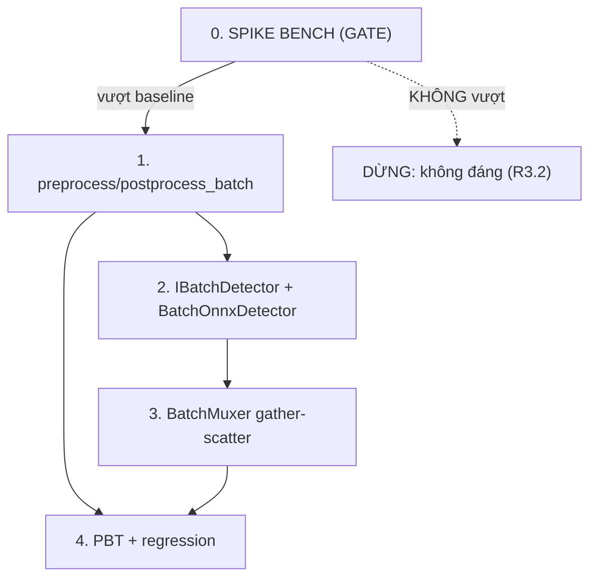

# Implementation Plan

## Overview

> **Spec:** batch-mux · **Workflow:** Design-First → Requirements → Tasks. Nguồn: `design.md` (5 Property + RB-1..5 +
> Components) + `requirements.md` (5 Requirement EARS).
>
> **Luật vàng:** mỗi slice TDD nhỏ nhất; kết thúc có **bằng chứng chạy thật** (`.venv\Scripts\python.exe -m pytest -q`
> đọc output), GIỮ baseline **647 passed/2 skipped · lint 5/0 · drift PASS**. Mỗi task xong → append
> `AI-IMPLEMENTATION-LOG.md` + cập nhật `activeContext.md` + decision-journal + `vp check`.
>
> **NGUYÊN TẮC SỐNG-CÒN (Nghi-vấn Lỗ-1):** batch-mux CHƯA chắc thắng baseline K-092 (104.7/s @K4). ⇒ **Task 0 = spike
> bench đặt TRƯỚC làm CỔNG QUYẾT ĐỊNH** (R3.2): nếu batched-throughput KHÔNG vượt baseline ở latency-SLA → DỪNG, ghi
> nhận "không đáng", KHÔNG build Task 1-4 (chống sunk-cost). Chỉ tiếp khi Task 0 chứng minh có lợi.
>
> **Ràng buộc layer (AGENTS §4):** `IBatchDetector` ∈ kernel (port thuần); `preprocess_batch/postprocess_batch` thuần
> (domain/adapters, numpy-only); `BatchOnnxDetector` ∈ adapters; `BatchMuxer` ∈ application. Additive — KHÔNG sửa
> `IDetector`/`OnnxDetector`/`DetectorPipeline`/base (backward-compat R4).
>
> **Network/GPU:** Task 0 cần re-export model dynamic (network — CHỜ đèn xanh) + GPU (có sẵn RTX 2060). Task 1-2 THUẦN
> logic (no-GPU/no-network, dùng model ONNX tí-hon dynamic tự tạo — R5.2). Task 3-4 no-GPU (fake detector).

## Tasks

- [ ] 0. **SPIKE BENCH (CỔNG QUYẾT ĐỊNH — trả lời "batch-mux có đáng không")** _(cần đèn xanh network + GPU)_
  - 0.1 Re-export `yolov8n.onnx` với **trục batch ĐỘNG** (`ultralytics export(format=onnx, dynamic=True, imgsz=640)`) trong venv throwaway (repro K-083/K-087, giữ `.venv` chính) → `models/yolov8n_dyn.onnx` (gitignored). Probe xác nhận `session.run` batch=2/4/8 CHẠY (khác RB-1/K-093 model cũ cố định).
  - 0.2 Script spike tối thiểu (ngoài src, như `benchmarks/`): stack B frame giả `[B,3,640,640]` → 1 `session.run` (CUDA) → đo throughput + latency cho B=1/2/4/8 (warmup + N mẫu, như bench hiện có).
  - 0.3 So số với baseline K-092 (104.7/s @K4, p95 49.5ms). Ghi `04-things-to-know.md` (K mới) + cập nhật capacity model design.md/scale-arch (bản-3).
  - 0.4 **GATE:** IF batched-throughput > baseline ở latency-SLA → tiếp Task 1. ELSE → DỪNG + ghi "không đáng cho yolov8n+RTX2060" (R3.2), đóng spec ở mức spike.
  - _Requirements: 3.1, 3.2, 3.3, 5.1_

- [ ] 1. `preprocess_batch` / `postprocess_batch` (THUẦN, no-GPU/no-network) + verify bằng model tí-hon dynamic
  - 1.1 `preprocess_batch(frames: list[np.ndarray], model_h, model_w) -> (tensor [B,3,H,W], list[BatchItem])`: letterbox mỗi frame (tái dùng `LetterboxTransform`) → CHW/float → stack; `BatchItem{request_id?, orig_h, orig_w}` giữ per-sample cho inverse (R1.3).
  - 1.2 `postprocess_batch(raw [B,...], items, decode_fn) -> list[list[Detection]]`: split theo trục batch → decode+NMS mỗi sample → inverse-letterbox theo `items[i]` → route đúng thứ tự (R1.1).
  - 1.3 Test `test_batch_preprocess.py`: stack B frame KHÁC size → shape `[B,3,640,640]` đúng + `BatchItem` khớp; split trả đúng số sample + đúng thứ tự.
  - 1.4 Test identity/tương-đương bằng **model ONNX tí-hon dynamic-batch tự tạo** (output phụ-thuộc-sample, license sạch — như `test_onnx_detector`): `detect_batch([f0,f1])[i]` == marker của `f_i` (Property 1 + Property 4), KHÔNG cần YOLO/GPU (R5.2).
  - _Requirements: 1.1, 1.2, 1.3, 5.2_

- [ ] 2. Port `IBatchDetector` (kernel) + `BatchOnnxDetector` (adapters) + fail-fast dynamic-check
  - 2.1 `kernel/ports/...`: `IBatchDetector.detect_batch(frames: list[np.ndarray]) -> list[list[Detection]]` (port RIÊNG, KHÔNG sửa `IDetector` — R4.1).
  - 2.2 `adapters/batch_onnx_detector.py`: tái dùng cơ chế session của `OnnxDetector` (providers/cuda_dll_path D-097/098) + `preprocess_batch`/`postprocess_batch`. `setup()` dò trục batch input: nếu CỐ ĐỊNH → **fail-fast** message rõ "re-export dynamic-batch" (R5.1).
  - 2.3 Test `test_batch_onnx_detector.py` (no-GPU, spy/fake session): model batch cố định → fail-fast; model dynamic (tí-hon) → `detect_batch` trả đúng B lists. KHÔNG cần GPU.
  - _Requirements: 4.1, 4.2, 5.1_

- [ ] 3. `BatchMuxer` (application) — gather-scatter + batch_timeout + shed + bulkhead
  - 3.1 `application/batch_muxer.py`: inbound `BoundedQueue` (tái dùng K-016); gather tới `max_batch` HOẶC `batch_timeout_ms` (cái nào trước) → `detect_batch` → scatter kết quả về đúng `request_id`. `max_batch`/`batch_timeout_ms` tham số (R2.3).
  - 3.2 Shed khi queue đầy + counter (bất biến `submitted==processed+shed+error`, R2.2); bulkhead per-sample: 1 sample postprocess lỗi không giết batch (R2.4).
  - 3.3 Test `test_batch_muxer.py` (no-GPU, fake detector + fake clock): **Property 2** flush sau timeout khi batch chưa đầy (event-driven, KHÔNG sleep cứng — bài học K-035/D-077); **Property 3** shed đếm đúng; bulkhead 1-sample-lỗi.
  - _Requirements: 2.1, 2.2, 2.3, 2.4, 4.2_

- [ ] 4. PBT + regression cuối (giữ baseline)
  - 4.1 `test_batch_pbt.py` (hypothesis): Property 1 (identity route đúng) + Property 4 (tương đương single↔batch) trên B + frame-size ngẫu nhiên (model tí-hon dynamic).
  - 4.2 Chạy FULL suite: baseline **647/2** + test mới đều xanh (R4.3 — không phá base) · `vp lint` 5/0 · `vp check` drift PASS.
  - _Requirements: 1.1, 1.2, 2.1, 4.3_

## Task Dependency Graph

```json
{
  "waves": [
    { "wave": 0, "tasks": ["0"], "note": "SPIKE BENCH = cổng quyết định; GATE trước mọi build (cần network+GPU)" },
    { "wave": 1, "tasks": ["1"], "note": "preprocess/postprocess batch thuần + model tí-hon (no-GPU) — chỉ khi Task 0 PASS gate" },
    { "wave": 2, "tasks": ["2"], "note": "IBatchDetector + BatchOnnxDetector (cần task 1)" },
    { "wave": 3, "tasks": ["3"], "note": "BatchMuxer gather-scatter (cần task 2)" },
    { "wave": 4, "tasks": ["4"], "note": "PBT + regression (cần task 1+3)" }
  ]
}
```



> **Task 0 là CỔNG:** không tự động sang Task 1 — cần số đo chứng minh batch-mux vượt baseline (chống sunk-cost, R3.2).

## Notes

- **Mỗi task = 1 commit save-point** + 1 LOG entry + cập nhật con trỏ + `vp check` PASS.
- **Task 0 cần đèn xanh network** (re-export model — repro K-083/K-087) + GPU (có sẵn). Task 1-2-3 THUẦN logic no-GPU
  (model ONNX tí-hon dynamic tự tạo — R5.2), làm được KHÔNG cần network sau khi có model dynamic.
- **Additive tuyệt đối** — KHÔNG sửa `IDetector`/`OnnxDetector`/`DetectorPipeline`/base → baseline 647/2 phải giữ (R4.3).
- **KHÔNG thêm dependency** ngoài onnxruntime-gpu đã có; BatchMuxer dùng threading stdlib.
- **Chống bịa:** đọc lại chữ ký `LetterboxTransform`/`yolov8_decode`/`BoundedQueue`/`OnnxDetector` THẬT trước khi wire (K-043).
- **model tí-hon dynamic** (Task 1) = cách né network để verify logic mux TRƯỚC khi có model YOLO dynamic thật.
