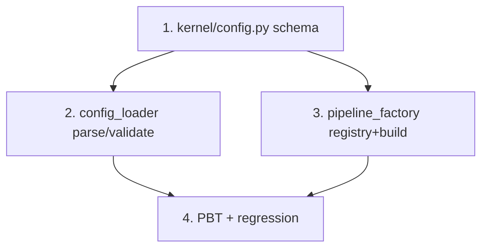

# Implementation Plan

## Overview

> **Spec:** config-declarative · **Workflow:** Design-First → Tasks. Nguồn: `design.md` (§Components/§Data Models/
> §Testing) + `requirements.md` (4 requirement EARS).
>
> **Luật vàng:** mỗi slice TDD nhỏ nhất; kết thúc có **bằng chứng chạy thật** (`.venv\Scripts\python.exe -m pytest -q`
> đọc output), GIỮ baseline **379 passed/1 skipped**. Máy KHÔNG GPU → test chỉ dùng fake/noise + FakeDetector.
> `lint-imports` hiện bị diệt-virus chặn (.exe) → chạy lại khi AV cho phép; KHÔNG claim lint pass khi chưa chạy được.
> Mỗi task xong → append `AI-IMPLEMENTATION-LOG.md` + cập nhật `activeContext.md` + decision-journal.
>
> **Ràng buộc layer (AGENTS §4):** `kernel/config.py` THUẦN (stdlib, không I/O/adapter); `config_loader` ∈ application;
> `pipeline_factory` ∈ profiles. Không thêm dependency (dùng `tomllib` stdlib). Additive — không sửa base.

## Tasks

- [x] 1. `kernel/config.py` — schema frozen dataclass (THUẦN stdlib) ✅ 7 test (386/1, no regression)
  - `SourceConfig/StageConfig/SinkConfig/DetectorConfig(type: str, params: Mapping)` · `PipelineConfig(id, source, stages, sinks, detector|None, max_frames|None)` · `AppConfig(pipelines)`. Tất cả `@dataclass(frozen=True)`; `params` bọc `MappingProxyType` (bất biến).
  - Test `test_config_schema.py`: khởi tạo đúng; frozen (gán lại → `FrozenInstanceError`); `params` không mutate được. KHÔNG import I/O/adapter.
  - _Requirements: 1.2, 4.1_

- [x] 2. `application/config_loader.py` — parse + validate + load (fail-fast) ✅ 12 test (398/1, no regression)
  - `parse_app_config(raw: dict) -> AppConfig`: build từ dict + validate (field bắt buộc; `id` duy nhất; `type` ∈ tập hợp lệ; sinks rỗng OK; detector optional khi không có stage detect). Sai → `ConfigError` (nêu id/khoá/type hợp lệ).
  - `load_app_config(path) -> AppConfig`: `tomllib.load` (mở "rb") → `parse_app_config`; file thiếu/sai TOML → `ConfigError` bọc gốc.
  - Test `test_config_loader.py`: round-trip dict hợp lệ; từng nhánh sai (thiếu field / type lạ / id trùng) → `ConfigError`; file tạm .toml round-trip; file thiếu + TOML hỏng → `ConfigError`.
  - _Requirements: 1.1, 1.3, 1.4, 2.1, 2.2, 2.3, 4.3_

- [x] 3. `profiles/pipeline_factory.py` — registry + build_runner ✅ 6 test (404/1)
  - `DEFAULT_REGISTRY` {sources: fake/noise/video/rtsp, detectors: fake/pt, stages: detect/count, sinks: jsonl} — mỗi entry callable(params)->object, BỌC `_build_*` tương đương `vision_slice_app` (đọc lại chữ ký adapter trước khi wire).
  - `build_runner(pcfg, *, registry=DEFAULT_REGISTRY) -> PipelineRunner`: dựng source + `SyncLinearExecutor([stages])` + `CompositeSink([sinks])` + `PipelineRunner`. Detector tiêm vào DetectStage khi stage=detect.
  - Test `test_pipeline_factory.py` (no-GPU): config fake source + fake detector + [detect,count] + sink rỗng → `build_runner` → `.run(max_frames=n)` → `RunStats.processed>0`; registry thêm type giả → dùng được (mở rộng không sửa lõi); type lạ → lỗi.
  - _Requirements: 3.1, 3.3_

- [x] 4. PBT + regression cuối ✅ 2 PBT → full **406/1** · lint **5 kept/0 broken** (chạy qua `importlinter.api`, né AV chặn .exe)
  - `test_config_pbt.py` (hypothesis): Property 1 (round-trip parse) + Property 4 (immutability) trên config sinh ngẫu nhiên hợp lệ.
  - Chạy FULL suite: baseline **379/1** + test mới đều xanh (Property 5 — không phá base). `lint-imports` khi AV cho phép.
  - _Requirements: 1.1, 1.2, 3.2_

## Task Dependency Graph

```json
{
  "waves": [
    { "wave": 1, "tasks": ["1"], "note": "kernel schema thuần (nền, không phụ thuộc)" },
    { "wave": 2, "tasks": ["2"], "note": "loader parse+validate (cần schema task 1)" },
    { "wave": 3, "tasks": ["3"], "note": "factory build_runner (cần schema + adapter hiện có)" },
    { "wave": 4, "tasks": ["4"], "note": "PBT + regression (cần loader + factory)" }
  ]
}
```



> Tuyến tính an toàn: 1 → 2 → 3 → 4. Task 3 cần đọc lại chữ ký adapter thật trước khi wire (chống bịa, K-043).

## Notes

- **Mỗi task = 1 commit save-point** (git on-hold K-007 → chờ user cho phép push/commit; local commit theo AGENTS §8) + 1 log entry + cập nhật con trỏ.
- **Máy KHÔNG GPU** → mọi test dùng fake/noise + FakeDetector (xác định). KHÔNG viết test cần cuda/torch/onnx-model.
- **KHÔNG thêm dependency** — chỉ `tomllib` (stdlib py3.11). Nếu sau cần GHI config → `tomli-w` (v2, ngoài phạm vi).
- **Additive tuyệt đối** — không sửa `PipelineRunner`/`SyncLinearExecutor`/adapter/stage → baseline 379/1 phải giữ.
- lint-imports bị AV chặn (.exe) → verify ranh giới import khi AV cho phép; tạm thời rà tay theo contract.
