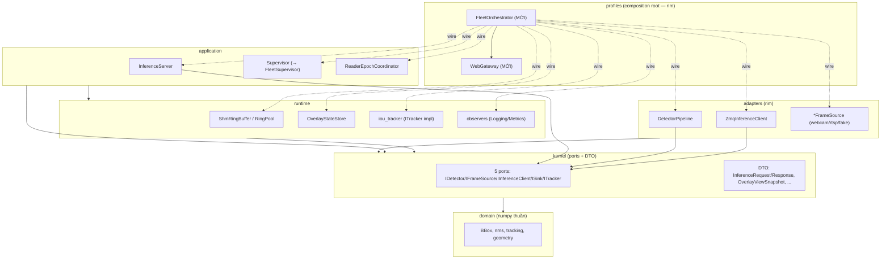
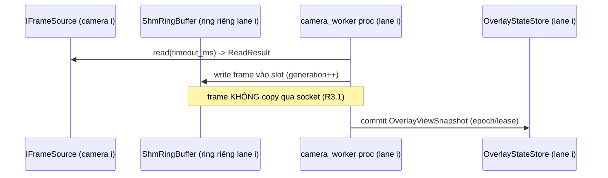
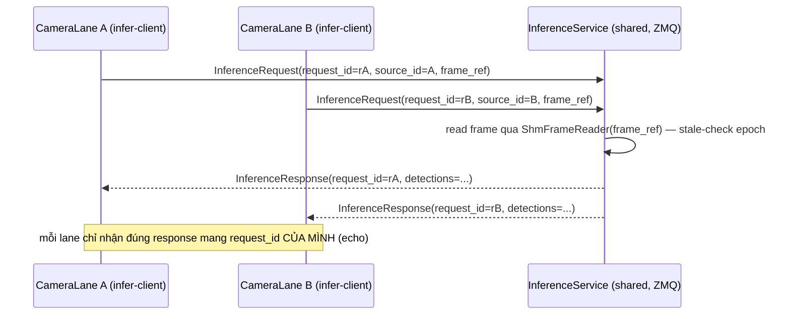
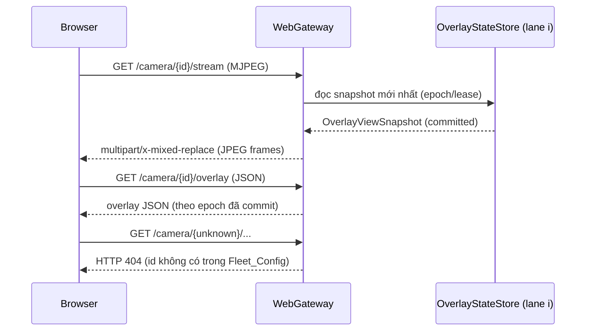

# Design Document: multicamera-fleet-profile

> Ngôn ngữ tài liệu: tiếng Việt. Ví dụ code: Python (khớp codebase thật tại
> `vision-platform/src/vision_platform/`).
>
> **Nguyên tắc grounding (chống bịa):** mọi component/port/lớp tái dùng nêu path THẬT đã kiểm tồn tại.
> Thành phần MỚI được ghi rõ **(MỚI)**. Suy luận chưa kiểm được gắn nhãn **[suy đoán]** / **[chưa kiểm]**.
>
> **Kiến trúc đã chốt:** Candidate 1 — Lane-oriented (bulkhead dọc per-camera), theo
> `architecture_selection.md`. KHÔNG chọn lại kiến trúc khác.

## Overview

`multicamera-fleet-profile` là một **composition-root profile MỚI** (`vision_platform/profiles/`) hợp nhất
hai topology rời rạc đang tồn tại (Finding F7.2):

- `profiles/vision_web_app.py` — single-view web (webcam → detect → MJPEG + overlay JSON), in-process, có web
  UI live nhưng chỉ 1 camera. (đã kiểm tồn tại)
- `profiles/vision_fullstack_profile.py` — multi-process (capture → SHM ring → ZMQ inference → Supervisor),
  bulkhead per-process nhưng không web UI, v1 chỉ 1 camera. (đã kiểm tồn tại)

Feature ghép ưu điểm của cả hai thành **1 fleet N-camera**: mỗi camera là một **Camera_Lane** cô lập bulkhead
(K-045), đi qua tầng inference multi-process (tái dùng `ZmqInferenceClient`/`InferenceServer`/SHM), tổng hợp
về một **WebGateway** phục vụ MJPEG + overlay JSON **live** per-camera, có **FleetSupervisor** giám sát +
restart.

**Phạm vi bản chất là WIRING / COMPOSITION** các thành phần đã kiểm chứng. Feature này **KHÔNG** phát minh
cơ chế IPC/SHM/detector mới. Code MỚI chỉ gồm: composition root, config loader fleet, N-lane spawner/wiring,
web gateway đa-endpoint, và các DTO cấu hình fleet.

### Giả định tường minh (kế thừa nguyên văn từ requirements.md)

- **[ASSUMPTION A1]** GPU target = x86-64 + NVIDIA rời. Nếu Jetson/ARM → kích hoạt nợ K-001 (atomicity SHM
  chưa verify trên ARM), NGOÀI phạm vi v1. Chỉ ảnh hưởng validation phần cứng của Capture+SHM, KHÔNG đổi phân rã.
- **[ASSUMPTION A2]** Quy mô fleet nhỏ–vừa (hàng chục camera, ít viewer đồng thời). N và số slot ring **tham số
  hoá qua config**, không hard-code.
- **[ASSUMPTION A3]** Web transport = MJPEG (đã có trong `vision_web_app.py`). WebRTC = follow-on F4.1, NGOÀI
  phạm vi v1.

### Ngoài phạm vi v1 (extension point, KHÔNG triển khai)

- **Batch-mux GPU (F3.3):** gom request cross-camera để batch trên GPU. `InferenceService` được thiết kế là
  **điểm chia sẻ duy nhất** để về sau ghép batch-mux tại đây mà không đụng component khác (DI-INV-C). v1 chỉ
  ghi là extension point.
- **WebRTC (F4.1)**, **persistence/ResultRepository** (đã cân nhắc & loại ở Candidate 3).

## Architecture

Phần này bám nguyên `architecture_selection.md` — **Candidate 1 Lane-oriented**. Bất biến TRỘI của feature là
**INV1 (isolation per-camera bulkhead)**; kiến trúc biến ranh giới bulkhead thành **ranh giới component hạng
nhất**: mỗi camera = 1 process group cô lập → isolation cưỡng chế bằng CẤU TRÚC, không bằng kỷ luật nội bộ.

### Sơ đồ tầng hexagonal (6 tầng) và vị trí component

Luật import 6 tầng (cưỡng chế bằng import-linter): `domain ← kernel ← runtime ← application`; `adapters` và
`profiles` là rim. `FleetOrchestrator` sống ở tầng `profiles` — **composition root DUY NHẤT** được phép wire
thành phần cụ thể của mọi tầng (R7.1).



> Ghi chú: mũi tên đứt (`-.wire.-`) = FleetOrchestrator khởi tạo/nối dây (đặc quyền composition root), KHÔNG
> phải import ngược luật tầng — các thành phần vẫn chỉ phụ thuộc theo chiều hợp lệ.

### Phân rã component (từ architecture_selection.md)

| Component | Tầng | State sở hữu | Trách nhiệm | Tái dùng / MỚI |
|---|---|---|---|---|
| `FleetOrchestrator` | profiles | Fleet_Config đã parse, lane registry | Parse config, spawn N Camera_Lane, wire, shutdown trật tự | **MỚI** |
| `CameraLane` (×N) | profiles (đơn vị spawn) | SHM ring riêng, capture proc, infer-client, `ITracker`, `OverlayStateStore` của camera đó | Pipeline end-to-end cô lập 1 camera (đơn vị bulkhead) | **MỚI** (wiring quanh thành phần đã có) |
| `InferenceService` | application | model / GPU session | Serve inference cross-process (ZMQ) cho mọi lane; điểm tích hợp batch-mux tương lai | tái dùng `InferenceServer` |
| `WebGateway` | profiles | HTTP server, route per-camera, trang index | Phục vụ MJPEG + overlay JSON per-camera READ-ONLY | **MỚI** (tái dùng mẫu MJPEG từ `vision_web_app.py`) |
| `FleetSupervisor` | application | process registry, heartbeat, backoff | Giám sát + restart process con (per-lane + inference) | tái dùng `Supervisor` |

### Luồng 1 — Dữ liệu per-lane (bulkhead cô lập)

Mỗi Camera_Lane là một đường dữ liệu độc lập, không chia sẻ ring với lane khác (DI-INV-A):



### Luồng 2 — Inference cross-process (điểm chia sẻ duy nhất)

Mọi lane gọi cùng `InferenceService` qua ZMQ. Identity per-camera enforce bằng `request_id`/`source_id` echo
(DI-INV-C, INV2):



> `InferenceRequest` mang thẳng `ShmFrameRefData` (gồm `ring_epoch`) — inference đọc frame qua SHM, không copy
> qua socket (R3.1). Đây là hành vi đã có trong `kernel/inference_protocol.py` (đã kiểm).

### Luồng 3 — Web read-only (gateway không chạy inference)

`WebGateway` CHỈ đọc `OverlayStateStore` per-camera + trạng thái health; không giữ tham chiếu process/ring của
lane (DI-INV-B, INV5). Gateway sập KHÔNG kéo lane:



### Information Flow (từ architecture_selection.md)

| From \ To | FleetOrchestrator | CameraLane | InferenceService | WebGateway | FleetSupervisor |
|---|---|---|---|---|---|
| **FleetOrchestrator** | — | → spawn/wire | → khởi tạo | → khởi tạo | → đăng ký |
| **CameraLane** | — | — | → InferenceRequest | — | ← heartbeat |
| **InferenceService** | — | → InferenceResponse (echo id) | — | — | ← heartbeat |
| **WebGateway** | — | ← đọc OverlayStore/health | — | — | — |
| **FleetSupervisor** | — | → restart (per-lane) | → restart | — | — |

(→ gọi/điều khiển · ← đọc/callback). Không có chu trình đồng bộ: `CameraLane→InferenceService` là
request/echo-response (ZMQ), không tạo phụ thuộc vòng.

### Bất biến sinh ra từ quyết định phân rã (Design-Induced Invariants)

Trích nguyên `architecture_selection.md` — dùng làm nền cho Correctness Properties:

- **DI-INV-A:** Ranh giới `CameraLane` = ranh giới process group → INV1 (isolation) & INV8 (no cross-lane lock
  dep) là **hệ quả cấu trúc**. Ràng buộc: KHÔNG đặt tài nguyên dùng chung tháo-gỡ-lẫn-nhau giữa 2 lane; SHM ring
  cấp per-lane.
- **DI-INV-B:** `WebGateway` chỉ đọc `OverlayStateStore` (không giữ tham chiếu process/ring) → INV5 (read-only)
  + INV3 (freshness) cô lập trong cặp `Lane.OverlayStore ↔ Gateway`; gateway sập không kéo lane.
- **DI-INV-C:** `InferenceService` là điểm chia sẻ DUY NHẤT giữa các lane → mọi coupling cross-camera (kể cả
  batch-mux tương lai) PHẢI đi qua đây; identity (INV2) enforce bằng `request_id` echo per-lane.
- **DI-INV-D:** `Camera_Id` là khoá tương quan bất biến xuyên FleetOrchestrator→Lane→metrics/log/endpoint; mọi
  label/route dùng đúng khoá này (INV4 unique ở config).

### Contract import-linter dự kiến cho profile mới

Feature phải vượt mọi contract ranh giới tầng hiện có (R7.6). Contract **dự kiến bổ sung/áp dụng** cho profile
mới [suy đoán — tên contract cụ thể do cấu hình `importlinter`/`pyproject` quyết định, chưa kiểm file cấu hình]:

1. `FleetOrchestrator` (profiles) được import mọi tầng — nhưng KHÔNG tầng nào được import ngược `profiles`
   (rim, forbidden reverse).
2. **Contract #6 (đã có):** thành phần overlay hiển thị (display projection) KHÔNG được import bất kỳ module
   analytics nào (R7.3). Áp dụng cho code render overlay của `WebGateway`.
3. `domain` mà feature chạm tới chỉ phụ thuộc numpy (không cv2/torch/ZMQ) — R7.4.
4. `kernel` chỉ ports + DTO, không adapter cụ thể — R7.5.
5. `WebGateway` chỉ giao tiếp domain/runtime/application qua 5 port `kernel/ports` — R7.2 (không import trực
   tiếp impl inference/detector).

## Components and Interfaces

### 1. FleetOrchestrator (MỚI, `profiles/`)

**Trách nhiệm:** composition root duy nhất (R7.1). Parse Fleet_Config → dựng `WorkerSpec` cho từng lane +
inference service → đăng ký với FleetSupervisor → chạy → shutdown trật tự.

**State sở hữu:** `Fleet_Config` đã parse; lane registry (map `Camera_Id → LaneRuntimeHandle`); tham chiếu
FleetSupervisor + WebGateway.

**Port dùng:** không trực tiếp gọi port nghiệp vụ; nó **nối dây** các adapter/impl vào port. Đây là đặc quyền
composition root.

**Tái dùng:** mẫu spawn/wiring của `profiles/vision_fullstack_profile.py` (`run_profile`, `camera_worker`,
`inference_server_entry` — đã kiểm tồn tại). Mở rộng từ 1 lane → N lane.

Chữ ký dự kiến (MỚI):

```python
# profiles/multicamera_fleet_profile.py  (MỚI)
def run_fleet(config_path: str, duration_s: float | None = None) -> dict[str, int]:
    """Đọc Fleet_Config, spawn N lane + inference, chạy tới shutdown. Trả metrics tổng hợp."""

def build_worker_specs(cfg: "FleetConfig") -> list["WorkerSpec"]:
    """Dựng WorkerSpec cho từng camera_worker(lane) + inference_server. Không side-effect (thuần) — dễ test."""
```

### 2. CameraLane (×N, MỚI — đơn vị bulkhead)

**Trách nhiệm:** pipeline end-to-end cô lập cho 1 camera: capture → SHM ring riêng → gửi InferenceRequest →
nhận response → tracker → commit OverlayViewSnapshot vào OverlayStateStore của lane.

**State sở hữu (per-lane, KHÔNG chia sẻ):** một `ShmRingBuffer`/`RingPool` riêng; capture process; một
`ZmqInferenceClient`; đúng một `ITracker` (K-042 camera-affinity); một `OverlayStateStore`.

**Port dùng:** `IFrameSource` (nguồn frame), `IInferenceClient` (`infer/setup/teardown`), `ITracker`
(`update/reset`).

**Tái dùng:** `ShmRingBuffer` @`runtime/ipc/shm_frame_ring.py`, `RingPool` @`runtime/ipc/ring_pool.py`,
`ReaderEpochCoordinator` @`application/reader_epoch_coordinator.py`, `ZmqInferenceClient`
@`adapters/zmq_inference_client.py`, `OverlayStateStore` @`runtime/overlay_state_store.py`, iou tracker
@`runtime/iou_tracker.py`, `DetectorPipeline` @`adapters/detector_pipeline.py`. **MỚI** = mã wiring gom các
thành phần này thành một lane + hàm entry `camera_worker` per-lane.

**Bất biến:** một Camera_Lane KHÔNG giữ khóa/tài nguyên mà việc giải phóng phụ thuộc lane khác còn sống (R2.5 /
DI-INV-A).

### 3. InferenceService (shared, tái dùng `InferenceServer`)

**Trách nhiệm:** serve inference cross-process cho mọi lane qua ZMQ; đọc frame qua SHM (`ShmFrameReader`),
echo `request_id` (R3.3). Là **điểm chia sẻ duy nhất** giữa các lane (DI-INV-C).

**State sở hữu:** model / GPU session.

**Port dùng:** `IDetector` (chạy detect), phía server của giao thức `IInferenceClient`.

**Tái dùng:** `InferenceServer` @`application/inference_server.py`, `DetectorPipeline`
@`adapters/detector_pipeline.py`. **Extension point (v1 KHÔNG làm):** batch-mux F3.3 — gom request cross-lane
để batch GPU, chèn tại đây, không đụng component khác.

### 4. WebGateway (MỚI, `profiles/`)

**Trách nhiệm:** phục vụ HTTP READ-ONLY (INV5): MJPEG stream + overlay JSON per-camera; trang index liệt kê
Camera_Id + health; endpoint `/metrics` tổng hợp fleet. **KHÔNG chạy inference** (R4.7).

**State sở hữu:** HTTP server; bảng route `Camera_Id → OverlayStateStore` (chỉ đọc) + tham chiếu health; KHÔNG
giữ process/ring của lane (DI-INV-B).

**Endpoint (dự kiến):**

| Route | Method | Trả về | Requirement |
|---|---|---|---|
| `/` | GET | Trang index: danh sách Camera_Id + health khoẻ/lỗi | R4.5 |
| `/camera/{id}/stream` | GET | MJPEG (`multipart/x-mixed-replace`) | R4.1 |
| `/camera/{id}/overlay` | GET | Overlay JSON mới nhất theo epoch/lease | R4.2, R4.4 |
| `/camera/{unknown}/...` | GET | HTTP 404 | R4.6 |
| `/metrics` | GET | Số liệu tổng hợp fleet (Prometheus text) | R6.2 |

**Tái dùng:** mẫu MJPEG + overlay JSON của `profiles/vision_web_app.py`; `metrics_http_server.py` /
`metrics_exposition.py` @`adapters/` cho `/metrics`; `OverlayStateStore` cho đọc snapshot. **MỚI** = routing
đa-camera + trang index fleet.

### 5. FleetSupervisor (tái dùng `Supervisor`)

**Trách nhiệm:** giám sát heartbeat + restart backoff mọi process con (mỗi camera_worker + inference server).
Restart 1 process của một lane KHÔNG gián đoạn lane khác (R5.4 / K-045).

**State sở hữu:** `_procs`, `_restart_counts`, `_heartbeats`, backoff state (đã có trong `Supervisor`).

**Tái dùng:** `Supervisor` @`application/supervisor.py` với `WorkerSpec` (fields đã kiểm: `worker_id`,
`target`, `args`, `max_restarts`, `uses_shutdown_event`, `uses_heartbeat`, `heartbeat_timeout_s`,
`restart_backoff_base_s`, `restart_backoff_cap_s`). Fleet production PHẢI bật heartbeat + backoff tường minh
(R5.6 / F5.2 — mặc định tắt).

**API dùng:** `Supervisor.run(duration_s)` → dict đếm restart; `request_stop()` cho shutdown; `_cascade_shutdown()`
đã có để dừng trật tự.

## Data Models

### Fleet_Config — schema TOML (MỚI)

`Fleet_Config` là DTO cấu hình fleet, nạp từ file TOML (theo mẫu `application/config_loader.py`:
`_read_toml` + parse fail-fast + `ConfigError` — đã kiểm tồn tại). Nạp qua tham số dòng lệnh hoặc biến môi
trường (R1.1).

Ví dụ file TOML:

```toml
# fleet.toml — khai báo N camera + tham số fleet (ASSUMPTION A2: N tham số hoá)
[fleet]
default_ring_slots = 8          # mặc định cấp-fleet, dùng khi camera không khai báo (R1.6)
heartbeat_timeout_s = 2.0       # BẬT tường minh cho production (R5.6 / F5.2)
restart_backoff_base_s = 0.5    # >0 = bật backoff (R5.3, R5.6)
restart_backoff_cap_s = 30.0
max_restarts = 3
web_host = "0.0.0.0"
web_port = 8080

[[camera]]
camera_id = "cam-front"         # Camera_Id DUY NHẤT (R1.2, R1.4 / INV4)
source_type = "rtsp"            # ánh xạ sang IFrameSource adapter
source_uri = "rtsp://10.0.0.11/stream"
height = 720
width = 1280
channels = 3
ring_slots = 12                 # override default_ring_slots

[[camera]]
camera_id = "cam-door"
source_type = "webcam"
source_index = 0
height = 480
width = 640
channels = 3
# ring_slots bỏ trống → dùng default_ring_slots = 8 (R1.6)
```

DTO tương ứng (MỚI — frozen dataclass, đặt ở tầng phù hợp; parse fail-fast):

```python
# DTO cấu hình fleet (MỚI). Frozen, validate ở __post_init__ (fail-fast, giống overlay_view.py).
@dataclass(frozen=True)
class CameraConfig:
    camera_id: str           # DUY NHẤT trong fleet (INV4)
    source_type: str         # "rtsp" | "webcam" | "video_file" | "fake" ...
    source_params: dict      # tham số riêng của adapter nguồn (uri/index/path)
    height: int
    width: int
    channels: int
    ring_slots: int          # đã resolve (override hoặc default fleet)

@dataclass(frozen=True)
class FleetConfig:
    cameras: tuple[CameraConfig, ...]     # đúng N mục (R1.2)
    default_ring_slots: int
    heartbeat_timeout_s: float
    restart_backoff_base_s: float
    restart_backoff_cap_s: float
    max_restarts: int
    web_host: str
    web_port: int
```

**Quy tắc validate (fail-fast, R1.4/R1.5):**
- Trùng `camera_id` giữa hai `[[camera]]` → `ConfigError` nêu rõ id trùng (R1.4 / INV4).
- Thiếu trường bắt buộc hoặc sai kiểu → `ConfigError` nêu rõ **trường + camera** vi phạm (R1.5).
- `ring_slots` khuyết → điền từ `default_ring_slots` cấp fleet (R1.6).

### DTO tái dùng (đã kiểm tồn tại — KHÔNG định nghĩa lại)

**`InferenceRequest` / `InferenceResponse`** @`kernel/inference_protocol.py`:

```python
@dataclass(frozen=True)
class InferenceRequest:
    request_id: str          # UUID — correlation key
    source_id: str           # camera_id (routing/logging) → khoá INV2/DI-INV-D
    frame_ref: ShmFrameRefData   # mang thẳng ref SHM (gồm ring_epoch) — KHÔNG copy frame qua socket (R3.1)

@dataclass(frozen=True)
class InferenceResponse:
    request_id: str          # ECHO request_id (R3.3 / INV2)
    detections: tuple[Detection, ...] = ()
    error: Optional[InferenceError] = None
```

Fleet dùng `source_id = camera_id` để gán kết quả về đúng lane (R3.4). `request_id` echo bảo đảm mỗi lane chỉ
nhận đúng response của mình (INV2). Không định nghĩa DTO inference mới.

**`OverlayViewSnapshot`** @`kernel/overlay_view.py` — ảnh committed atomic mà mỗi `OverlayStateStore` per-lane
commit và WebGateway chiếu ra JSON (R4.3, R4.4). Các trường then chốt cho freshness:
`schemaVersion`, `processEpoch`, `sourceEpoch (>=1)`, `eventRevision (>=0, đơn điệu)`, `health` (source +
detector state), `display` (DisplayView), `rawResult` (nullable). WebGateway phục vụ theo epoch/revision đã
commit — không phục vụ bản cũ hơn (R4.4 / INV3).

**`ShmFrameRefData`** @`kernel/shm_frame_ref.py` — ref frame trong SHM (ring_name/slot/generation/ring_epoch/
H/W/C), dùng cho stale-check khi inference đọc (đã kiểm được tham chiếu trong `inference_protocol.py`).

### Model runtime per-lane (MỚI, nội bộ profile)

```python
# Handle runtime của một lane trong lane registry của FleetOrchestrator (MỚI).
@dataclass
class LaneRuntimeHandle:
    camera_id: str
    ring: "ShmRingBuffer"            # ring RIÊNG lane (DI-INV-A)
    overlay_store: "OverlayStateStore"   # store RIÊNG lane (đọc bởi WebGateway, DI-INV-B)
    worker_id: str                    # khoá trong Supervisor._procs
    healthy: bool                     # trạng thái khoẻ/lỗi hiện tại (R6.4, R4.5)
    frames_processed: int
    frames_dropped: int
```

Đây là state nội bộ; nhãn metric/log theo `camera_id` (DI-INV-D / R6.3).

## Correctness Properties

*Một property là đặc tính/hành vi PHẢI đúng trên MỌI thực thi hợp lệ của hệ thống — một phát biểu hình thức
về điều hệ thống phải làm. Property là cầu nối giữa đặc tả người-đọc-được và bảo đảm đúng-đắn máy-kiểm-được.*

> **PBT áp dụng cho một TẬP CON feature này.** Feature bản chất là wiring/composition, nên nhiều acceptance
> criteria là INTEGRATION (cross-process, cần spawn thật) hoặc SMOKE (enforce bằng import-linter). Tuy nhiên
> phần logic THUẦN — parse/validate config, cấp phát tài nguyên per-lane, định tuyến identity, freshness
> overlay, routing/404, completeness observability — kiểm được bằng property với **fake source + tiêm phụ
> thuộc**, KHÔNG cần GPU/nhiều camera thật. Các property dưới đây phủ đúng tập con đó.

### Tập bất biến tham chiếu (INV / DI-INV)

Ánh xạ từ `architecture_selection.md`. Các INV được nêu tên tường minh trong tài liệu kiến trúc: INV1, INV2,
INV3, INV4, INV5, INV8. Các INV còn lại suy ra từ requirements (gắn nhãn [suy đoán] về SỐ HIỆU, nhưng nội dung
là ràng buộc thật trong requirements):

| Ký hiệu | Nội dung | Nguồn |
|---|---|---|
| INV1 | Isolation per-camera bulkhead (lane lỗi không kéo lane khác) | architecture_selection (TRỘI), R2 |
| INV2 | Identity kết quả per-camera (request_id echo, không lẫn) | architecture_selection, R3.3/3.4 |
| INV3 | Freshness overlay (phục vụ epoch/revision mới nhất, không lùi) | architecture_selection, R4.4 |
| INV4 | Camera_Id duy nhất trong config | architecture_selection, R1.4 |
| INV5 | Web read-only (gateway không chạy inference) | architecture_selection, R4.7 |
| INV6 [suy đoán số hiệu] | Observability gắn nhãn theo Camera_Id (tương quan bất biến) | R6.3 + DI-INV-D |
| INV7 [suy đoán số hiệu] | Supervision/recovery không phá isolation | R5.4 |
| INV8 | Không cross-lane lock dependency | architecture_selection, R2.5 |
| DI-INV-A..D | Bất biến sinh từ phân rã (xem §Architecture) | architecture_selection |

### Property 1: Config hợp lệ N camera sinh đúng N lane 1-1

*For any* Fleet_Config hợp lệ chứa N (N ≥ 1) mục camera với Camera_Id đôi một khác nhau, việc build lane phải
sinh ĐÚNG N lane và ánh xạ Camera_Id ↔ lane là song ánh (mỗi lane gắn đúng một Camera_Id).

**Validates: Requirements 1.2, 1.7** (INV4, DI-INV-D)

### Property 2: Trùng Camera_Id → fail-fast nêu id

*For any* Fleet_Config mà có ít nhất hai mục camera trùng Camera_Id, parse phải từ chối (raise `ConfigError`)
và thông báo lỗi phải chứa đúng Camera_Id bị trùng — không bao giờ khởi tạo lane.

**Validates: Requirements 1.4** (INV4)

### Property 3: Trường bắt buộc thiếu/sai kiểu → fail-fast nêu trường + camera

*For any* Fleet_Config hợp lệ mà xoá hoặc gán sai kiểu MỘT trường bắt buộc ở một camera bất kỳ, parse phải từ
chối (raise `ConfigError`) và thông báo phải nêu rõ tên trường vi phạm cùng Camera_Id chứa trường đó.

**Validates: Requirements 1.5**

### Property 4: Ring_slots khuyết → nhận default cấp fleet

*For any* Fleet_Config trong đó một tập con camera bỏ trống `ring_slots`, sau parse mọi camera thiếu phải có
`ring_slots` bằng đúng `default_ring_slots` cấp fleet, các camera khai báo tường minh giữ nguyên giá trị của
mình.

**Validates: Requirements 1.6**

### Property 5: Tài nguyên per-lane rời nhau (isolation cấu trúc)

*For any* Fleet_Config N camera, tập định danh tài nguyên IPC cấp cho các lane (ring name/handle,
OverlayStateStore, tracker) phải đôi một khác nhau — không lane nào chia sẻ slot ring hay tài nguyên tháo-gỡ-
lẫn-nhau với lane khác.

**Validates: Requirements 2.1, 2.5** (INV1, INV8, DI-INV-A)

### Property 6: Lane lỗi không chặn phục vụ lane khoẻ

*For any* tập lane trong đó một tập con bị đánh dấu lỗi/không khoẻ, mọi yêu cầu stream/overlay tới một lane
KHOẺ vẫn phải thành công và trả đúng dữ liệu của lane đó, độc lập với số lane đang lỗi.

**Validates: Requirements 2.3** (INV1, DI-INV-B)

### Property 7: Health theo ngưỡng thời gian, cô lập per-lane

*For any* lane có nguồn ngừng cấp frame vượt ngưỡng cấu hình (với đồng hồ tiêm), lane đó phải được đánh dấu
không khoẻ, và trạng thái khoẻ của mọi lane khác KHÔNG đổi do sự kiện này.

**Validates: Requirements 2.4** (INV1)

### Property 8: Identity kết quả per-camera (echo + không lẫn)

*For any* tập lane mỗi lane phát InferenceRequest với `request_id` riêng và `source_id = camera_id` của mình,
qua cùng một InferenceService chia sẻ, mỗi lane chỉ nhận đúng InferenceResponse mang `request_id` của chính
nó (response echo đúng request_id), không bao giờ nhận kết quả của camera khác — kể cả khi request bị xen kẽ.

**Validates: Requirements 3.3, 3.4, 3.5** (INV2, DI-INV-C)

### Property 9: Một ITracker cho mỗi camera (K-042)

*For any* Fleet_Config N camera, số instance `ITracker` được tạo phải bằng N và mỗi Camera_Id ánh xạ tới một
instance tracker riêng biệt (không chia sẻ state giữa hai camera).

**Validates: Requirements 3.6**

### Property 10: Freshness overlay đơn điệu theo epoch/revision

*For any* dãy commit OverlayViewSnapshot vào một OverlayStateStore với `eventRevision` (trong cùng
`sourceEpoch`) không giảm, mọi lần đọc của WebGateway sau một commit phải trả revision ≥ revision của mọi lần
commit trước đó — không bao giờ phục vụ một bản cũ hơn bản đã commit gần nhất.

**Validates: Requirements 4.4** (INV3, DI-INV-B)

### Property 11: Routing per-camera đúng + index đầy đủ

*For any* Fleet_Config N camera với snapshot khác nhau ở mỗi store, GET `/camera/{id}/overlay` (và stream)
trả về đúng dữ liệu của camera `id` đó cho mọi Camera_Id trong config; và trang index liệt kê đầy đủ tất cả
Camera_Id kèm trạng thái khoẻ/lỗi tương ứng.

**Validates: Requirements 4.1, 4.2, 4.5** (DI-INV-D)

### Property 12: Camera_Id không tồn tại → HTTP 404

*For any* chuỗi id KHÔNG nằm trong tập Camera_Id của Fleet_Config, mọi endpoint per-camera
(`/camera/{id}/stream`, `/camera/{id}/overlay`) phải trả về HTTP 404.

**Validates: Requirements 4.6**

### Property 13: Đăng ký đủ worker + bật heartbeat/backoff tường minh

*For any* Fleet_Config N camera với heartbeat/backoff bật, tập WorkerSpec dựng ra phải gồm đúng một spec cho
mỗi camera_worker (N spec) cộng spec cho inference server, và MỌI spec phải có `uses_heartbeat = True` cùng
`restart_backoff_base_s > 0`.

**Validates: Requirements 5.1, 5.6** (INV7)

### Property 14: Observability gắn nhãn Camera_Id + phơi đủ trường + log chuyển trạng thái

*For any* Fleet_Config N camera: (a) mỗi lane có gắn cả `LoggingObserver` và `MetricsObserver`; (b) mọi metric
sample và bản ghi log phát ra từ một lane mang đúng nhãn `camera_id` của lane nguồn, và tối thiểu phơi
`frames_processed`, `frames_dropped`, trạng thái khoẻ/lỗi; (c) mỗi lần một lane chuyển trạng thái khoẻ↔lỗi
sinh đúng một bản ghi log kèm Camera_Id và trạng thái mới.

**Validates: Requirements 6.1, 6.3, 6.4, 6.5** (INV6, DI-INV-D)

## Error Handling

### Fail-fast cấu hình (khởi động)

- Trùng Camera_Id, thiếu trường bắt buộc, sai kiểu → `ConfigError` (mẫu `application/config_loader.py`) với
  thông báo nêu rõ **trường + Camera_Id** vi phạm; profile **từ chối khởi động** trước khi spawn bất kỳ
  process nào (R1.4, R1.5 / Property 2, 3). Không khởi tạo một phần rồi rollback — validate toàn bộ trước.
- Giá trị số phi hữu hạn / ngoài miền trong DTO overlay đã fail-fast sẵn ở `overlay_view.py` (`_finite`,
  `__post_init__`) — tái dùng, không nới lỏng.

### Bulkhead recovery (runtime)

- Một Camera_Lane lỗi không phục hồi (process con thoát bất thường): FleetSupervisor restart theo backoff
  (`restart_backoff_base_s/cap_s`, `max_restarts`) CHỈ process của lane đó; các lane khác không bị đụng (R2.2,
  R5.4 / INV1, INV7). Vượt `max_restarts` → lane giữ trạng thái lỗi, WebGateway tiếp tục phục vụ lane khoẻ
  (R2.3) và index phản ánh lỗi (R4.5).
- Nguồn frame im lặng quá ngưỡng → đánh dấu lane không khoẻ (Property 7), không lan sang lane khác. Ngưỡng
  cấu hình được (fleet-level hoặc per-camera).
- InferenceService lỗi (điểm chia sẻ): là process được Supervisor giám sát → restart. Trong lúc restart, các
  lane nhận lỗi/timeout từ `ZmqInferenceClient` (theo hợp đồng `IInferenceClient`: `InferenceError.retryable`);
  lane xử lý theo backpressure đã có, KHÔNG crash cả fleet. [suy đoán — hành vi retry/timeout cụ thể phụ thuộc
  cấu hình `ZmqInferenceClient`, chưa kiểm chi tiết timeout mặc định.]

### Shutdown trật tự

- Nhận tín hiệu tắt (SIGINT/SIGTERM) → `FleetSupervisor.request_stop()` + `_cascade_shutdown()` (đã có) dừng
  mọi process con trong `shutdown_grace_s`; sau đó giải phóng SHM (unlink segment) và đóng ZMQ (R5.5). Thứ tự:
  dừng capture (ngừng nạp) → dừng inference → đóng gateway → unlink SHM. Worker dùng `uses_shutdown_event` để
  thoát cooperative (ERRATA E-10 đã có trong `WorkerSpec`).

### Lỗi phía Web (read-only)

- Camera_Id lạ → HTTP 404 (Property 12). Store chưa có snapshot (trước first result) → overlay JSON phản ánh
  health `INITIALIZING` với `rawResult = None` (shape ổn định theo `OverlayViewSnapshot`), KHÔNG dựng gen giả.
- WebGateway sập KHÔNG kéo lane (DI-INV-B): gateway chỉ đọc store, không giữ tham chiếu process/ring.

## Testing Strategy

Chiến lược kép: **unit/property tests** (logic thuần, chạy được KHÔNG cần GPU/nhiều camera thật, dùng fake
source + tiêm phụ thuộc) và **integration tests** (cross-process spawn thật cho isolation/supervision, đánh
dấu rõ).

### Nền tảng test không cần phần cứng thật

- **Fake source:** `adapters/fake_frame_source.py` + `adapters/noise_frame_source.py` (đã kiểm tồn tại) →
  cấp frame xác định/ngẫu nhiên không cần webcam/RTSP. Dùng cho mọi property lane/config.
- **Fake detector / inference:** `adapters/fake_detector.py` + `application/inline_inference_client.py`
  (`InlineInferenceClient`, cùng process — đã kiểm) → chạy identity/routing (Property 8) in-memory, không cần
  GPU, không cần ZMQ thật.
- **Tiêm đồng hồ (clock injection):** cho Property 7 (health theo ngưỡng thời gian) — không `sleep` thật.
- **Tiêm phụ thuộc ở composition root:** `build_worker_specs` / builder lane là hàm THUẦN (không side-effect
  spawn) → property test build N lane, kiểm cấu trúc (Property 1, 5, 9, 13, 14) mà không spawn process.

### Property-based testing (bắt buộc khi PBT áp dụng)

- Thư viện: **Hypothesis** (Python) — repo đã dùng (thư mục `.hypothesis/` tồn tại). KHÔNG tự viết PBT.
- Cấu hình: tối thiểu **100 iteration** mỗi property test.
- Mỗi property test gắn comment tham chiếu design property, định dạng:
  **`Feature: multicamera-fleet-profile, Property {number}: {property_text}`**.
- Mỗi Correctness Property (P1–P14) hiện thực bằng MỘT property test.
- Generator chính: danh sách camera (N biến thiên, id duy nhất/trùng có kiểm soát), params hợp lệ/khuyết/sai
  kiểu, dãy commit revision tăng, tập lane khoẻ/lỗi, chuỗi id trong/ngoài config.
- Nhóm property theo phân loại prework:
  - Config: P1, P2, P3, P4, P13 (thuần parse/validate/build — nhanh).
  - Isolation/identity/freshness: P5, P6, P7, P8, P9, P10, P11 (fake source + inline inference + clock tiêm).
  - Web/observability: P11, P12, P14 (WSGI test client + observer giả).

### Unit tests (ví dụ cụ thể + edge case)

- Nạp TOML qua CLI và qua env (R1.1) — ví dụ 1 file (EXAMPLE).
- Config đủ trường tối thiểu (R1.3) — schema (EXAMPLE).
- InferenceRequest mang `ShmFrameRefData`, không mang bytes frame (R3.1) — EXAMPLE.
- `/metrics` gộp metric nhiều lane (R6.2) — EXAMPLE (tái dùng `metrics_exposition.py`).
- Mapping 1-1 `camera_id → OverlayStateStore` (R4.3) — registry (EXAMPLE).
- Edge: store trước first result (health INITIALIZING, `rawResult=None`); N=1; ring_slots khuyết toàn bộ.

### Integration tests (cross-process spawn THẬT — đánh dấu rõ)

> Các test dưới CẦN spawn process thật (multiprocessing) + SHM/ZMQ thật. Chạy tách nhóm (chậm hơn), có thể
> gate riêng trong CI. KHÔNG cần GPU (dùng fake detector trong inference server).

- **[cross-process]** R2.2/R5.4 (INV1/INV7): spawn N lane, kill 1 camera_worker → assert các worker khác vẫn
  heartbeat + Supervisor chỉ restart worker chết.
- **[cross-process]** R5.2/R5.3: worker treo (ngừng heartbeat) → Supervisor phát hiện timeout + restart theo
  backoff (đọc restart count trả về từ `Supervisor.run`).
- **[cross-process]** R5.5: gửi shutdown → mọi process con exit trong grace; SHM segment được unlink; ZMQ đóng.
- **[cross-process]** R6.6: gây restart → metric restart count có nhãn `worker_id` đúng.

### Smoke / kiểm tĩnh (import-linter — không PBT)

- R3.2: profile wiring dùng đúng `ZmqInferenceClient` + `InferenceServer` (kiểm type khi build).
- R4.7 / contract #6 (R7.3): WebGateway (overlay hiển thị) KHÔNG import module analytics/inference-impl.
- R7.1, R7.2, R7.4, R7.5, R7.6: chạy **import-linter** trên toàn codebase sau khi thêm profile → 0 vi phạm
  mới. Là cổng CI (`.github/workflows/verify.yml` — đã kiểm tồn tại file workflow [chưa kiểm nội dung có sẵn
  bước import-linter hay chưa]).

---

### Ghi chú verify

- **Đã verify (đọc file thật):** path và chữ ký của `ShmRingBuffer`, `RingPool`, `ReaderEpochCoordinator`,
  `InferenceServer`, `ZmqInferenceClient`, `Supervisor`/`WorkerSpec`, `OverlayStateStore`, `DetectorPipeline`,
  5 port `kernel/ports/`, DTO `InferenceRequest/Response`, `OverlayViewSnapshot`, các fake source/detector +
  `InlineInferenceClient`; hai profile hiện có `vision_web_app.py` / `vision_fullstack_profile.py`.
- **Chưa verify [chưa kiểm]:** nội dung cấu hình import-linter (tên contract cụ thể), timeout mặc định của
  `ZmqInferenceClient`, bước import-linter trong `verify.yml`. Số hiệu INV6/INV7 là [suy đoán] (nội dung ràng
  buộc là thật trong requirements; architecture_selection chỉ nêu tên INV1–INV5, INV8).
