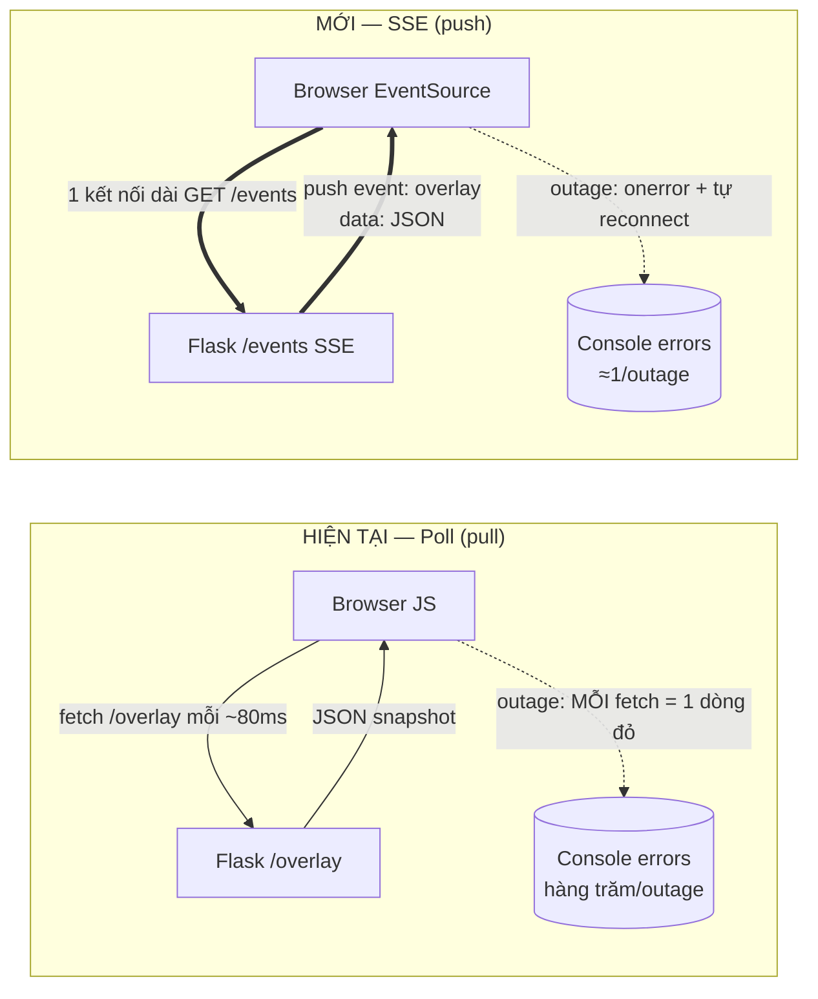
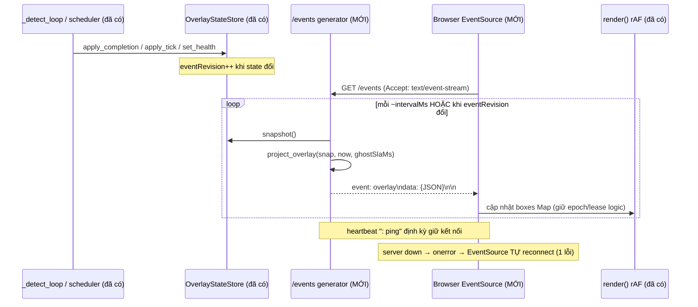

# Design Document: overlay-sse-transport

> Tài liệu thiết kế (design-first). Ngôn ngữ: tiếng Việt; ví dụ code Python/JS bám codebase thật.
>
> **TRẠNG THÁI TRIỂN KHAI (cập nhật 2026-07-19, LOG #454 / D-150):** **Wave 1 ĐÃ CODE + VERIFY** —
> endpoint `/events` + `_sse_overlay_stream` + client `EventSource` (tách `applyOverlay`, giữ poll fallback)
> trong `vision_web_app.py`; test `tests/test_web_sse.py`; `vp verify` 896/2 · lint 7 kept/0 broken · drift PASS.
> **Verify browser MCP dưới waitress (số thật):** rủi ro **waitress-buffer = BÁC BỎ** (flush first 3.7ms /
> gap median 50.8ms = đúng tick, không gom); **P2** outage overlay-channel **3 lỗi vs poll ~24** (giảm ~8×);
> P1/P3/P5/P6/P7 đạt. **Bug đã sửa (K-122):** header `Connection: keep-alive` (design phác ở Component 1) là
> **hop-by-hop PEP 3333 CẤM** → waitress `AssertionError` → ĐÃ BỎ header. **CÒN [chưa kiểm] → Wave sau:**
> SSE+Basic Auth (Property 4) + thread-budget nhiều viewer (Kịch bản 5) + đo trên máy GPU/RTSP thật.
> Quy ước chống bịa (luật repo §5): thành phần **(MỚI)** = chưa tồn tại; **[chưa kiểm]** = hành vi runtime chưa
> đo; **[suy đoán]** = suy luận chưa xác nhận. Mọi path/symbol "tái dùng" đã được ĐỌC file xác nhận tồn tại.

## Overview

### Vấn đề (grounded — đã đo bằng Playwright MCP, LOG Entry #447, re-confirm K-119)

Web app phục vụ overlay hiện **dùng HTTP polling**. Đã xác nhận bằng đọc file thật
`vision-platform/src/vision_platform/profiles/vision_web_app.py`:

- Client JS `poll()` gọi `fetch('/overlay', {cache:'no-store'})` theo cơ chế **self-rescheduling** qua
  `setTimeout(poll, pollFails===0 ? 80 : ...)` — tức ~80ms/lần khi khỏe (khớp mô tả #415), cộng `statsLoop()`
  gọi `/stats` (~1000ms) và ảnh MJPEG `` (route `/stream`, `multipart/x-mixed-replace`).
- Route `/overlay` (hàm `overlay()`) đọc `_store.snapshot()` rồi `project_overlay(...)` → JSON. Đây là
  **pull-based**: browser chủ động hỏi liên tục.
- Đã có badge "mất kết nối" (`<div id="conn">`) + backoff luỹ thừa (80ms→cap 2s) khi lỗi liên tiếp (#436).

Đo thực tế (LOG #447): server UP = 0 lỗi console, ~373 request 200. Server DOWN lúc tab đang mở =
**trình duyệt TỰ log** `ERR_CONNECTION_REFUSED`/`ERR_CONNECTION_RESET` cho MỖI fetch hỏng
(13→45 lỗi qua outage ~20s). Server BACK = app self-heal, badge tắt, 0 lỗi mới.

**Gốc rễ:** lỗi tầng-mạng do BROWSER tự phát khi backend unreachable — JS **không** `try/catch` chặn được
dòng đỏ này. Với transport polling, mỗi chu kỳ poll gặp outage = 1 dòng lỗi → "cực nhiều lỗi". Đây **không**
phải defect logic; backoff chỉ **hãm tần suất**, không **khử** lỗi.

### Mục tiêu feature

Đổi **transport** của kênh dữ liệu overlay từ HTTP-poll sang **SSE (Server-Sent Events, `text/event-stream`)**:
một kết nối dài, **server PUSH** snapshot overlay; browser dùng `EventSource` (tự reconnect sẵn). Khi outage,
`EventSource` chỉ phát **1 lỗi + tự thử lại**, thay vì hàng trăm dòng đỏ từ vòng poll.

Phạm vi CHỈ đổi **transport của dữ liệu overlay**. KHÔNG đụng: semantics epoch/lease/eventRevision, DTO
`OverlayViewSnapshot`, cơ chế render `requestAnimationFrame` + ngoại suy `vx/vy` (#416), luồng video MJPEG.

### Định hướng thiết kế (bám xuyên suốt, KHÔNG đổi hướng)

1. **SSE, KHÔNG WebSocket.** Overlay là luồng **một chiều** server→client. SSE đủ, đơn giản hơn, `EventSource`
   có **auto-reconnect** sẵn, chạy trên HTTP thường + reverse-proxy. WebSocket (song công 2 chiều) là thừa cho
   use-case này (không có message client→server). Trade-off nêu rõ ở §Architecture.
2. **ADDITIVE, đảo được.** THÊM endpoint SSE mới **(MỚI)** song song; **GIỮ** `/overlay` poll cũ làm
   backward-compat + fallback. Client ưu tiên `EventSource`, tự fallback poll khi SSE lỗi.
3. **Tái dùng, KHÔNG đổi model.** Dùng lại `OverlayStateStore.snapshot()` +
   `project_overlay(...)` + DTO `OverlayViewSnapshot`. SSE chỉ **đóng gói cùng dict JSON** mà `/overlay` đang
   trả, bọc trong khung `event:`/`data:`. Giữ nguyên Property freshness (epoch/lease).
4. **Hexagonal.** Endpoint SSE thuộc `profiles` (composition root/rim). Không cho tầng dưới import ngược.
   Overlay hiển thị KHÔNG import analytics (Property 10, đã cưỡng chế bằng import-linter ở spec cũ).

## Architecture

### So sánh transport: Poll (cũ) vs SSE (mới)



### Luồng SSE server→client (đã bám thread hiện có)

`vision_web_app.py` đã có sẵn 3 thread nền: `_video_loop`, `_detect_loop`, `OverlayExpiryScheduler`. Chúng cập
nhật `_store` (authority). SSE **không** thêm thread sản xuất dữ liệu — nó chỉ **đọc** `_store.snapshot()` trong
generator của mỗi kết nối và đẩy ra client.



### Vị trí trong kiến trúc 6 layer (hexagonal)

- **profiles** (`vision_web_app.py`): nơi đặt route `/events` **(MỚI)** — composition root, được phép phụ thuộc
  mọi tầng. ĐÚNG chỗ cho endpoint transport.
- **runtime** (`overlay_state_store.py`, `overlay_projection.py`): tái dùng nguyên trạng, KHÔNG sửa. SSE chỉ
  gọi `snapshot()` + `project_overlay(...)`.
- **kernel** (`overlay_view.py`): DTO `OverlayViewSnapshot` — KHÔNG đổi.
- **adapters** (`wsgi_server.py`, `auth_middleware.py`, `security_headers.py`): tái dùng; xem ràng buộc
  buffering/auth ở §Error Handling + §Rủi ro.

Ràng buộc import (giữ nguyên luật §4): profiles→(mọi tầng) OK; KHÔNG tầng dưới import profiles; route overlay
KHÔNG import analytics/count/sink (Property 10).

## Components and Interfaces

### Component 1: Endpoint SSE `/events` (MỚI) — `profiles/vision_web_app.py`

**Mục đích:** phục vụ một stream `text/event-stream` dài, push snapshot overlay đã chiếu JSON.

**Contract sự kiện (SSE wire format):** mỗi lần đẩy là một "event" theo chuẩn SSE:

```text
event: overlay
data: {"schemaVersion":1,"processEpoch":"...","sourceEpoch":1,"eventRevision":42,...}

```

(kết thúc mỗi event bằng **1 dòng trống**). Ngoài ra:
- `event: overlay` — payload chính = **cùng dict** mà `project_overlay()` sinh cho `/overlay` (không đổi schema).
- Dòng `: ping` (comment SSE) định kỳ = **heartbeat** giữ kết nối sống + giúp phát hiện đứt.
- `retry: <ms>` (tùy chọn) — gợi ý client khoảng chờ reconnect.

**Interface (Flask, bám mẫu generator streaming `_mjpeg()` đã có trong file):**

```python
# profiles/vision_web_app.py  (MỚI — phác thảo thiết kế, CHƯA code)
import json, time
from flask import Response, stream_with_context

def _sse_overlay_stream():
    """Generator: push snapshot overlay dạng SSE. Đọc _store (authority) — KHÔNG mutate."""
    last_rev = None
    last_ping = time.monotonic()
    while True:
        snap = _store.snapshot() if _store is not None else None
        if snap is not None:
            payload = project_overlay(snap, time.monotonic_ns(), _cfg.ghostSlaMs)
            # chỉ đẩy khi eventRevision đổi (giảm băng thông) — vẫn ping để giữ kết nối
            if payload["eventRevision"] != last_rev:
                last_rev = payload["eventRevision"]
                yield f"event: overlay\ndata: {json.dumps(payload)}\n\n"
        now = time.monotonic()
        if now - last_ping >= _SSE_HEARTBEAT_S:      # heartbeat comment giữ kết nối
            last_ping = now
            yield ": ping\n\n"
        time.sleep(_SSE_TICK_S)                      # nhịp quét (vd 0.05–0.1s) — cân freshness ⊥ CPU

@app.route("/events")
def events():
    resp = Response(stream_with_context(_sse_overlay_stream()),
                    mimetype="text/event-stream")
    resp.headers["Cache-Control"] = "no-cache, no-store, must-revalidate"
    resp.headers["X-Accel-Buffering"] = "no"   # tắt buffering ở reverse-proxy (nginx) — xem §Rủi ro
    resp.headers["Connection"] = "keep-alive"
    return resp
```

> **[chưa kiểm]** Flush thực tế từng event qua **waitress** (production WSGI, đã xác nhận dùng ở `wsgi_server.py`):
> waitress có thể buffer response — CẦN đo bằng chạy thật (xem §Testing + §Rủi ro). Có thể phải điều chỉnh
> tham số waitress hoặc chấp nhận độ trễ nhỏ. Mẫu `_mjpeg()` hiện chạy được multipart streaming là dấu hiệu
> tích cực **[suy đoán]** nhưng chưa đủ để khẳng định cho `text/event-stream`.

### Component 2: Client JS — `EventSource` + fallback poll (SỬA khối `<script>` trong `_PAGE`)

**Mục đích:** thay **nguồn dữ liệu** overlay bằng `EventSource`; **giữ nguyên** `render()` (rAF + ngoại suy
`vx/vy`) và toàn bộ logic epoch-rollback/lease/`boxes` Map hiện có.

**Thiết kế:** tách phần "nhận 1 payload overlay → cập nhật `boxes`" ra một hàm dùng chung
`applyOverlay(o, rtt)` (refactor từ thân `poll()` hiện tại). Cả SSE lẫn poll-fallback đều gọi hàm này → logic
đồng nhất, không nhân đôi.

```javascript
// _PAGE <script> (SỬA — phác thảo, CHƯA code). GIỮ render()/boxes Map/epoch logic như cũ.
let es = null, usingSSE = false;
function applyOverlay(o, rtt){ /* nguyên logic epoch/lease/boxes từ poll() cũ, rtt≈0 cho SSE */ }

function startSSE(){
  try{
    es = new EventSource('/events');
    es.addEventListener('overlay', ev => {
      setConn(true); pollFails=0;
      applyOverlay(JSON.parse(ev.data), 0);   // SSE push: coi rtt≈0
    });
    es.onopen = () => { usingSSE = true; setConn(true); };
    es.onerror = () => {                       // server down: TRÌNH DUYỆT phát 1 lỗi + EventSource tự reconnect
      setConn(false);
      // EventSource tự thử lại; nếu muốn fallback poll khi SSE liên tục fail → có ngưỡng chuyển
    };
  }catch(e){ usingSSE=false; startPollFallback(); }   // môi trường không hỗ trợ EventSource
}
function startPollFallback(){ poll(); }        // GIỮ nguyên poll() cũ làm đường lui
// khởi động: ưu tiên SSE, fallback poll nếu không có EventSource
if (window.EventSource) startSSE(); else startPollFallback();
requestAnimationFrame(render); statsLoop();    // render + stats giữ nguyên
```

**Trách nhiệm:**
- Ưu tiên `EventSource`; nếu trình duyệt không hỗ trợ → gọi `poll()` cũ.
- Nhận `event: overlay` → `applyOverlay()` (cùng logic cũ).
- `onerror` → hiện badge + để `EventSource` tự reconnect; **1 lỗi/outage** thay vì flood.

### Component 3: Tái dùng (KHÔNG sửa)

| Thành phần | Path (đã đọc xác nhận tồn tại) | Vai trò trong SSE |
|---|---|---|
| `OverlayStateStore.snapshot()` | `runtime/overlay_state_store.py` | Nguồn snapshot immutable đã commit |
| `project_overlay(snap, now_ns, ghost_sla_ms)` | `runtime/overlay_projection.py` | Chiếu snapshot → dict JSON (dùng chung với `/overlay`) |
| `OverlayViewSnapshot` + DTO con | `kernel/overlay_view.py` | Data model — KHÔNG đổi |
| `serve_wsgi(app, host, port, threads, server)` | `adapters/wsgi_server.py` | Serving waitress; liên quan thread budget |
| `BasicAuthMiddleware` / `SecurityHeadersMiddleware` | `adapters/auth_middleware.py`, `security_headers.py` | Bọc ngoài wsgi_app — phủ cả `/events` |

## Data Models

**Không có DTO mới.** Payload `event: overlay` = **chính xác** dict do `project_overlay()` sinh (đang dùng cho
`/overlay`). Đã đọc `overlay_projection.py`, cấu trúc:

```jsonc
{
  "schemaVersion": 1,
  "processEpoch": "…hex…",
  "sourceEpoch": 1,
  "eventRevision": 42,          // đơn điệu tăng khi state đổi → client dedupe/ordering
  "serializedAtMs": 123456,
  "health": { "source": "LIVE", "detector": "LIVE" },
  "rawResult": { /* hoặc null trước first result */ },
  "display": {
    "revision": 7, "reason": "…",
    "boxes": [
      { "displayId":"…","trackRevision":3,"remainingLeaseMs":420,
        "label":"person","confidence":0.87,
        "x":0.1,"y":0.2,"width":0.15,"height":0.3,
        "vx":0.01,"vy":-0.02 }
    ]
  }
}
```

**Ràng buộc giữ nguyên (từ DTO `OverlayViewSnapshot`, đã đọc `overlay_view.py`):**
- `eventRevision >= 0`, `sourceEpoch >= 1` (validate ở `__post_init__`).
- Snapshot là **atomic committed** (Property 1): không trộn epoch/raw/display/health.
- Toạ độ chuẩn hoá; box zero-area bị loại ở `project_overlay`.

**Khung SSE bọc ngoài (MỚI, chỉ là format truyền tải, không phải DTO):**

| Trường SSE | Ý nghĩa |
|---|---|
| `event: overlay` | Tên sự kiện — client `addEventListener('overlay', …)` |
| `data: <json>` | Một dòng JSON = payload `project_overlay` |
| `: ping` | Comment heartbeat (client bỏ qua) |
| `retry: <ms>` | (tùy chọn) gợi ý khoảng reconnect cho EventSource |

## Correctness Properties

> Phát biểu ở dạng bất biến ∀ để dẫn xuất test. Nhãn trạng thái kiểm chứng ghi rõ.

### Property 1: Freshness bảo toàn qua SSE
∀ event push, payload = `project_overlay(store.snapshot(), now, …)` tại thời điểm đẩy → box/health/epoch client
thấy qua SSE **tương đương** giá trị poll `/overlay` sẽ trả cùng lúc. SSE KHÔNG được đưa ra dữ liệu cũ hơn
snapshot đã commit. *(test được — so trực tiếp payload.)*

### Property 2: 1-lỗi-console mỗi outage (mục tiêu cốt lõi)
∀ một chu kỳ outage (server down rồi up), số dòng lỗi console phía trình duyệt với transport SSE **≤ vài lỗi**
(kỳ vọng ≈1/lần đứt + các lần EventSource tự thử lại thưa dần), và **nhỏ hơn nhiều** so với polling (hàng
chục–trăm ở #447). *(test được — Playwright đếm console error, so SSE vs poll — [chưa kiểm], phải đo thật.)*

### Property 3: Fallback poll khi SSE không khả dụng
Nếu `window.EventSource` không tồn tại → client dùng `poll()` cũ; overlay vẫn cập nhật (không màn hình trắng).
*(test được — env không EventSource.)*

### Property 4: Auth vẫn phủ `/events`
Khi đặt `VP_WEB_USER`/`VP_WEB_PASS`, request `/events` không kèm credential hợp lệ → bị `BasicAuthMiddleware`
chặn (giống mọi route, vì middleware bọc ngoài `wsgi_app`).
*([chưa kiểm] — EventSource không set custom header dễ; xem §Rủi ro về cơ chế auth.)*

### Property 5: Auto-reconnect + resume
Server down → `EventSource` phát `onerror` + tự reconnect; server back → stream nối lại, `applyOverlay` tiếp
tục, badge tắt. *(test được — Playwright: down→up.)*

### Property 6: Additive / không hồi quy
Route `/overlay` (poll) + `/stream` (MJPEG) + `/stats` vẫn hoạt động y như trước khi thêm `/events`.
*(test được — smoke các route cũ.)*

### Property 7: Không rò analytics vào overlay
Module phục vụ `/events` KHÔNG import count/sink/tracker (Property 10 cũ). *(test được — import-linter.)*

## Error Handling

### Kịch bản 1: Server down khi tab đang mở
- **Điều kiện:** backend unreachable giữa chừng.
- **Phản ứng:** `EventSource` phát `onerror` (trình duyệt log ~1 lỗi mạng), client hiện badge "mất kết nối".
- **Khôi phục:** `EventSource` **tự reconnect** theo chu kỳ (mặc định trình duyệt, có thể chỉnh bằng `retry:`);
  KHÔNG cần vòng poll thủ công → không flood console.

### Kịch bản 2: Server back
- **Phản ứng:** kết nối SSE mới mở, `onopen` → badge tắt; event `overlay` tiếp tục.
- **Khôi phục:** `applyOverlay` cập nhật `boxes`; logic epoch-rollback cũ xử lý nếu `processEpoch` đổi
  (server restart) — GIỮ nguyên cơ chế `retired`/`procEpoch` hiện có.

### Kịch bản 3: waitress buffering (flush chậm) [chưa kiểm]
- **Điều kiện:** waitress đệm response `text/event-stream` → event không tới client kịp thời.
- **Phản ứng thiết kế:** set `Cache-Control: no-cache` + `X-Accel-Buffering: no`, flush theo từng event
  (yield từng chunk). Nếu vẫn trễ → đo và cân nhắc tham số waitress / heartbeat ngắn hơn.
- **Khôi phục/đường lui:** nếu waitress không flush kịp cho SSE → **fallback poll vẫn còn** (additive), và có
  thể ghi Non-Goal "SSE chỉ bật sau khi đo flush đạt".

### Kịch bản 4: Kết nối chết âm thầm (proxy đóng idle)
- **Phản ứng:** heartbeat `: ping` định kỳ giữ kết nối + giúp phát hiện đứt sớm; nếu ping fail →
  `EventSource` reconnect.

### Kịch bản 5: Cạn thread budget waitress [chưa kiểm]
- **Điều kiện:** `serve_wsgi(..., threads=8)` mặc định; mỗi viewer SSE giữ **1 kết nối dài** → chiếm 1 thread
  suốt phiên. Nhiều viewer → cạn thread, chặn cả `/stream`.
- **Phản ứng thiết kế:** ghi rõ ràng buộc quy mô (A2 fleet nhỏ–vừa). Cân nhắc tăng `--threads`, hoặc giới hạn
  số kết nối SSE, hoặc đánh giá server async. Nêu như **rủi ro cần đo**, chưa chọn giải pháp.

## Testing Strategy

### Đo mục tiêu cốt lõi bằng Playwright MCP (bám phương pháp phiên #447)
- **Nguồn synthetic, KHÔNG cần GPU/camera:** chạy `vision_web_app` với nguồn synthetic (`moving_square_frame`
  khi không truyền `--video/--rtsp/--camera` — đã xác nhận nhánh này trong `_open_source`/`_video_loop`) +
  detector nhẹ (`BrightBlobDetector` mặc định). Test-được trên máy dev thường.
- **So sánh console-error-count qua outage:** mở tab (SSE), snapshot số lỗi; kill server ~20s; đo số dòng lỗi;
  bật lại; đo phục hồi. Lặp tương tự với transport poll (route cũ). **Tiêu chí P2:** SSE ≤ vài lỗi/outage và
  nhỏ hơn hẳn poll. *(bằng chứng phải là log console thật — [chưa kiểm] tới khi chạy.)*
- **Freshness (P1):** với server UP, so payload `event: overlay` và `/overlay` poll cùng thời điểm → khớp
  `eventRevision`/`display.boxes` (sai lệch chỉ do thời điểm chụp, trong ngưỡng).
- **Fallback (P3):** giả lập môi trường không có `EventSource` (override `window.EventSource=undefined` trong
  Playwright) → overlay vẫn cập nhật qua poll.
- **Reconnect (P5):** down→up, xác nhận badge bật/tắt + stream resume.
- **Flush waitress (Kịch bản 3):** đo **độ trễ** từ lúc `_store` đổi tới lúc client nhận event (đóng dấu thời
  gian) khi chạy `--server waitress` — xác nhận SSE flush đúng thời gian thực, không bị đệm. **[chưa kiểm].**

### Unit / property test (Python)
- `project_overlay` đã có test riêng (tồn tại `test_overlay_state_store.py`); SSE tái dùng nên không nhân đôi.
- Test route `/events`: header đúng (`Content-Type: text/event-stream`, `Cache-Control`, `X-Accel-Buffering`),
  và generator sinh khung `event: overlay\ndata: …\n\n` hợp lệ (parse được).
- Import-linter (P7): module `/events` không import analytics.

### Non-Goal / ngoài phạm vi
- Không đổi transport video MJPEG.
- Không thêm kênh client→server (SSE một chiều là đủ — lý do ở §Architecture).
- Không nhúng TLS (vẫn qua reverse-proxy như Wave 3).

## Rủi ro cần validate (chưa khẳng định — nêu CÁCH kiểm)

| Rủi ro | Trạng thái | Cách kiểm |
|---|---|---|
| **waitress buffer `text/event-stream`** → event không flush ngay (tương tự lo ngại MJPEG proxy_buffering #427/#428) | **[chưa kiểm]** | Chạy `--server waitress` thật + đo mốc thời gian event tới client qua Playwright/EventSource; thử `X-Accel-Buffering:no`, flush per-event |
| **SSE + Basic Auth (Wave 2):** `EventSource` KHÔNG gửi custom header dễ → auth qua cookie/session hay Basic Auth trong URL? | **[chưa kiểm]** | Kiểm middleware `BasicAuthMiddleware` với request SSE; xác định cơ chế credential khả thi (cookie sau login, hay Basic Auth ở URL — có ràng buộc bảo mật) |
| **SecurityHeaders (Wave 3)** ảnh hưởng stream? | **[chưa kiểm]** | Bật middleware + kiểm header trên response `/events` không phá streaming |
| **Thread budget** (`threads=8`): mỗi viewer 1 connection dài | **[suy đoán]** cần đo | Mở N tab SSE, quan sát `/stream` còn phục vụ không; cân nhắc tăng threads / giới hạn kết nối |
| **Heartbeat interval** hợp lý (giữ proxy idle không đóng, không tốn CPU) | **[chưa kiểm]** | Thử `_SSE_HEARTBEAT_S` (vd 15s) + `_SSE_TICK_S` (vd 0.05–0.1s), đo CPU + độ trễ |

## Dependencies

- **Không thêm dependency mới.** SSE dựng bằng Flask `Response(generator, mimetype="text/event-stream")` +
  `stream_with_context` (Flask đã có, đã dùng `Response` streaming cho `/stream`). `EventSource` là API sẵn có
  của trình duyệt.
- Tái dùng: `waitress` (đã có, `wsgi_server.py`), `BasicAuthMiddleware`, `SecurityHeadersMiddleware`.

---

### Ghi chú path (chống bịa)
Yêu cầu ban đầu nêu `profiles/vision_web_app.py`, `runtime/overlay_state_store.py`, `kernel/overlay_view.py`.
**Đã đọc & xác nhận** path THẬT trong repo có tiền tố package: `vision-platform/src/vision_platform/…`
(vd `vision-platform/src/vision_platform/profiles/vision_web_app.py`). Thiết kế dùng path thật này.
