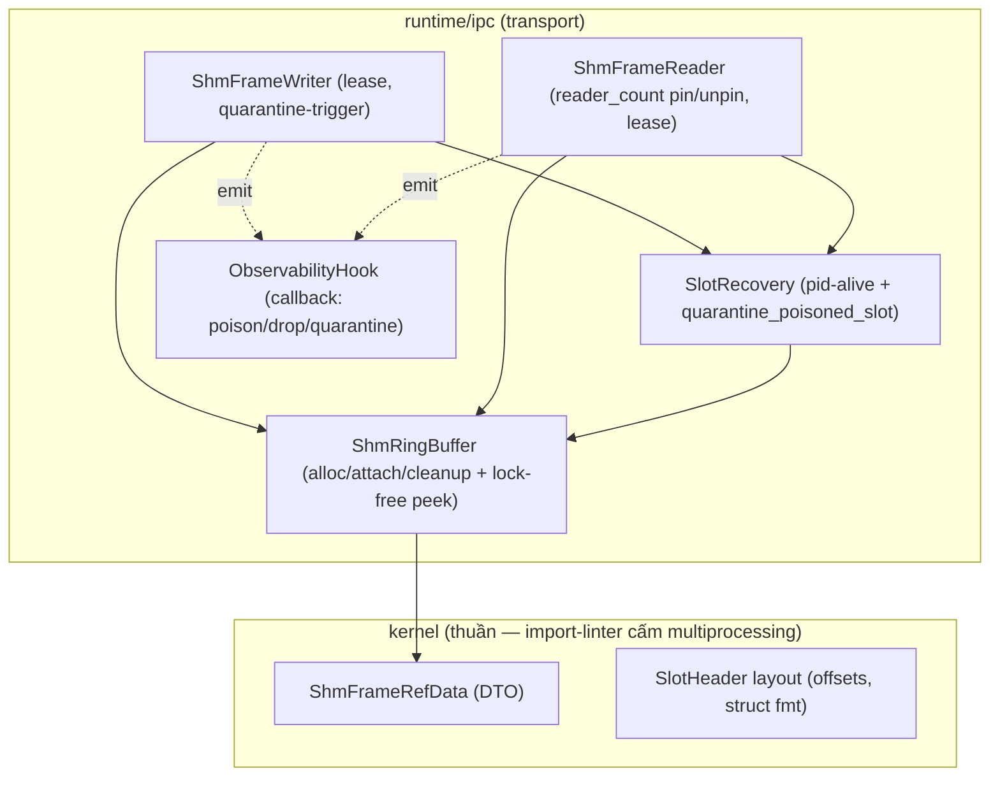
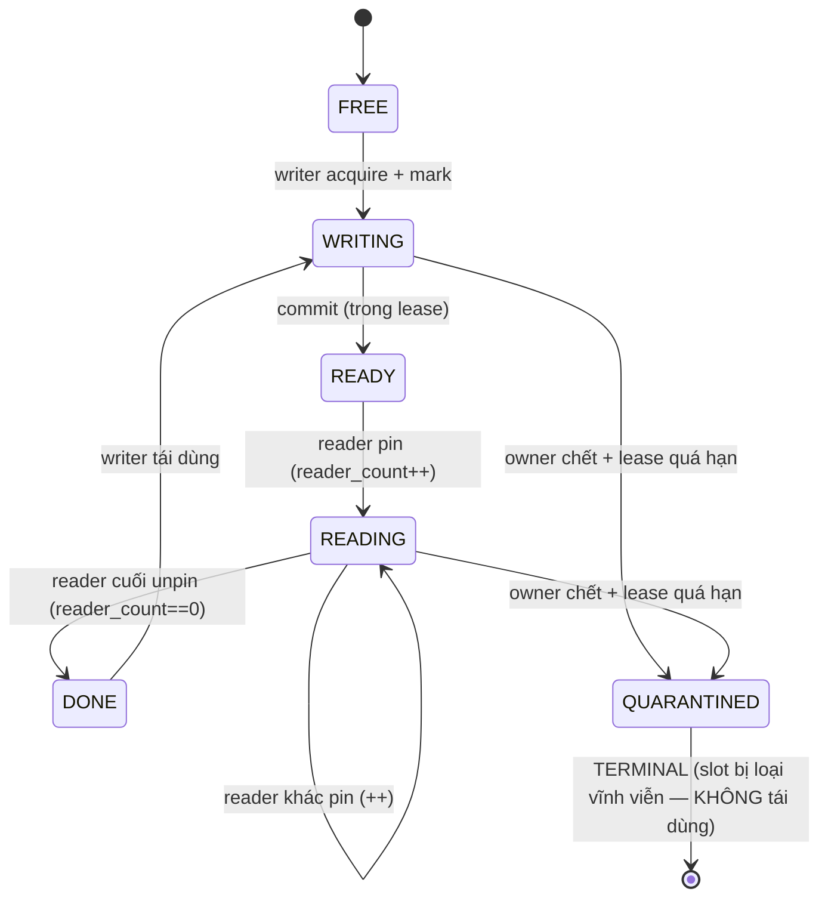

# Design — SHM frame bus PRODUCTION hardening (shm-production-hardening)

> **Loại spec:** Feature · **Workflow:** Design-First (HLD + LLD). Tài liệu THIẾT KẾ để **đọc lại + valid
> trước khi triển khai** (không phải code). Requirements suy ra từ design này.
>
> **Quy ước nhãn (chống bịa):** 🟢 **[GROUNDED]** có nguồn trong repo / đã chạy thật ·
> 🟡 **[THIẾT KẾ MỚI — CẦN DUYỆT]** tôi tự thiết kế (spec production đầy đủ
> `Vision_platform_architecture_design/05-inference-and-ipc/` KHÔNG có trong repo — ERRATA E-5; KHÔNG coi là spec chính thức) ·
> 🔴 **[CẦN KIỂM CHỨNG]** giả định chưa chạy thật trên môi trường đích.

## Overview

Nâng SHM frame bus (#05, `runtime/ipc/shm_frame_ring.py`) từ **demo giản lược** lên **chuẩn sản phẩm
thương mại 24/7** (Mỹ+Nhật): chịu được **process chết / lock poison** mà KHÔNG cạn slot, quan sát được, đa reader.

**Trong phạm vi:** P-1 crash/poison recovery · P-2 observability hooks · P-3 multi-reader · P-4 header giàu ·
P-5 ép invariant 1-writer. **Ngoài phạm vi (spec khác):** P-6 backpressure (#07), structlog đầy đủ (#08), seqlock.

**Hiện trạng** 🟢 **[GROUNDED — 16 test xanh + verify Windows]:** bản hiện tại ĐÚNG về atomicity/race trong
model **1-writer/1-reader** (mọi header `<IQQ` 20B truy cập dưới per-slot lock → không torn; ABA chặn bằng
`generation`; reader `arr.copy()` trước khi nhả). **Khoảng trống** 🟢 **[GROUNDED — brief Pha 1b]:**

| # | Khoảng trống | Hệ quả production |
|---|---|---|
| P-1 | Không hồi phục khi owner chết / lock poison | slot kẹt WRITING (F-3)/READING (F-3b) **vĩnh viễn** → ring cạn → **bus đứng** |
| P-2 | Nuốt lỗi im lặng | không phát hiện poison/drop khi vận hành |
| P-3 | READING độc quyền 1 reader | không phục vụ nhiều consumer |
| P-4 | Header `<IQQ` quá mỏng | thiếu owner_pid/lease/reader_count |
| P-5 | `generation` writer-local, không ép | lỡ 2 writer/ring → trùng gen → vỡ ABA |

## Architecture

### Nguyên tắc nền (atomicity)
🟢 **[GROUNDED — `Design/module-04-deep-dives/02-shm-atomicity-explained.md` + Intel SDM Vol 3A §8.1.1]**
x86-64 store atomic **chỉ khi ≤8 byte, aligned**. Header 20B (`<IQQ`) KHÔNG atomic → đọc/ghi đa-byte BẮT BUỘC
dưới lock. **R5-CRITICAL-01:** ghi 1 trường `state` **4-byte @offset0, aligned** thì atomic → ghi **lock-free**
làm sentinel `QUARANTINED`; reader/writer **peek lock-free** `state` TRƯỚC khi acquire → thấy QUARANTINED thì
bỏ qua (không đụng lock poison). Sentinel **sticky** → luôn thấy "state cũ HOẶC QUARANTINED", không torn.

### Sơ đồ thành phần

🟡 **[THIẾT KẾ MỚI — CẦN DUYỆT]** Lớp `SlotRecovery` + `ObservabilityHook` tách mới (demo chưa có) vì P-1/P-2 là cross-cutting.

### State machine slot (mở rộng)

🟡 **[THIẾT KẾ MỚI — CẦN DUYỆT]** Thêm `QUARANTINED`; `READING` đa-reader qua `reader_count`; chuyển
`QUARANTINED` CHỈ khi **lease quá hạn VÀ owner chết** (định danh pid+create_time — §pid_is_alive).
**🔴 SỬA theo review 1.1/1.2 (CHÍ TỬ):** `QUARANTINED` là **TERMINAL** — slot bị **loại vĩnh viễn**, KHÔNG
reclaim về FREE. Lý do: `multiprocessing.Lock` (POSIX sem / Windows semaphore) **KHÔNG robust** — owner chết
thì lock vật lý kẹt ở mức OS, ghi QUARANTINED vào SHM KHÔNG giải phóng được nó. Tái dùng slot = phải acquire
lại lock đã chết = timeout mãi. → Bỏ qua slot QUARANTINED VĨNH VIỄN qua lock-free peek (không bao giờ đụng
lock chết); ring **giảm 1 slot dung lượng** mỗi lần quarantine (degrade graceful) + phát metric/alert; khi số
slot quarantine vượt ngưỡng → **tạo lại TOÀN BỘ ring** (segment mới + lock mới) là recovery cuối cùng.

### Lock vs Seqlock
🟢 **[GROUNDED — deep-dive]** Giữ **per-slot lock** (Option A) mặc định. Forces: *đơn giản+đúng+đa-writer* ↔
*serialize 1 slot + nguy cơ poison* (đã giải bằng lock-free peek + quarantine). **Seqlock** (Option B: reader
lock-free, đa-reader, không poison) — dùng khi read-heavy + contention cao (>~32 cam); KHÔNG dùng khi cần
đa-writer / tránh dependency `atomics`. → **ngoài phạm vi** bản này.

## Data Models

### Header layout MỚI (P-4) — 🟡 [THIẾT KẾ MỚI — CẦN DUYỆT] (v2 sau review)
Thay `<IQQ` (20B); **`state` GIỮ @offset0, 4-byte aligned** (lock-free peek/quarantine atomic). v2 thêm
`owner_create_time` (R-3.1 chống pid reuse) + **reader registry** (R-2.1 multi-reader crash):

| Offset | Field | struct | Ý nghĩa |
|---|---|---|---|
| 0 | `state` | `<I` (4B) | SlotState gồm `QUARANTINED=0xFFFFFFFF`. Atomic peek/write tại đây. |
| 8 | `generation` | `<Q` (8B) | ABA counter (aligned 8B). |
| 16 | `owner_pid` | `<Q` (8B) | pid writer đang giữ. |
| 24 | `owner_create_time_ns` | `<Q` (8B) | định danh chống pid-reuse (R-3.1). |
| 32 | `lease_deadline_ns` | `<Q` (8B) | hạn chót owner xong. |
| 40 | `reader_count` | `<I` (4B) | số reader đang pin (P-3). |
| 48.. | `reader_registry[MAX_READERS]` | mỗi ô `<QQQ` (24B) = (reader_pid, reader_create_time_ns, reader_lease_ns) | R-2.1: phát hiện reader chết để dọn. |
| — | (pad → bội cache-line 64B) | | tránh false sharing. |

> 🟡 **`MAX_READERS = 8` (đã chốt — Codex Q3).** Header ≈ `48 + 8*24 = 240B`, pad lên bội 64B → **256B/slot**.
> Overhead meta nhỏ so với data 6MB/frame. 🔴 **[CẦN KIỂM CHỨNG]** `struct.calcsize` + alignment thật khi code
> (mọi field 8-byte ở offset chia hết 8; `state`@0 & `reader_count`@40 chia hết 4). **Self-describing (`magic`+`header_version`+`header_size`+`max_readers`, P2-1) KHÔNG nằm trong 256B per-slot** mà ở **ring-level control segment `<name>_ctrl`** (xem §P0-3) → attach mismatch fail-fast. Task 2 tạo ctrl tối thiểu (4 trường này); Task 10 mở rộng (ring_id/epoch/writer_registry).

### DTO `ShmFrameRefData` (kernel) — THÊM `ring_epoch` (P0-3)
🟡 Thêm trường **`ring_epoch: int`** (ngoài ring_name/slot/generation/h/w/c) → reader cầm ref cũ thấy epoch mismatch
sau switchover → trả `None` (stale), không đọc nhầm ring mới. Vẫn thuần (không import multiprocessing — import-linter ép).

## Components and Interfaces

### Process identity & liveness — 🟢 cạm bẫy ĐÃ KIỂM CHỨNG · psutil làm CHÍNH (Codex Q1/Q2)
🟢 **[GROUNDED — chạy thật Windows/Python 3.12.10]** **CẢNH BÁO:** `os.kill(pid, 0)` trên Windows = `CTRL_C_EVENT`
→ gửi Ctrl+C vào console process group → chính tiến trình gọi nhận `KeyboardInterrupt` (chứng kiến trực tiếp).
→ **KHÔNG dùng `os.kill(pid,0)` trên Windows.**

**Quyết định (Codex Q1/Q2 — chốt):** dùng **`psutil` làm đường CHÍNH** cho liveness + định danh (production
hardening, không phải bài tối thiểu dependency). Định danh = **`(pid, create_time)`** chống PID reuse.
Trạng thái không xác định (AccessDenied/lỗi platform) → **alive_or_unknown**, KHÔNG coi là dead (không quarantine).
```python
# runtime/ipc/_process_identity.py  (🟡 THIẾT KẾ MỚI — psutil primary)
import psutil

def current_identity() -> tuple[int, int]:
    p = psutil.Process()
    return p.pid, int(p.create_time() * 1_000_000_000)   # (pid, create_time_ns) — helper DUY NHẤT

class Liveness:  # ALIVE / DEAD / UNKNOWN
    ALIVE = "alive"; DEAD = "dead"; UNKNOWN = "unknown"

def owner_liveness(pid: int, create_time_ns: int) -> str:
    if pid <= 0:
        return Liveness.DEAD
    try:
        p = psutil.Process(pid)                          # NoSuchProcess nếu không tồn tại
        if not p.is_running():                           # is_running xử lý PID reuse tốt hơn pid thô
            return Liveness.DEAD
        actual = int(p.create_time() * 1_000_000_000)
        return Liveness.DEAD if actual != create_time_ns else Liveness.ALIVE   # khác create_time = pid bị tái dùng
    except psutil.NoSuchProcess:
        return Liveness.DEAD
    except (psutil.AccessDenied, psutil.ZombieProcess, OSError):
        return Liveness.UNKNOWN                           # KHÔNG quarantine khi UNKNOWN
```
**Quy tắc quarantine (sửa):** chỉ quarantine khi `owner_liveness(...) == DEAD` **VÀ** lease quá hạn. `UNKNOWN`/`ALIVE`
→ skip slot + emit metric (`shm_owner_liveness_unknown` / `lease_expired_owner_alive`), KHÔNG quarantine.
🔴 **[CẦN KIỂM CHỨNG]** psutil trên Windows với process khác quyền (AccessDenied→UNKNOWN); fake-provider giả lập PID reuse.

> **Fallback ctypes (chỉ khi cấm native wheel — Codex P0-2):** nếu KHÔNG được dùng psutil, hand-roll WinAPI phải đủ
> an toàn: `ctypes.WinDLL("kernel32", use_last_error=True)` + khai báo `argtypes/restype` (HANDLE 64-bit, KHÔNG để
> default c_int) + xử lý `WAIT_FAILED (0xFFFFFFFF)` (KHÔNG diễn dịch failure thành "dead") + `ERROR_ACCESS_DENIED→UNKNOWN`.
> Coi fallback là **sub-spec riêng** có test Windows/Linux đầy đủ. KHÔNG để ctypes là đường chính ở vòng đầu.
> ⚠️ **Lint:** `psutil` chỉ được import ở `runtime/ipc` — thêm `psutil` vào `forbidden_modules` của contract **domain + kernel** (import-linter).

### Lock-free peek + quarantine — 🟢 cơ chế GROUNDED, 🟡 impl mới
```python
def _peek_state(self, slot_idx) -> int:
    (state,) = struct.unpack_from("<I", self._meta_shms[slot_idx].buf, 0)  # 🟢 atomic 4B
    return state

def quarantine_poisoned_slot(self, slot_idx) -> bool:
    meta = self._meta_shms[slot_idx]
    owner_pid = struct.unpack_from("<Q", meta.buf, 16)[0]
    if owner_pid > 0 and pid_is_alive(owner_pid):
        return False                                  # owner còn sống → KHÔNG quarantine
    struct.pack_into("<I", meta.buf, 0, SlotState.QUARANTINED)  # 🟢 atomic 32-bit store
    self._obs.emit("shm_slot_quarantined", slot=slot_idx, owner_pid=owner_pid)  # P-2
    return True
```
Mọi đường acquire-lock thêm bước 0: `if self._peek_state(i) == QUARANTINED: continue`.

### Lease (P-1) — 🟡 [THIẾT KẾ MỚI — CẦN DUYỆT]
Writer mark WRITING/READY ghi `lease_deadline_ns = monotonic_ns()+WRITE_LEASE_NS`; reader pin gia hạn
`+READ_LEASE_NS`. Lease là **chỉ báo** (không tự kill), chỉ kích hoạt recovery khi quá hạn. Giá trị mặc định
🟡 cần SLA + đo thật.

### Multi-reader `reader_count` (P-3) — 🟡 [THIẾT KẾ MỚI]
Pin: dưới lock → `state=READING`, `reader_count+=1`, gia hạn lease. Unpin (sau copy): dưới lock →
`reader_count-=1`; `==0` → `DONE`. Writer chỉ tái dùng FREE/DONE.

### Ép invariant 1-writer (P-5) — 🟡 [THIẾT KẾ MỚI]
`register_writer()` ném `RuntimeError` nếu gọi >1 trong process; ghi `writer_pid` sentinel mức ring để ép cross-process.

## Correctness Properties
🟡 **[THIẾT KẾ MỚI — CẦN DUYỆT]** (sẽ thành PBT ở tasks)

### Property 1: No torn read
Đọc header đa-byte luôn dưới lock; chỉ trường `state` 4-byte được peek lock-free (aligned → atomic).
**Validates: Requirements 7.1, 4.1**

### Property 2: ABA prevention
Reader chỉ trust data khi `actual_gen == expected_gen` ∧ `state ∈ {READY, READING}`.
**Validates: Requirements 7.2**

### Property 3: No global deadlock của RING (đóng F-3/F-3b) — degrade monotonic
Owner DEAD + lease quá hạn ⇒ slot **QUARANTINED (terminal)**, bỏ qua qua lock-free peek → ring **không deadlock
toàn cục khi còn slot khỏe**. Availability **giảm đơn điệu** (mất capacity vĩnh viễn mỗi quarantine) cho tới khi
**rebuild ring có kiểm soát** (ring epoch switchover — P0-3). KHÔNG tái dùng slot terminal (lock vật lý không robust — R-1.1).
**Validates: Requirements 1.5, 1.6, 1.7**

### Property 4: Quarantine an toàn
KHÔNG bao giờ quarantine slot mà `owner_pid` còn sống.
**Validates: Requirements 1.4, 4.1, 2.5**

### Property 5: Multi-reader nhất quán
`reader_count ≥ 0` mọi lúc; slot chỉ chuyển DONE khi `reader_count == 0`; writer không tái dùng khi `> 0`.
**Validates: Requirements 3.3, 3.5, 3.6**

### Property 6: Sticky sentinel
`QUARANTINED` không bao giờ tự revert — là trạng thái **terminal** (slot bị loại). Reader/writer thấy
QUARANTINED qua lock-free peek thì bỏ qua vĩnh viễn (không đụng lock chết).
**Validates: Requirements 7.3, 1.5**

## Error Handling

### Luồng crash-recovery (P-1) — bản chất 🟡 [THIẾT KẾ MỚI — CẦN DUYỆT]
Khi writer/reader **không acquire được lock trong timeout**:
1. **Peek lock-free** `state`@0. QUARANTINED → bỏ qua slot ngay.
2. Đọc (peek) `lease_deadline_ns` + `owner_pid`.
3. `now < lease_deadline` → owner có thể còn bận → **KHÔNG** quarantine, skip slot khác.
4. `now >= lease_deadline` **VÀ** `pid_is_alive(owner)==False` → `quarantine_poisoned_slot` → slot **QUARANTINED (terminal)**, bỏ qua vĩnh viễn (KHÔNG reclaim — review 1.1). Ring giảm 1 slot + alert.
5. lease quá hạn nhưng owner **còn sống** = treo (hang) → **log cảnh báo + skip** (KHÔNG quarantine process còn sống — tránh corrupt dữ liệu nó đang ghi).

> **Vì sao CẢ lease quá hạn VÀ pid chết:** lease một mình → quarantine nhầm process chậm (data race); pid-chết
> một mình → không đủ (OS tái dùng pid). Hai điều kiện = an toàn. 🟡 production thật còn cơ chế khác; đây là phương án tối thiểu đủ-an-toàn.

### Observability (P-2) 🟡
`ObservabilityHook.emit(event, **fields)` cho: `shm_slot_lock_poisoned`, `shm_slot_quarantined`, `shm_frame_dropped`.
Bản này chỉ là **hook callback** (mặc định no-op/stderr); structlog đầy đủ ở #08. Thay cho `except: pass` im lặng.

## Testing Strategy

### Migration theo slice (mỗi slice GIỮ 16 test cũ XANH)
1. Header layout mới + offsets (giữ hành vi cũ) → 2. lock-free peek + QUARANTINED (chưa kích hoạt) →
3. `pid_is_alive` (test FILE riêng, không stdout) → 4. lease + recovery → 5. reader_count → 6. observability hook →
7. ép invariant 1-writer. Mỗi slice: `pytest` + `lint-imports` thật.

### Test mới cần có
- **Terminal quarantine (P-INV3):** spawn writer subprocess, **kill cứng** giữa WRITING (đang giữ lock) → parent acquire timeout → slot chuyển **QUARANTINED (terminal)**; writer/reader sau **peek thấy QUARANTINED, KHÔNG bao giờ acquire lại lock đó**. (KHÔNG còn "về FREE" — review R-1.1/P0-1.) 🔴 test thật Windows.
- **Ring degrade (P-INV3):** sau quarantine 1 slot → writer vẫn ghi được các slot khỏe; `healthy_slots = n_slots - quarantined`.
- **Ring rebuild:** chỉ test SAU khi có ring epoch/switchover protocol (P0-3).
- **Quarantine an toàn (P-INV4):** owner còn sống + lease quá hạn → KHÔNG quarantine (skip + metric).
- **Multi-reader (P-INV5):** ≥2 reader pin/unpin đồng thời → reader_count = số ô registry active; 1 reader chết → reap đúng ô, count giảm, KHÔNG quarantine cả slot nếu còn reader sống; reader chết khi đang giữ lock → slot terminal.
- **pid/identity:** alive(self)=True; dead=False; **PID reuse giả lập** (cùng pid, khác create_time → khác owner); AccessDenied/unknown → KHÔNG quarantine. Ghi kết quả ra FILE.
- **Regression:** toàn bộ 16 test #05 cũ vẫn xanh.

### Trạng thái 6 câu CẦN DUYỆT → ĐÃ CHỐT (xem §"Quyết định sau validation Codex")
1. psutil (chính) + ctypes hardened (fallback) · 2. `(pid, create_time_ns)` qua psutil · 3. `MAX_READERS=8` ·
4. lease 2s + `LOCK_ACQUIRE_TIMEOUT` 0.05–0.10s (tách) · 5. chỉ claim x86-64, ARM gate riêng · 6. header ~256B/slot.
> Trước khi Generate Tasks: P0-1 (đã fix "slot về FREE"), P0-2 (psutil primary — đã fix), P0-3 (ring epoch protocol — đã ghi; cân nhắc tách sub-spec).

## Nguồn + độ chắc chắn
- 🟢 Atomicity/lock-free/quarantine: `Design/module-04-deep-dives/02-shm-atomicity-explained.md` + Intel SDM §8.1.1 — cao (cơ chế).
- 🟢 `os.kill(pid,0)`=CTRL_C_EVENT trên Windows: **chạy thật phiên này** (KeyboardInterrupt lặp) — cao.
- 🟡 Header/lease/reader_count/recovery: thiết kế mới (spec production đầy đủ KHÔNG có trong repo — E-5). Cần duyệt + kiểm chứng từng slice.
- 🔴 pid_is_alive Windows + đua reader_count cross-process: CẦN test thật khi triển khai.

## Rủi ro từ review (đã thẩm định + sửa thiết kế)

> Nguồn: `review/shm_production_hardening_design_review.md` (Antigravity). Đã thẩm định TỪNG claim theo §5
> (không tin mù). 9/11 ĐÚNG, 2 chỉnh sắc thái. Thay đổi thiết kế tương ứng:

### R-1.1 [ĐÚNG — CHÍ TỬ] OS lock không robust → QUARANTINED phải TERMINAL
`multiprocessing.Lock` = POSIX semaphore / Windows **semaphore** (KHÔNG phải mutex) → owner chết thì sem kẹt,
KHÔNG có cơ chế robust/abandoned-recovery. Ghi `QUARANTINED` vào SHM **không** giải phóng lock vật lý.
→ **ĐÃ SỬA:** QUARANTINED = **terminal** (state machine + Property 3 + Error Handling). Slot bị loại vĩnh viễn,
bỏ qua qua lock-free peek (không bao giờ acquire lại lock chết). Ring degrade graceful + alert; quá ngưỡng → tạo
lại ring. 🟢 Cơ chế lock không-robust: documented CPython multiprocessing (độ chắc cao); 🔴 chưa repro bằng kill process (rủi ro trong môi trường này).

### R-1.2 [đúng kết luận, lệch cơ chế] Windows: semaphore, KHÔNG có WAIT_ABANDONED
multiprocessing.Lock trên Windows là **CreateSemaphore**, không phải Mutex → KHÔNG có `WAIT_ABANDONED` để khôi
phục (review nói "abandoned mutex" — sai chi tiết). Hệ quả còn TỆ hơn: không có đường khôi phục lock → củng cố R-1.1 (terminal).

### R-2.1 + R-2.2 [ĐÚNG] Multi-reader crash → reader_count kẹt (1 owner_pid không đủ)
🟡 **[THIẾT KẾ MỚI — CẦN DUYỆT]** ĐÃ SỬA: thêm **reader registry** trong header — mảng cố định `MAX_READERS`
phần tử `(reader_pid, reader_create_time, reader_lease_ns)`. Reader pin → ghi vào 1 ô trống + `reader_count++`;
unpin → xoá ô + `reader_count--`. Recovery: quét registry, ô nào `(pid,create_time)` chết + lease quá hạn →
xoá ô + `reader_count--` (KHÔNG quarantine cả slot nếu còn reader sống → giải R-2.2). Đánh đổi: header to thêm
(MAX_READERS × ~20B) → cần chốt MAX_READERS. 🔴 cần test đua tranh cross-process.

### R-3.1 [ĐÚNG] PID reuse → định danh (pid, create_time)
ĐÃ SỬA (xem §pid_is_alive): owner/reader lưu **(pid, create_time)**; coi "còn sống" chỉ khi pid sống VÀ
create_time khớp. Chống OS cấp lại pid cho process khác.

### R-3.2 [ĐÚNG — BUG] OpenProcess ACCESS_DENIED = còn sống (ĐÃ SỬA trong code §pid_is_alive)
`OpenProcess` fail với `ERROR_ACCESS_DENIED(5)` nghĩa là process TỒN TẠI (khác quyền) → trả True, KHÔNG False.

### R-3.3 [ĐÚNG — gotcha] STILL_ACTIVE(259) trùng exit code (ĐÃ SỬA): dùng `WaitForSingleObject(h,0)`.

### R-4.1 [ĐÚNG — giảm nhẹ nhờ sticky] ARM weak memory model
🟡 **[THIẾT KẾ MỚI — CẦN DUYỆT]** Trên ARM64 (Jetson, Apple Silicon, Graviton), store 4-byte aligned là atomic
(không torn) NHƯNG **ordering/visibility yếu** — core khác có thể thấy giá trị cũ chậm. `struct.pack_into` KHÔNG
phát memory barrier. **Giảm nhẹ:** QUARANTINED là **sticky** → đọc trễ cùng lắm thấy state cũ 1 nhịp → reader
thử lock (timeout) rồi re-peek → cuối cùng vẫn thấy QUARANTINED (đúng, chỉ chậm). **Quyết định:** (a) chấp nhận
eventual-visibility cho fast-path lock-free (an toàn vì sticky), HOẶC (b) giới hạn fast-path lock-free chỉ bật
trên x86-64, ARM dùng lock thuần (lock có barrier ngầm). 🔴 cần đo trên ARM thật (chưa có máy ARM ở đây).

### R-4.2 [phần lớn giảm nhờ invariant 1-writer/ring] Lock contention
"Nhiều camera 1 ring" mâu thuẫn invariant P-5 (1 writer/ring). Với 1 writer + ít reader, contention thấp.
🔴 vẫn cần đo latency jitter ở FPS cao khi triển khai; nếu vượt SLA → cân nhắc seqlock (Option B, ngoài phạm vi).

### R-5.1 [ĐÚNG] Cold-start sanitation
🟡 **[THIẾT KẾ MỚI — CẦN DUYỆT]** ĐÃ THÊM: creator (`create=True`) PHẢI **sanitize** trước khi tạo: thử
`unlink` segment cùng tên còn sót từ phiên crash trước (POSIX: SHM/sem named persist tới reboot), rồi tạo MỚI
hoàn toàn (segment + lock mới). KHÔNG bao giờ attach vào segment cũ ở vai creator. Reader/writer non-creator
attach → nếu peek thấy state rác/QUARANTINED → bỏ qua. 🔴 cần test cold-start (tạo segment, mô phỏng sót, tạo lại).

### Tổng kết thay đổi
- State machine + Property 3/6 + Error Handling: QUARANTINED **terminal** (R-1.1/1.2).
- `pid_is_alive`: ACCESS_DENIED→alive + WaitForSingleObject (R-3.2/3.3); định danh (pid,create_time) (R-3.1).
- Header: thêm **reader registry** (R-2.1/2.2) + **owner create_time** (R-3.1) → header to hơn 64B, cần chốt MAX_READERS.
- Atomicity: ghi rõ ràng buộc **ARM cần barrier** / giới hạn fast-path x86-64 (R-4.1).
- Error Handling: thêm **cold-start sanitation** (R-5.1).
- 4.2: đo jitter khi triển khai (mitigated by invariant).
> **Giá trị design-first:** review bắt được lỗi CHÍ TỬ R-1.1 (reclaim QUARANTINED→FREE bất khả vì lock không robust) TRƯỚC khi viết bất kỳ dòng code nào.

## Quyết định sau validation Codex (2026-06-24) — đã thẩm định + chốt

> Nguồn: `review/shm_production_hardening_design_validation_codex_2026-06-24.md`. Codex tự verify: chạy test #05
> (16 passed), lint (5 kept), kiểm `multiprocessing.synchronize.Lock = SemLock(SEMAPHORE,1,1)` thật, đối chiếu docs
> chính thống (ctypes/shared_memory/psutil/WinAPI). Thẩm định: **toàn bộ P0/P1/P2 xác đáng** — áp dụng.

### Chốt 6 câu (CẦN DUYỆT → ĐÃ CHỐT)
1. **psutil** làm đường chính cho liveness + create_time (ctypes hardened = fallback sub-spec). `psutil>=5.9` vào runtime deps; lint cấm `psutil` ở domain/kernel.
2. **Định danh `(pid, create_time_ns)`** = `int(psutil.create_time()*1e9)` (1 helper duy nhất). NoSuchProcess→DEAD; AccessDenied/unknown→UNKNOWN (không quarantine).
3. **`MAX_READERS = 8`** (dư địa: inference/recorder/preview/health/replay/audit). Header ~256B/slot.
4. **Lease:** `WRITE_LEASE_NS = READ_LEASE_NS = 2s` (config, không hard-code). **TÁCH** `LOCK_ACQUIRE_TIMEOUT = 0.05–0.10s** cho đường scan realtime (KHÔNG dùng 2s như demo). Lease chỉ bao pin/copy/unpin, KHÔNG bao model inference.
5. **ARM:** vòng hardening này **chỉ claim production cho x86-64**; ARM gate riêng (task `arm-atomic-sentinel-validation`: stress visibility + kill-holder + jitter trên HW thật). Sticky giảm rủi ro nhưng CHƯA đủ để gọi verified.
6. **Header 256B/slot** (MAX_READERS=8) — chấp nhận (nhỏ so với 6MB/frame); thứ đáng lo là số OS objects + protocol cleanup, không phải bytes.

### P0-3 + P2-1: Ring epoch / rebuild protocol (control-plane) 🟡 [THIẾT KẾ MỚI — CẦN DUYỆT]
Rebuild KHÔNG được ẩn trong per-slot recovery — nó là **ring-level operation** có handshake + observability:
- **Ring-level metadata** (segment riêng `<name>_ctrl`): `magic`, `header_version`, `header_size`, `max_readers`, **`ring_id`/`epoch`**, `writer registry`.
- **`ShmFrameRefData` THÊM `ring_epoch`** (DTO kernel) → reader cầm ref cũ thấy `epoch` mismatch → trả `None` (stale), KHÔNG đọc nhầm ring mới.
- Khi `quarantined_count >= threshold`: control-plane (authority = supervisor/composition root, KHÔNG phải per-slot) tạo ring epoch mới (name theo epoch/uuid) → publish → writer/reader chuyển sang; unlink ring cũ CHỈ khi không còn handle attach.
- Attach mismatch (`magic`/`version`/`header_size`) → **fail-fast**, không diễn dịch bytes rác thành state.
- 🔴 Toàn bộ switchover/epoch CẦN KIỂM CHỨNG; có thể tách **sub-spec `shm-ring-epoch-switchover`** nếu quá lớn.

### P1-1: Snapshot rule khi đọc multi-field lúc recovery 🟡 [THIẾT KẾ MỚI]
- Lock-free peek CHỈ cho `state` (4B). Đọc `owner_pid/create_time/lease/registry` (multi-field, KHÔNG atomic):
  thực hiện **sau khi acquire-lock timeout** (đã biết khả nghi), và **đọc snapshot 2 lần liên tiếp** — chỉ hành động
  khi 2 snapshot GIỐNG nhau hoặc `state` đã là `QUARANTINED`. Torn/không ổn định → KHÔNG quarantine, emit metric + retry sau.
- Owner ghi header theo thứ tự có chủ đích: **identity trước → lease → state cuối**. Chỉ `state` là authority để skip.

### P1-2: Reader registry — invariant chặt
`reader_count == số ô registry active` (KHÔNG phải biến độc lập). Mỗi reader 1 ô/slot. Pin: còn ô trống mới được,
hết ô → **fail-fast** `shm_reader_registry_full` (không spin). Unpin: xoá ô theo `(pid,create_time)` rồi recompute count
dưới lock. Reap dead reader: chỉ xoá ô dead/expired; còn reader sống → slot vẫn `READING`. Reader chết khi đang GIỮ lock
lúc pin/unpin → slot terminal (lock có thể poison).

### P1-3: Cross-process single-writer + writer-death policy 🟡 [THIẾT KẾ MỚI]
`register_writer()` intra-process là chưa đủ. Thêm **ring-level writer registry** `(writer_pid, writer_create_time, writer_lease)`.
Writer mới: nếu writer hiện tại còn sống + create_time khớp → **reject**. Nếu writer cũ DEAD → **ưu tiên rebuild/switchover
ring** (KHÔNG takeover im lặng ring cũ đã có slot terminal), trừ khi chứng minh được takeover an toàn.

### P1-4: Cold-start sanitation — phân biệt POSIX/Windows 🟡 [THIẾT KẾ MỚI]
🟢 [GROUNDED — Python docs Codex trích] `SharedMemory.unlink()` **không tác dụng trên Windows** (block mất khi mọi handle
đóng); POSIX unlink chặn attach mới nhưng memory sống tới khi handle cuối đóng. → **Dùng tên ring theo epoch/uuid mỗi
phiên** thay vì tái dùng name cố định. Creator `create=True` KHÔNG attach vào name cũ. Well-known name (nếu cần) chỉ trỏ
control-plane nhỏ; data ring dùng name theo epoch.

### P2-2: Observability taxonomy (chốt sớm để test không mơ hồ)
Events: `shm_slot_lock_timeout` · `shm_slot_quarantined` · `shm_reader_registry_full` · `shm_reader_reaped` ·
`shm_owner_liveness_unknown` · `shm_ring_rebuild_requested` · `shm_ring_capacity_degraded`. Fields tối thiểu mỗi event:
`ring_name, ring_epoch, slot, state, owner_pid, owner_create_time_ns, quarantined_count, healthy_slots`.

### Thứ tự triển khai (Codex — chốt)
1. Design correction pass (xong sau lượt này). 2. `_process_identity.py` (psutil primary + fake provider test).
3. Header v2 constants + magic/version + layout test. 4. Lock-free state peek + terminal quarantine (chưa registry).
5. Reader registry (count derived). 6. Observability hook (taxonomy). 7. Writer registry/ring epoch (sau khi chốt switchover).
8. Ring rebuild (KHÔNG gộp per-slot). → **#06 ZMQ vẫn là bước build kế tiếp theo tracker; #05-production là track hardening riêng.**

> **CHƯA sang Requirements/Tasks cho tới khi:** P0-1 (đã fix), P0-2 (psutil primary — đã fix), P0-3 (ring epoch — đã ghi protocol + có thể tách sub-spec). Codex: "chỉ một dòng test 'slot về FREE' sót cũng kéo implementer về bug R-1.1" → đã xoá.
