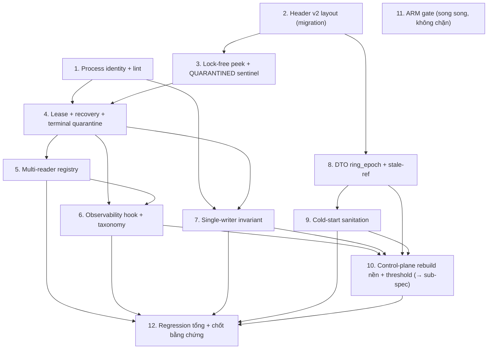

# Implementation Plan

## Overview

> **Spec:** shm-production-hardening · **Workflow:** Design-First → Tasks. Nguồn: `design.md` (§Testing Strategy +
> §"Thứ tự triển khai Codex") + `requirements.md` (12 requirement EARS).
>
> **Luật vàng cho MỌI task (Req 12):** mỗi slice là TDD nhỏ nhất; KẾT THÚC slice phải có **bằng chứng chạy thật**
> (`pytest -q` đọc output + `lint-imports`), giữ **16 test #05 cũ XANH** + `lint` **5 kept / 0 broken**. Test
> liveness/subprocess ghi kết quả ra FILE rồi đọc (terminal Windows nuốt output / KeyboardInterrupt). KHÔNG gọi
> "xong" bằng đọc-code-tĩnh. Mỗi task xong → append `AI-IMPLEMENTATION-LOG.md` + cập nhật `activeContext.md`.
>
> **Phạm vi nền tảng (Req 10):** chỉ claim production cho x86-64; ARM là task gate riêng (Task 11).
> **Quyết định scope:** ring rebuild/switchover đầy đủ TÁCH sub-spec `shm-ring-epoch-switchover` (Task 10 chỉ đặt nền).

## Tasks

- [x] 1. Module định danh & liveness tiến trình (`_process_identity.py`) + ép lint
  - Tạo `runtime/ipc/_process_identity.py`: `current_identity() -> (pid, create_time_ns)` (helper DUY NHẤT, `int(psutil.Process().create_time()*1e9)`); enum `Liveness {ALIVE, DEAD, UNKNOWN}`; `owner_liveness(pid, create_time_ns) -> str` đúng bảng quyết định (NoSuchProcess→DEAD; create_time lệch→DEAD; AccessDenied/Zombie/OSError→UNKNOWN; pid<=0→DEAD).
  - Thêm `psutil>=5.9` vào runtime deps (`pyproject.toml`); thêm `psutil` vào `forbidden_modules` của contract `domain` + `kernel` trong import-linter config.
  - Inject "process provider" (mặc định psutil) để test giả lập được PID reuse / AccessDenied mà không cần spawn thật.
  - Test (ghi kết quả ra FILE): `alive(self)=ALIVE`; pid không tồn tại=DEAD; cùng pid khác create_time=DEAD (PID reuse giả lập); provider ném AccessDenied=UNKNOWN; pid<=0=DEAD. Khẳng định KHÔNG dùng `os.kill(pid,0)` trên Windows.
  - Chạy `pytest` + `lint-imports` (xác nhận psutil bị cấm ở domain/kernel = 5 kept/0 broken; thử import lén để thấy BROKEN rồi gỡ).
  - _Requirements: 2.1, 2.2, 2.3, 2.4, 2.5, 2.6, 2.7, 2.9, 12.2, 12.5_

- [x] 2. Header layout v2 (offsets + magic/version) — migration GIỮ hành vi cũ
  - [x] 2.1 Định nghĩa hằng layout v2 ở kernel (DTO/struct fmt thuần, không import multiprocessing): offsets `state`@0(4B) · `generation`@8 · `owner_pid`@16 · `owner_create_time_ns`@24 · `lease_deadline_ns`@32 · `reader_count`@40(4B) · `reader_registry[MAX_READERS=8]` mỗi ô `<QQQ`(24B)@48 · pad → 256B. Hằng ring-level control (segment riêng): `magic`, `header_version`, `header_size`, `max_readers` (KHÔNG nhúng vào 256B per-slot).
    - Test layout: `struct.calcsize` + alignment thật (mọi field 8B ở offset chia hết 8; `state`@0 & `reader_count`@40 chia hết 4); tổng = 256B; cache-line multiple; `QUARANTINED=0xFFFFFFFF` pack được `<I`.
    - _Requirements: 4.1, 4.2, 4.3, 4.4, 4.5, 4.7_
  - [x] 2.2 Chuyển `ShmRingBuffer`/Writer/Reader sang đọc/ghi header theo offsets v2, GIỮ nguyên semantics 1-writer/1-reader hiện tại (chưa bật tính năng mới). Tạo ring-level control segment `<name>_ctrl` ghi `magic/version/header_size/max_readers` lúc create; attach (create=False) đọc + mismatch → fail-fast (raise).
    - Test: 16 test #05 cũ vẫn XANH với header mới; test attach mismatch (magic/version/size sai) → raise fail-fast.
    - _Requirements: 4.6, 12.1, 12.2_

- [x] 3. Lock-free state peek + sentinel QUARANTINED (định nghĩa, CHƯA kích hoạt recovery)
  - Thêm `SlotState.QUARANTINED = 0xFFFFFFFF`; `_peek_state(slot) -> int` đọc atomic `<I`@0 lock-free; mọi đường acquire-lock thêm bước 0 `if peek==QUARANTINED: continue` (skip vĩnh viễn).
  - Đảm bảo ghi `state` luôn là atomic 4-byte store; giữ thứ tự ghi header: identity → lease → `state` cuối (Req 7.5).
  - Test: peek trả đúng state hiện tại; slot set QUARANTINED thủ công → writer/reader skip, KHÔNG acquire lock đó; sticky (không tự revert).
  - _Requirements: 1.1, 1.2, 7.1, 7.3, 7.5_

- [x] 4. Lease + crash-recovery + terminal quarantine (đóng F-3/F-3b)
  - [x] 4.1 Thêm config `WRITE_LEASE_NS = READ_LEASE_NS = 2s` + `LOCK_ACQUIRE_TIMEOUT = 0.05–0.10s` (tách, không hard-code). Writer mark WRITING/READY ghi `lease_deadline_ns = monotonic_ns()+WRITE_LEASE_NS`. Lease chỉ bao pin/copy/unpin.
    - _Requirements: 11.1, 11.2, 11.3, 11.4_
  - [x] 4.2 `quarantine_poisoned_slot(slot)`: dùng `owner_liveness`; chỉ quarantine khi `DEAD` **VÀ** `now>=lease_deadline`; ALIVE/UNKNOWN → skip + emit metric (KHÔNG quarantine). Đọc multi-field theo **double-snapshot** (2 lần liên tiếp giống nhau HOẶC state đã QUARANTINED) — torn thì retry sau. QUARANTINED là **terminal** (không reclaim FREE). `healthy_slots = n_slots - quarantined_count`.
    - _Requirements: 1.3, 1.4, 1.5, 1.6, 7.4_
  - [x] 4.3 Test thật (subprocess, ghi FILE): spawn writer subprocess → **kill cứng** giữa WRITING (đang giữ lock) → parent acquire timeout → slot chuyển QUARANTINED (terminal); peek sau thấy QUARANTINED, KHÔNG bao giờ acquire lại lock đó. Ring degrade: các slot khỏe vẫn ghi được. Quarantine an toàn: owner còn sống + lease quá hạn → KHÔNG quarantine.
    - _Requirements: 1.5, 1.6, 7.4, 12.1, 12.5_

- [x] 5. Multi-reader: reader registry + reader_count dẫn xuất (P-3)
  - Pin (dưới lock): ghi `(pid, create_time, reader_lease_ns)` vào ô registry trống → `state=READING`, gia hạn lease; registry đầy → fail-fast `shm_reader_registry_full` (KHÔNG spin). Unpin (sau copy): xoá ô theo `(pid,create_time)` → recompute `reader_count`; `==0` → `DONE`. Invariant `reader_count == số ô active`. Writer chỉ tái dùng khi `state∈{FREE,DONE}` ∧ `reader_count==0`.
  - Reap dead reader: quét registry, ô `(pid,create_time)` chết + lease quá hạn → xoá ô + giảm count; còn reader sống → KHÔNG quarantine cả slot. Reader chết khi đang GIỮ lock → slot terminal.
  - Test (file output): ≥2 reader pin/unpin đồng thời → count khớp số ô active; registry đầy → fail-fast; 1 reader chết → reap đúng ô, count giảm, slot vẫn READING nếu còn reader sống.
  - _Requirements: 3.1, 3.2, 3.3, 3.4, 3.5, 3.6, 3.7, 3.8, 7.2_

- [x] 6. Observability hook + taxonomy (thay `except: pass`)
  - `ObservabilityHook.emit(event, **fields)` (mặc định no-op/stderr). Thay mọi nuốt-lỗi-im-lặng bằng emit. Taxonomy cố định: `shm_slot_lock_timeout, shm_slot_quarantined, shm_reader_registry_full, shm_reader_reaped, shm_owner_liveness_unknown, shm_ring_rebuild_requested, shm_ring_capacity_degraded`. Fields tối thiểu mỗi event: `ring_name, ring_epoch, slot, state, owner_pid, owner_create_time_ns, quarantined_count, healthy_slots`.
  - Test: hook nhận đúng event + đủ field tối thiểu ở các đường: lock timeout, quarantine, registry full, reader reaped, liveness unknown, capacity degraded.
  - _Requirements: 6.1, 6.2, 6.3, 6.4_

- [x] 7. Ép invariant single-writer (intra + cross-process)
  - `register_writer()` ném `RuntimeError` nếu gọi >1 trong process. Ring-level writer registry `(writer_pid, writer_create_time, writer_lease)` (segment control-plane). Writer mới: writer hiện tại ALIVE + create_time khớp → reject; writer cũ DEAD → phát `shm_ring_rebuild_requested` (KHÔNG takeover im lặng ring có slot terminal).
  - Test (file output): gọi register_writer 2 lần/process → RuntimeError; mô phỏng writer cũ còn sống → reject; writer cũ chết → yêu cầu rebuild (không takeover).
  - _Requirements: 5.1, 5.2, 5.3, 5.4_

- [x] 8. DTO `ring_epoch` + xử lý stale-ref (nền cho switchover — rủi ro thấp)
  - Thêm trường `ring_epoch: int` vào DTO `ShmFrameRefData` (kernel, vẫn thuần — import-linter ép). Reader cầm ref có `ring_epoch` khác epoch hiện tại của ring → trả `None` (stale), KHÔNG đọc ring.
  - Test: ref đúng epoch → đọc OK; ref epoch cũ → trả None; DTO vẫn pass import-linter (kernel không import multiprocessing/psutil).
  - _Requirements: 8.1, 8.2, 12.2_

- [x] 9. Cold-start sanitation (đặt tên ring theo epoch/uuid mỗi phiên)
  - Data ring dùng name theo epoch/uuid mỗi phiên (KHÔNG tái dùng name cố định). Creator `create=True` KHÔNG attach name cũ → luôn tạo segment + lock MỚI. Ghi rõ (docstring/comment + test note) `SharedMemory.unlink()` vô tác dụng trên Windows → không dựa unlink để dọn. Well-known name (nếu cần) chỉ trỏ control-plane nhỏ.
  - Test: tạo ring epoch mới khác name; mô phỏng segment sót phiên trước → creator không attach nhầm; (Windows) không dựa unlink.
  - _Requirements: 9.1, 9.2, 9.3, 9.4_

- [x] 10. Đặt nền control-plane rebuild + xác định `REBUILD_THRESHOLD` (phần đầy đủ → sub-spec)
  - [x] 10.1 Ring-level metadata segment `<name>_ctrl`: `magic, header_version, header_size, max_readers, ring_id/epoch, writer_registry`. Khi `quarantined_count >= REBUILD_THRESHOLD` → emit `shm_ring_rebuild_requested` cho control-plane (KHÔNG tự rebuild per-slot). Quyền rebuild = supervisor/composition root.
    - _Requirements: 8.3, 8.4, 1.7_
  - [x] 10.2 Xác định `REBUILD_THRESHOLD` bằng ĐO, không đoán: thêm config (default thận trọng, có comment 🔴 cần tuning theo SLA); viết test/bench nhỏ mô phỏng tỉ lệ quarantine để chọn ngưỡng; ghi kết quả + lý do vào design/log. KHÔNG hard-code số khơi khơi.
    - _Requirements: 1.7_
  - [x] 10.3 Tách sub-spec `shm-ring-epoch-switchover` cho switchover ĐẦY ĐỦ (publish epoch mới → writer/reader chuyển → unlink ring cũ khi hết handle). Task này CHỈ ghi con trỏ + acceptance để bàn giao; KHÔNG triển khai switchover ở spec hiện tại.
    - _Requirements: 8.5, 8.6_

- [x] 11. Gate nền tảng ARM (task riêng, KHÔNG chặn x86-64)
  - Tạo task/test placeholder `arm-atomic-sentinel-validation`: kịch bản stress visibility + kill-holder + jitter trên HW ARM thật; tới khi có bằng chứng thật thì fast-path lock-free trên ARM giữ trạng thái 🔴 chưa-verified (hoặc giới hạn ARM dùng lock thuần). Ghi rõ trong README/spec rằng vòng này chỉ claim x86-64.
  - _Requirements: 10.1, 10.2, 10.3_

- [x] 12. Regression tổng + chốt bằng chứng
  - Chạy full `pytest -q` + `pytest tests/test_step_05_shm.py -q` + `lint-imports`; xác nhận 16 test cũ XANH + toàn bộ test mới XANH + lint 5 kept/0 broken. Tổng hợp số liệu thật vào log + cập nhật `00-IMPLEMENTATION-TRACKER`/activeContext. Soát mọi nhãn 🟡/🔴 còn lại → cái nào đã verify thật thì nâng 🟢, cái nào chưa thì ghi rõ "chưa verify vì X".
  - _Requirements: 12.1, 12.2, 12.3, 12.4_

## Task Dependency Graph

```json
{
  "waves": [
    { "wave": 1, "tasks": ["1", "2", "11"], "note": "Khởi đầu độc lập: identity, header v2 migration, ARM gate (song song)" },
    { "wave": 2, "tasks": ["3"], "note": "Lock-free peek + sentinel (cần header v2)" },
    { "wave": 3, "tasks": ["4"], "note": "Lease + recovery + terminal quarantine (cần identity + peek)" },
    { "wave": 4, "tasks": ["5", "7", "8"], "note": "Multi-reader (cần 4); single-writer (cần 1,4); DTO ring_epoch (cần 2)" },
    { "wave": 5, "tasks": ["6", "9"], "note": "Observability (cần 4,5); cold-start (cần 8)" },
    { "wave": 6, "tasks": ["10"], "note": "Control-plane rebuild nền + threshold (cần 6,7,8,9) → bàn giao sub-spec" },
    { "wave": 7, "tasks": ["12"], "note": "Regression tổng + chốt bằng chứng" }
  ]
}
```



Thứ tự tuyến tính an toàn (khớp "Thứ tự triển khai Codex"): **1 → 2 → 3 → 4 → 5 → 6 → 7 → 8 → 9 → 10 → 12**.
Task **11 (ARM)** chạy song song/độc lập, KHÔNG chặn x86-64. Task **10.3** bàn giao sub-spec `shm-ring-epoch-switchover`.

## Notes

- **Mỗi task = 1 commit save-point** (chờ user duyệt trước khi commit theo git-safety §8) + 1 entry log + cập nhật con trỏ.
- **Nhãn rủi ro kế thừa design:** 🟢 grounded · 🟡 thiết kế mới cần duyệt · 🔴 cần kiểm chứng trên môi trường đích.
  Sau khi test thật xanh, nâng 🟡→🟢 cho phần đã verify; phần CHƯA test được (ARM, switchover đầy đủ) giữ 🔴.
- **Migration rủi ro nhất = Task 2** (đổi header `<IQQ` 20B → 256B): bắt buộc giữ 16 test cũ xanh từng bước; nếu vỡ → dừng, soi gốc, KHÔNG vá ngọn.
- **Test môi trường:** liveness/subprocess/kill-process ghi kết quả ra FILE rồi đọc (terminal Windows nuốt output).
- **Chưa làm trong spec này (cố ý):** backpressure (#07), structlog đầy đủ (#08), seqlock (Option B), switchover ARM đầy đủ — đều ngoài phạm vi.
