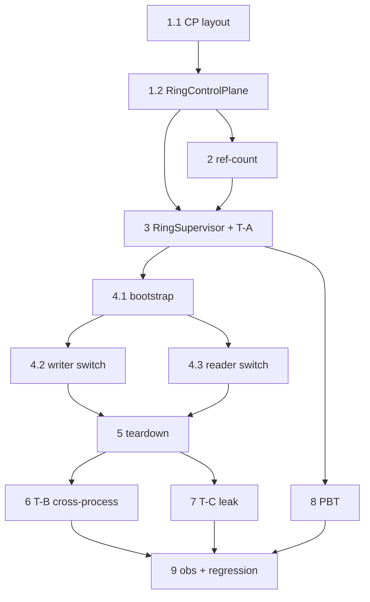

# Implementation Plan

## Overview

> **Spec:** shm-ring-epoch-switchover (sub-spec) · **Workflow:** Design-First → Tasks. Nguồn: `design.md`
> (§Components, §Data Models, §Testing Strategy) + `requirements.md` (6 requirement EARS).
>
> **Luật vàng cho MỌI task:** mỗi slice là TDD nhỏ nhất; kết thúc phải có **bằng chứng chạy thật** (`pytest -q`
> đọc output + `lint-imports` 5 kept/0 broken), GIỮ **toàn bộ test #05 hiện có XANH** (180 passed/1 skipped baseline).
> Test cross-process/kill ghi kết quả ra FILE rồi đọc (terminal Windows nuốt output). KHÔNG gọi "xong" bằng
> đọc-code-tĩnh. Mỗi task xong → append `AI-IMPLEMENTATION-LOG.md` + cập nhật `activeContext.md`.
>
> **Ràng buộc layer (AGENTS §4):** `RingControlPlane` ∈ `runtime/ipc`; `RingSupervisor` ∈ `application`
> (được phụ thuộc kernel+runtime). Ép bằng import-linter (thêm contract nếu cần).
> **Phạm vi:** chỉ x86-64 (theo gate spec cha); tuning `REBUILD_THRESHOLD` = ngoài phạm vi (task benchmark riêng).

## Tasks

- [x] 1. `RingControlPlane` — control-plane segment tên cố định (layout + publish/read + fail-fast) ✅ (1.1+1.2 xong)
  - [x] 1.1 Định nghĩa layout control-plane THUẦN (kernel, chỉ `struct`): `magic`(u32)@0 · `version`(u32)@4 · `attach_count`(u32)@8 · `current_epoch`(u64)@16 · `current_ring_name`(bytes[96])@24; tổng ≥128B; hàm `pack_cp_header()`/`check_cp_header()` fail-fast (cùng pattern `check_ring_control`). ✅ `kernel/shm_control_plane_layout.py` + 8 test (188 passed/1 skipped · lint 5 kept/0 broken).
    - Test layout: `struct.calcsize`/offset alignment (u64 @16 chia hết 8); name field đủ chứa `vp_ring_<32hex>`; magic/version sai → `ValueError`.
    - _Requirements: 2.2, 6.2_
  - [x] 1.2 `RingControlPlane` (`runtime/ipc/ring_control_plane.py`): `publish(epoch, ring_name)` ghi name TRƯỚC, `current_epoch` (8B aligned) CUỐI; `read_current() -> (epoch, ring_name)`; attach mismatch → fail-fast. ✅ + 4 test (192 passed/1 skipped · lint 5 kept/0 broken).
    - Test: publish→read_current round-trip; đọc khi epoch chưa đổi trả epoch cũ (không nửa vời); attach segment sai magic → raise.
    - _Requirements: 2.1, 2.2, 2.3, 2.4, 6.2_

- [x] 2. Teardown ring cũ = **OS handle ref-count (quyết định B — đã revert `attach_count`)**
  - Thực nghiệm `_shm_lifecycle_probe` (Windows): memory sống tới HANDLE CUỐI đóng → **không cần đếm tường minh**.
  - `RingControlPlane` chỉ giữ `publish/read_current/close/unlink`; **bỏ** `attach_register/detach/attach_count/cp_lock`. Byte @8 = RESERVED.
  - Teardown: mỗi bên `close()` handle ring cũ khi rời epoch; OS giải phóng ở handle cuối; POSIX có thể `unlink()` sớm.
  - ✅ đã revert code + test (198 passed/1 skipped · lint 5 kept/0 broken). 🔴 Linux `resource_tracker` verify ở Task 7 (T-C).
  - _Requirements: 4.1, 4.2, 4.3, 4.4_

- [x] 3. `RingSupervisor` (application) — nhận event + `switchover()`
  - `on_event(event, **fields)` lọc `shm_ring_rebuild_requested` (kể cả reason=threshold và writer_dead — 🟢 L432/L371).
  - `switchover() -> int`: tạo ring epoch N+1 (`new_ring_name()`), `RingControlPlane.publish(N+1, name)`, trả epoch mới. Epoch đơn điệu tăng. `ring_factory` tiêm ngoài (DI).
  - **Test T-A (unit, deterministic):** tiêm event → switchover → `read_current()` = (N+1, tên mới); gọi lại → N+2 (đơn điệu). ✅ 3 test (198 passed/1 skipped · lint 5 kept/0 broken; application→runtime giữ contract).
  - _Requirements: 2.1, 5.1, 5.2, 6.1_

- [x] 4. Writer/Reader bootstrap + chuyển epoch qua control-plane ✅ (4.1+4.2+4.3 xong)
  - [x] 4.1 Bootstrap: writer/reader attach control-plane (tên cố định) → `read_current()` → mở data ring tương ứng qua `ring_opener` (DI). (Quyết định B: KHÔNG `attach_register` — teardown dựa OS handle ref-count.)
    - Test: 2 tiến trình (giả lập in-proc) bootstrap ra cùng ring hiện tại. ✅ `bootstrap_current_ring(cp, ring_opener)` additive (KHÔNG sửa Writer/Reader cũ) + 3 test (201 passed/1 skipped · lint 5 kept/0 broken).
    - _Requirements: 2.2, 4.1_
  - [x] 4.2 Writer chuyển epoch (**additive, `WriterEpochCoordinator`**): phát hiện `current_epoch` đổi (check-on-write) → mở ring mới qua `ring_opener` → `register_writer()` ring mới TRƯỚC frame đầu → ghi ring mới → `ring.close()` handle ring cũ (teardown B, KHÔNG `detach`/đếm). Edge: `register_writer` ring mới raise `SingleWriterViolation` → fail-fast (đóng handle ring mới, giữ nguyên epoch cũ). ✅ `application/writer_epoch_coordinator.py` + 6 test (206 passed/1 skipped · lint 5 kept/0 broken · 0 diagnostic).
    - Test (deterministic in-proc, fake ring/writer tiêm qua DI): đổi epoch → coordinator register lại ring mới + ghi vào đó; ring cũ `close()`; KHÔNG 2 writer/epoch (`SingleWriterViolation` giữ). 🔴 cấp phát lock cross-process cho ring mới = Task 6 (K-012, chưa giải).
    - _Requirements: 3.1, 3.2, 3.3_
  - [x] 4.3 Reader chuyển epoch (**additive, `ReaderEpochCoordinator`**, check-on-read): ref epoch cũ → `None` (stale-check sẵn có ShmFrameReader); `current_epoch` đổi → mở ring mới qua `ring_opener`, `ring.close()` handle ring cũ (teardown B, KHÔNG `detach`). ✅ `application/reader_epoch_coordinator.py` + 6 test (212 passed/1 skipped · lint 5 kept/0 broken · 0 diagnostic).
    - Test: ref epoch N cũ (đến muộn) → None; sau chuyển, đọc được frame epoch N+1; ring cũ close(). 🔴 lock cross-process = Task 6 (K-012).
    - _Requirements: 1.1, 1.2, 1.3, 4.1_

- [x] 5. Teardown ring cũ (close-on-migrate, quyết định B)
  - Writer/reader `close()` handle ring cũ khi chuyển epoch (đã có trong 2 coordinator, D-008/D-009); supervisor `close()` handle ring cũ sau publish (D-010); emit `shm_ring_teardown_pending`. KHÔNG biến đếm; KHÔNG cưỡng bức unlink Windows.
  - Test: mọi handle close → attach lại tên ring cũ → FileNotFoundError (giải phóng); còn 1 handle → ring còn sống. ✅ `test_switchover_teardown.py` (4 test, 2 test ring THẬT skip non-win32) + supervisor close prev. Full **216 passed/1 skipped · lint 5 kept/0 broken · 0 diagnostic**.
  - 🔴 POSIX `resource_tracker`/unlink verify ở Task 7 (T-C) — test ring thật guard `skipif != win32` để KHÔNG claim sai (K-003).
  - _Requirements: 4.1, 4.2, 4.3, 6.1_

- [x] 6. Test T-B — switchover cross-process THẬT (spawn) ✅
  - Worker writer process (thừa kế `slot_locks_map` qua Process args) + parent supervisor/reader; parent switchover giữa stream → worker chuyển ring đích + parent đọc frame epoch mới cross-process. ✅ `test_switchover_cross_process.py` — **1 pass + lặp 5/5 không flaky** (LOG #138), giải K-012 cross-process. Ack-queue serialize chống flaky.
  - 🔴 Q2 frame-drop dưới TẢI THẬT chưa đo (T-B serialize drop=0 không đại diện) → bound cấu trúc ≤ n_slots điền `design.md §Q2`; số-đo-tải = K-014. Guard skipif != win32; POSIX = K-003.
  - _Requirements: 1.1, 1.2, 3.1, 5.1, 5.2_

- [x] 7. Test T-C — giải phóng ring cũ, không leak
  - **Bản chất no-leak dưới H2:** switchover TÁI DÙNG pool ring → số segment KHÔNG tăng theo số switchover (bounded = K ring). ✅ `test_switchover_leak.py`: no-accumulation qua 20 switchover (platform-independent) + memory-bounded-by-pool-size (K=2/3/5) + close_all frees all (win32-guarded). Full **242 passed/1 skipped · lint 5 kept/0 broken · 0 diagnostic**.
  - 🔴 POSIX `resource_tracker`/`/dev/shm` free CHƯA verify (chỉ Windows) — K-003, guard skip non-win32 (không claim sai).
  - _Requirements: 4.2, 4.3_

- [x] 8. Property-based tests (Property 1–5 trong design)
  - Hypothesis: P1 stale→None (ring thật + reset) · P2 epoch đơn điệu (FakeCP thuần) · P2b reset ép đơn điệu · P3 single-writer xuyên reset · P5 lọc event (FakeCP thuần). P4 (no-leak) = I/O → T-C (không PBT). ✅ `test_switchover_pbt.py` (5 property) — full **237 passed/1 skipped · lint 5 kept/0 broken · 0 diagnostic**. Thêm dep `hypothesis>=6.0` vào [dev].
  - _Requirements: 1.1, 2.1, 3.1, 5.1_

- [x] 9. Observability + fail-fast + regression cuối
  - Emit switchover start/done + teardown + reset qua `ObservabilityHook` (Req 6.1); control-plane magic/version sai → fail-fast (Req 6.2, đã có `test_attach_wrong_magic_fail_fast`). ✅ `test_switchover_observability.py` (taxonomy END-TO-END 1 hook dùng chung + default no-op) + `observability-taxonomy.md` (catalog 13 event cho vận hành). Regression cuối: full **239 passed/1 skipped · lint 5 kept/0 broken · 0 diagnostic · T-B 3/3**.
  - _Requirements: 6.1, 6.2, 6.3_

## Task Dependency Graph

```json
{
  "waves": [
    { "wave": 1, "tasks": ["1.1", "1.2", "2"], "note": "Control-plane segment layout + RingControlPlane + ref-count" },
    { "wave": 2, "tasks": ["3"], "note": "RingSupervisor + switchover() + test T-A (cần control-plane API)" },
    { "wave": 3, "tasks": ["4.1", "4.2", "4.3", "5"], "note": "Bootstrap + writer/reader chuyển epoch + teardown (cần supervisor)" },
    { "wave": 4, "tasks": ["6", "7", "8", "9"], "note": "T-B cross-process, T-C leak, PBT, observability + regression cuối" }
  ]
}
```



> wave_2 cần wave_1 (control-plane API); wave_3 cần wave_2 (supervisor+publish); wave_4 cần wave_3.
> Test cross-process (6/7) là **cổng chấp nhận** — chỉ đóng sub-spec khi T-B + T-C có bằng chứng chạy thật trên môi trường đích.

## Notes

- **Mỗi task = 1 commit save-point** (chờ user duyệt trước khi commit theo git-safety §8) + 1 entry `AI-IMPLEMENTATION-LOG.md` + cập nhật `activeContext.md`.
- **[CẬP NHẬT 2026-07-03] TẤT CẢ 9 task ✅ (Task 1–9) trên Windows** — full 242 passed/1 skipped · lint 5 kept/0 broken · T-B 5/5. Còn treo (giới hạn môi trường, KHÔNG claim): 🔴 K-003 (POSIX teardown) · K-014 (Q2 số-đo-tải) · K-001 (ARM). (Boilerplate "chưa làm" cũ đã bỏ.)
- Số Requirement X.Y trong mỗi task trỏ về `requirements.md` sub-spec này (không phải spec cha).
- Bound frame-drop (Q2) sẽ được ĐO ở Task 6 rồi điền ngược vào `design.md` §Overview Q2 (hiện 🔴 chưa có số — không bịa).
