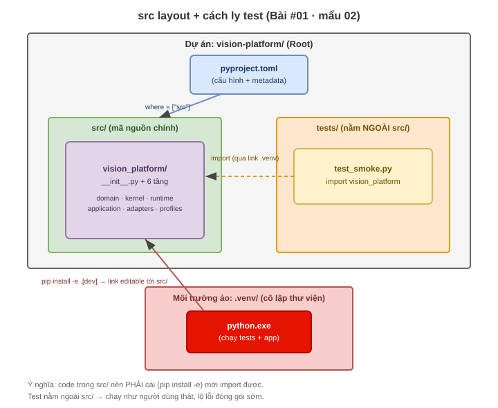

# #01 · Mẩu 02: Vì sao đặt code trong `src/`

## 1. Thuộc về đâu
Vấn đề #01 (skeleton) · cấu trúc thật: `vision-platform/src/vision_platform/...` + dòng khai báo
`where = ["src"]` trong `vision-platform/pyproject.toml` · đây là quyết định "code để ở đâu trong dự án".

## 2. Cần biết trước
- [src layout](../../knowledge-base/00-GLOSSARY.md#src-layout) ·
  [package](../../knowledge-base/00-GLOSSARY.md#package-thư-viện--library) ·
  [pyproject.toml](../../knowledge-base/00-GLOSSARY.md#pyprojecttoml) ·
  [pip](../../knowledge-base/00-GLOSSARY.md#pip)

## 3. Code thật (quote NGUYÊN VĂN — không sửa)

**Sơ đồ trực quan (cấu trúc thư mục + cách ly test):**



> Xem ảnh ngay trong markdown preview. Muốn chỉnh sửa: mở [src_layout.drawio](diagrams/src_layout.drawio) bằng extension Draw.io Integration.

Cây thư mục thật (rút gọn):
```
vision-platform/
├── pyproject.toml
├── src/
│   └── vision_platform/        ← code chính nằm TRONG src/
│       ├── __init__.py
│       ├── domain/  kernel/  runtime/  application/  adapters/  profiles/
└── tests/                      ← test nằm NGOÀI src/
    ├── __init__.py
    └── test_smoke.py
```
Dòng quyết định trong `vision-platform/pyproject.toml`:
```toml
[tool.setuptools.packages.find]
where = ["src"]
```

## 4. Giải thích từng phần nhỏ nhất
- `src/` → một thư mục tên "src" (viết tắt của *source* = mã nguồn). Code thật của package nằm bên trong nó.
- `vision_platform/` nằm TRONG `src/` → package chính. Còn `tests/` nằm NGOÀI `src/` → tách hẳn khỏi code.
- `[tool.setuptools.packages.find]` → một mục cấu hình cho công cụ build (`setuptools`).
- `where = ["src"]` → bảo setuptools: "đi TÌM package chỉ ở trong thư mục `src`". Nhờ vậy nó tìm thấy
  `vision_platform` ở `src/vision_platform` và bỏ qua `tests/`.

## 5. Là gì (1–2 câu)
**src layout** = quy ước đặt toàn bộ code package vào thư mục `src/`, còn test và file lặt vặt để bên ngoài.
Đối nghịch là **flat layout** (code nằm ngay ở thư mục gốc dự án).

## 6. Tại sao tồn tại / vấn đề nó giải
Vấn đề của flat layout: khi bạn chạy lệnh ngay tại thư mục gốc, Python tự thêm thư mục hiện tại vào
đường tìm import. Vậy `import vision_platform` sẽ "ăn" thẳng thư mục code đang nằm ở gốc — KỂ CẢ KHI
bạn CHƯA cài package. Hậu quả: test chạy với code "tại chỗ" chứ không phải code "đã cài như người
dùng thật sẽ cài" → lỗi đóng gói (thiếu file, sai cấu hình) bị che giấu, tới lúc người khác `pip install`
mới lòi ra. `src/` đẩy code xuống một tầng → không còn nằm ở gốc → buộc bạn phải **cài** package
(`pip install -e .`) mới import được → test chạy đúng như môi trường thật.

## 7. Dùng ở đâu trong project (cụ thể)
- `where = ["src"]` khiến `pip install -e .` (mẩu 07) cài đúng package từ `src/vision_platform`.
- `tests/test_smoke.py` gõ `import vision_platform` — chạy được là vì package ĐÃ cài, không phải vì
  nó nằm cùng chỗ. Test và code tách bạch.

## 8. Nếu KHÔNG có nó thì sao (flat layout)
Để code ngay ở gốc (`vision_platform/` cạnh `pyproject.toml`, không có `src/`): import có thể "chạy
được" ngay cả khi đóng gói sai. Bạn yên tâm rằng "chạy ổn", nhưng người dùng `pip install` về lại lỗi
thiếu module. Đó là cái bẫy `src/` giúp né.

## 9. Ví von đời thường
`src/` như **kho hàng có cửa kiểm**: muốn lấy hàng (import code) phải qua thủ tục nhập kho (cài đặt).
Flat layout như **để hàng ngay lối đi**: tiện nhặt đại, nhưng không ai chắc lô hàng đã đóng gói đúng để giao đi.

## 10. Liên kết bức tranh lớn
src layout là nền cho toàn bộ 6 tầng: mọi tầng (`domain`, `kernel`, ...) đều sống trong
`src/vision_platform/`. `import-linter` (mẩu 06) cũng soi các module dưới `vision_platform` này.

## 11. Cạm bẫy / lỗi thường gặp
- Quên cài (`pip install -e .`) rồi thắc mắc "sao import không thấy" — với src layout thì PHẢI cài trước.
- Đặt test TRONG `src/` → dễ bị đóng gói nhầm test vào package giao đi. Ở đây `tests/` cố ý để ngoài.

## 12. Tự kiểm (retrieval + Feynman) — đạt mới ✅
- Hỏi nhớ lại: vì sao flat layout có thể "chạy được" mà vẫn giấu lỗi đóng gói? `src/` chặn điều đó ra sao?
- Giải thích lại bằng LỜI MÌNH: "đặt code trong src/ để ... vì ..." (viết vào đây): ____

## 13. Mốc ôn (spaced repetition)
1 ngày → nói lại khác biệt src vs flat | 1 tuần → tự dựng 1 dự án nhỏ dùng src layout | 1 tháng → giải thích cho người khác.

## 14. Nguồn (đã verify) + độ chắc chắn
- Code/cấu trúc thật: `vision-platform/pyproject.toml` (`where=["src"]`, đã đọc nguyên văn) + cây thư mục `src/` (đã đọc). · Độ chắc: **cao**.
- Hành vi "phải cài mới import được": đã CHẠY thật — `tests/test_smoke.py` pass sau `pip install -e .[dev]`. · Độ chắc: **cao**.
- Lý do "flat layout giấu lỗi đóng gói": nguyên lý src layout có tài liệu (setuptools/Python packaging guide). · Độ chắc: cao (chưa làm thực nghiệm so sánh tay đôi — [chưa kiểm bằng thực nghiệm]).
