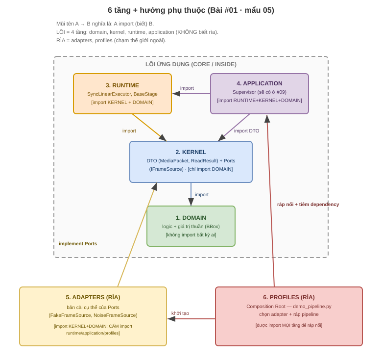

# #01 · Mẩu 05: 6 tầng (layer) + hướng phụ thuộc

## 1. Thuộc về đâu
Vấn đề #01 (skeleton) · cấu trúc thật: 6 thư mục trong `vision-platform/src/vision_platform/`
(`domain/ kernel/ runtime/ application/ adapters/ profiles/`) + comment khai báo trong
`vision-platform/pyproject.toml` · đây là TRÁI TIM cách sắp xếp toàn dự án.

## 2. Cần biết trước
- [package](../../knowledge-base/00-GLOSSARY.md#package-thư-viện--library) ·
  [src layout](../../knowledge-base/00-GLOSSARY.md#src-layout) ·
  [import-linter](../../knowledge-base/00-GLOSSARY.md#import-linter)
- Học sâu pattern: (sẽ tạo) `knowledge-base/hexagonal-architecture/` · `knowledge-base/dependency-direction/`

## 3. Code thật (quote NGUYÊN VĂN — không sửa)

**Sơ đồ trực quan (6 tầng + hướng mũi tên phụ thuộc):**



> Xem ảnh ngay trong markdown preview. Muốn chỉnh sửa: mở [hexagonal_layers.drawio](diagrams/hexagonal_layers.drawio) bằng extension Draw.io Integration.

6 thư mục thật (mỗi cái là 1 package có `__init__.py`):
```
src/vision_platform/
├── domain/        ← logic/giá trị thuần (vd domain/bbox.py)
├── kernel/        ← "hợp đồng": DTO + ports (kernel/media_packet.py, kernel/ports/frame_source.py)
├── runtime/       ← bộ máy chạy pipeline + stage (runtime/sync_linear_executor.py, runtime/stages/*)
├── application/   ← điều phối/use-case — HIỆN chỉ có __init__.py (Supervisor sẽ ở #09)
├── adapters/      ← bản cài CỤ THỂ nối thế giới ngoài (adapters/fake_frame_source.py)
└── profiles/      ← "bàn ráp" nối mọi thứ + chọn adapter (profiles/demo_pipeline.py)
```
Comment khai báo hướng phụ thuộc trong `vision-platform/pyproject.toml`:
```toml
# 4-layer Hexagonal: domain ← kernel ← runtime ← application; adapters/profiles ở rim.
[tool.importlinter]
root_package = "vision_platform"
```

## 4. Giải thích từng phần nhỏ nhất
- `domain` → code tính toán/giá trị thuần (chỉ Python + numpy). KHÔNG đụng camera/mạng/AI.
- `kernel` → nơi đặt "hợp đồng": **DTO** (gói dữ liệu để truyền) + **port** (bản mô tả việc cần làm, chưa nói làm bằng gì).
- `runtime` → "động cơ" chạy chuỗi xử lý (pipeline) và các bước (stage).
- `application` → tầng điều phối nghiệp vụ ("use-case"). Trong dự án này HIỆN còn **rỗng** (chỉ `__init__.py`); phần Supervisor sẽ thêm ở bước #09. (Không claim code chưa có.)
- `adapters` → bản cài CỤ THỂ cắm vào port (vd nguồn frame giả). Nằm ở "rìa" (rim) — chỗ chạm thế giới ngoài.
- `profiles` → "composition root": chỗ DUY NHẤT ráp mọi mảnh + chọn adapter nào để chạy.
- Mũi tên `←` đọc là "được phụ thuộc bởi": `domain ← kernel` nghĩa là **kernel phụ thuộc domain**, KHÔNG ngược lại.
- Lõi ứng dụng (gồm 4 layer: domain, kernel, runtime, application) HOÀN TOÀN KHÔNG biết các adapters cụ thể hay profiles ở rìa. (Chính xác: pyproject ghi "4-layer Hexagonal + adapters/profiles ở rim" → 4 tầng lõi xếp hướng phụ thuộc + 2 thư mục rìa = 6; luật repo gọi gọn "6 layer".)

## 5. Là gì (1–2 câu)
**6 tầng** = cách chia code thành các lớp theo vai trò, kèm LUẬT: lớp ở trong (ổn định) không được
biết lớp ở ngoài (hay đổi). "Lõi" (Core / Inside) = domain, kernel, runtime, application; "Rìa" (Rim / Outside) = adapters, profiles.

## 6. Tại sao tồn tại / vấn đề nó giải
Nỗi đau (đã nêu ở `00-cau-chuyen.md`): nếu logic nghiệp vụ gọi thẳng camera/mạng/AI thì đổi một thứ
ngoài (đổi loại camera) làm vỡ tận lõi, và không test được lõi nếu thiếu thiết bị thật. Chia tầng +
ép hướng phụ thuộc giải đúng cái đó: **cái hay đổi (camera, mạng) bị đẩy ra rìa (`adapters`)**, lõi
chỉ phụ thuộc "hợp đồng" (`kernel`) chứ không phụ thuộc bản cài cụ thể. Đổi camera = viết adapter mới,
lõi không động tới.

## 7. Dùng ở đâu trong project (cụ thể)
- `domain/bbox.py` (giá trị thuần) — không import gì ở tầng ngoài.
- `kernel/ports/frame_source.py` định nghĩa port "nguồn frame"; `adapters/fake_frame_source.py` là bản cài cụ thể của port đó.
- `profiles/demo_pipeline.py` là nơi chọn dùng adapter nào và ráp pipeline để chạy demo.
- Luật hướng phụ thuộc được `import-linter` ép bằng 5 contract (mẩu 06).

## 8. Nếu KHÔNG có nó thì sao (phản chứng)
Gộp tất cả một đống (flat, không tầng): logic dính I/O → đổi camera vỡ lan, test phải có thiết bị thật,
người mới đọc không biết "cái này thuộc về đâu". Chính cái đau này khiến dự án chọn chia tầng.

## 9. Ví von đời thường
Như **nhà hàng**: `domain` = công thức món (thuần ý tưởng); `kernel` = thực đơn + phiếu gọi món (hợp đồng);
`runtime` = bếp chạy theo phiếu; `adapters` = nhà cung cấp nguyên liệu cụ thể (đổi nhà cung cấp không
đổi công thức); `profiles` = quản lý ráp toàn bộ lại để mở cửa. Bếp không cần biết nông trại nào trồng rau.

## 10. Liên kết bức tranh lớn
Đây là pattern **Hexagonal (Ports & Adapters)**. Toàn bộ các bước sau (#02 DTO/port, #03 adapter,
#04 pipeline, #05 SHM...) đều RƠI vào đúng một trong 6 tầng này. Hiểu mẩu này = hiểu khung của cả dự án.

## 11. Cạm bẫy / lỗi thường gặp
- Hiểu sai mũi tên: `domain ← kernel` KHÔNG phải "domain phụ thuộc kernel"; là **kernel phụ thuộc domain**.
- Để `domain`/`kernel` lỡ `import cv2/torch/zmq/multiprocessing` hoặc tầng ngoài → vi phạm hướng phụ thuộc (mẩu 06 sẽ chặn).
- Tưởng `application` đã có Supervisor — CHƯA, nó ở #09. Đừng giả định code chưa build.
- Cạm bẫy cấu hình ERRATA **E-9**: contract có module ngoài thì pyproject phải có `include_external_packages = true` (mẩu 06).

## 12. Tự kiểm (retrieval + Feynman) — đạt mới ✅
- Hỏi nhớ lại: kể tên 6 tầng + vai trò 1 câu mỗi tầng. Tầng nào là "lõi", tầng nào là "rìa"?
- Tình huống (kiểu Architect): nếu mai đổi từ camera giả sang camera thật, ta sửa tầng nào, KHÔNG đụng tầng nào? Vì sao?
- Giải thích lại bằng LỜI MÌNH: "chia 6 tầng để ... , hướng phụ thuộc nghĩa là ..." (viết vào đây): ____

## 13. Mốc ôn (spaced repetition)
1 ngày → vẽ lại 6 hộp + mũi tên | 1 tuần → tự xếp 3 file bất kỳ vào đúng tầng | 1 tháng → giải thích vì sao lõi không biết rìa.

## 14. Nguồn (đã verify) + độ chắc chắn
- Cấu trúc thật: 6 thư mục trong `vision-platform/src/vision_platform/` (đã đọc) + comment `pyproject.toml` (đã đọc nguyên văn). · Độ chắc: **cao**.
- `application/` hiện chỉ có `__init__.py`: đã đối chiếu file thật (#01–#04 chưa build Supervisor). · Độ chắc: **cao**.
- Pattern Hexagonal/Ports&Adapters (Alistair Cockburn): khái niệm có tài liệu chính thống; bài này chỉ giới thiệu, học sâu để dành `knowledge-base/hexagonal-architecture/`. · Độ chắc: cao về tên/khung, [chưa kiểm] chi tiết lịch sử.
