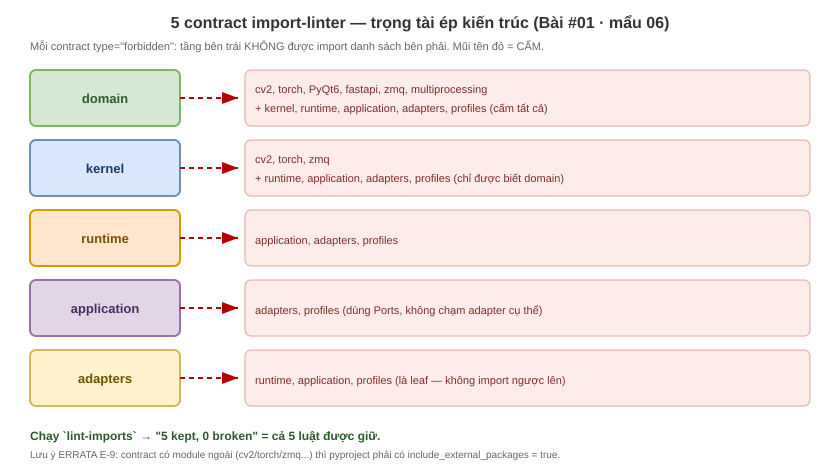

# #01 · Mẩu 06: 5 contract `import-linter` — trọng tài ép kiến trúc

## 1. Thuộc về đâu
Vấn đề #01 (skeleton) · file code thật: `vision-platform/pyproject.toml` (mục `[tool.importlinter]`
và 5 khối `[[tool.importlinter.contracts]]`) · đây là công cụ TỰ ĐỘNG ép hướng phụ thuộc 6 tầng (mẩu 05).

## 2. Cần biết trước
- [import-linter](../../knowledge-base/00-GLOSSARY.md#import-linter) ·
  [pyproject.toml](../../knowledge-base/00-GLOSSARY.md#pyprojecttoml)
- Mẩu 05 (6 tầng + hướng phụ thuộc) — đọc trước mẩu này.
- Học sâu: (sẽ tạo) `knowledge-base/dependency-direction/`

## 3. Code thật (quote NGUYÊN VĂN — không sửa)

**Sơ đồ trực quan (5 contract — tầng nào cấm import gì):**



> Xem ảnh ngay trong markdown preview. Muốn chỉnh sửa: mở [import_contracts.drawio](diagrams/import_contracts.drawio) bằng extension Draw.io Integration.

```toml
[tool.importlinter]
root_package = "vision_platform"
# Bắt buộc khi contract 'forbidden' liệt kê module NGOÀI (cv2/torch/zmq/multiprocessing...).
# import-linter 2.x báo lỗi nếu thiếu. (Design step-01 thiếu dòng này → đã sửa cả Design.)
include_external_packages = true

[[tool.importlinter.contracts]]
name = "Domain khong import I/O hay layer ngoai"
type = "forbidden"
source_modules = ["vision_platform.domain"]
forbidden_modules = [
    "cv2", "torch", "PyQt6", "fastapi", "zmq", "multiprocessing",
    "vision_platform.kernel", "vision_platform.runtime", "vision_platform.application",
    "vision_platform.adapters", "vision_platform.profiles",
]
```
(Còn 4 contract nữa cho kernel / runtime / application / adapters — cùng dạng `forbidden`, xem nguyên file.)

## 4. Giải thích từng phần nhỏ nhất
- `[tool.importlinter]` → mục cấu hình cho công cụ `import-linter`.
- `root_package = "vision_platform"` → soi các import bên trong package `vision_platform`.
- `include_external_packages = true` → cho phép contract nhắc tới module NGOÀI (như `cv2`, `torch`). Thiếu dòng này, import-linter 2.x báo lỗi cấu hình (đây là ERRATA **E-9**).
- `[[tool.importlinter.contracts]]` → một "điều luật". Dấu `[[ ]]` (hai ngoặc) = một mục trong DANH SÁCH luật → có nhiều luật.
  - `name = "..."` → tên luật (để báo lỗi cho dễ đọc).
  - `type = "forbidden"` → loại luật "cấm": module nguồn KHÔNG được import các module bị cấm.
  - `source_modules = ["vision_platform.domain"]` → luật này áp cho tầng `domain`.
  - `forbidden_modules = [...]` → danh sách `domain` BỊ CẤM import: thư viện I/O ngoài (`cv2`, `torch`, `PyQt6`, `fastapi`, `zmq`, `multiprocessing`) + MỌI tầng khác. Nghĩa là `domain` phải thuần nhất.
- Chạy luật: lệnh `lint-imports` (có sau khi cài nhóm `[dev]`).

## 5. Là gì (1–2 câu)
**import-linter** = công cụ đọc code, kiểm "ai import ai" có đúng luật hướng phụ thuộc không. 5 contract
ở đây là 5 điều luật cấm, mỗi điều khóa một tầng không cho import sai chiều.

## 6. Tại sao tồn tại / vấn đề nó giải
Luật 6 tầng (mẩu 05) chỉ là "lời hứa" — con người dễ quên, lỡ tay `import` sai chiều lúc vội. Không ai
canh thì kiến trúc rữa dần ("architecture erosion"). `import-linter` biến lời hứa thành **luật máy ép**:
sai chiều là báo đỏ NGAY, không cho lọt. Đây là điểm "ép bằng công cụ" trong câu chuyện vòng cung.

## 7. Dùng ở đâu trong project (cụ thể)
- Sau mỗi thay đổi code, chạy `lint-imports` (cwd `vision-platform`) → in "5 kept / 0 broken" nghĩa là cả 5 luật đều giữ.
- 5 contract khóa lần lượt: `domain` (cấm mọi I/O + mọi tầng), `kernel` (chỉ được biết `domain`),
  `runtime` (cấm application/adapters/profiles), `application` (cấm adapters/profiles), `adapters` (leaf — cấm import ngược lên runtime/application/profiles).

## 8. Nếu KHÔNG có nó thì sao (phản chứng)
Bỏ import-linter: code vẫn chạy, nhưng không ai chặn `domain` lỡ `import cv2`. Vài tuần sau lõi dính
chặt I/O, hết test/đổi được — đúng nỗi đau ban đầu, chỉ là quay lại chậm hơn và khó gỡ hơn.

## 9. Ví von đời thường
import-linter như **trọng tài + còi**: luật chơi (hướng phụ thuộc) ai cũng biết, nhưng phải có trọng
tài thổi còi mỗi khi có người việt vị thì trận đấu mới giữ kỷ luật.

## 10. Liên kết bức tranh lớn
Đây là mảnh "ép bằng công cụ" hoàn tất bộ ba của bài #01: **src layout (mẩu 02) + 6 layer (mẩu 05) +
import-linter (mẩu này)**. Mọi bước sau (#02→#10) thêm code vào tầng nào cũng phải qua 5 luật này.

## 11. Cạm bẫy / lỗi thường gặp
- ERRATA **E-9**: quên `include_external_packages = true` khi contract có module ngoài → `lint-imports` lỗi cấu hình (không phải lỗi code).
- Tưởng "code chạy được là kiến trúc đúng" — sai: chạy được vẫn có thể vi phạm hướng phụ thuộc; phải chạy `lint-imports` mới biết.
- Quên cài `[dev]` → không có lệnh `lint-imports`.

## 12. Tự kiểm (retrieval + Feynman) — đạt mới ✅
- Hỏi nhớ lại: `type = "forbidden"` nghĩa là gì? Vì sao `domain` bị cấm import nhiều thứ nhất?
- Tình huống: nếu ai đó thêm `import cv2` vào `domain/bbox.py`, điều gì xảy ra khi chạy `lint-imports`? Vì sao tốt?
- Giải thích lại bằng LỜI MÌNH: "import-linter để ... , 'forbidden' là ..." (viết vào đây): ____

## 13. Mốc ôn (spaced repetition)
1 ngày → nói lại 5 luật khóa gì | 1 tuần → tự thêm 1 contract đơn giản | 1 tháng → giải thích "architecture erosion" + vì sao cần trọng tài máy.

## 14. Nguồn (đã verify) + độ chắc chắn
- Code thật: `vision-platform/pyproject.toml` (`[tool.importlinter]` + 5 contract, đã đọc nguyên văn). · Độ chắc: **cao**.
- Hành vi "5 kept/0 broken": đã CHẠY `lint-imports` thật trong phiên build (kết quả 5 kept/0 broken). · Độ chắc: **cao**.
- E-9 (`include_external_packages`): đã gặp lỗi thật + sửa, ghi trong `Design/00-ERRATA.md`. · Độ chắc: **cao**.
