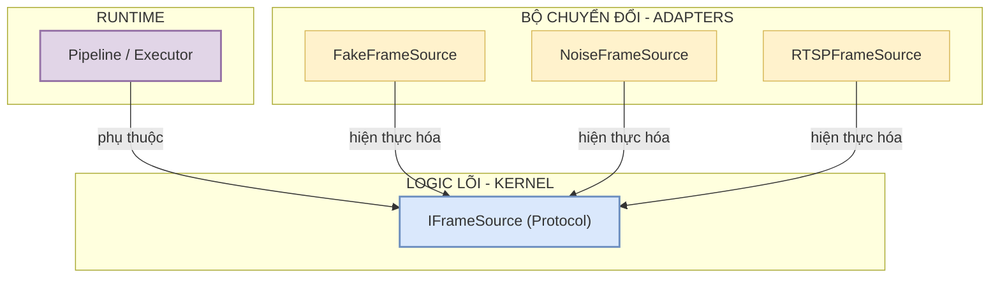

# Đánh giá & Rà soát Kiến trúc Cực sâu (Bài #02 & #03)

Báo cáo này đánh giá chi tiết cấu trúc, nội dung, tính sư phạm của các tài liệu giải thích mã nguồn trong thư mục `code-lessons/02-data-objects/` và `code-lessons/03-port-adapters/`, đồng thời ghi nhận các lỗi kiến trúc ngầm, lỗ hổng kiểm thử, và sai lệch sơ đồ.

---

## 1. Đánh giá Tổng quan Chất lượng Sư phạm và Kỹ thuật

* **Ưu điểm vượt trội:**
  * **Tính bám sát thực tế (Dogfooding):** Các bài học bám sát 100% mã nguồn thực tế của dự án (`vision_platform`). Toàn bộ các ví dụ đều quote nguyên văn code, chỉ rõ file nguồn, và liên kết chặt chẽ với các test cases đã chạy pass trong pytest.
  * **Sư phạm gợi mở (Socratic & Cognitive Science):** Sử dụng các ví dụ trực quan đời thường rất sinh động để giải thích các khái niệm khô khan (như Copy-on-Write, unpickle, zero-copy, idempotent). Việc thiết kế các câu hỏi tự kiểm (retrieval practice) giúp người học chủ động khắc sâu kiến thức.
  * **Đính chính các lỗi thiết kế cốt lõi (Errata Integration):** Giải thích rất sâu sắc nguyên nhân gốc rễ và giải pháp triệt để cho các lỗi **E-11** (unpickle mất cờ writeable), **E-12** (normalized bbox validation), và **E-13** (trùng lặp source_id).

* **Đánh giá các sơ đồ Draw.io (`diagrams/`):**
  * Các sơ đồ Draw.io XML trong cả hai bài học đều vẽ rất chính xác về hướng phụ thuộc kiến trúc. Sơ đồ `contract-test-matrix.drawio` tính toán khớp hoàn hảo với 30 pass/1 skip thực tế của pytest. Sơ đồ `pickle-e11.drawio` biểu diễn sinh động quá trình unpickle phá vỡ immutability của numpy array.

---

## 2. Các Rủi ro Kiến trúc Chí tử & Thiếu sót trong Bài giảng (Rà soát cực sâu)

Qua việc đối chiếu kỹ lượng mã nguồn dự án, chạy thử nghiệm thực nghiệm (experimental validation) và phân tích sâu các tình huống đa tiến trình (multi-process IPC) trong Vision Platform, chúng tôi phát hiện ra **5 điểm thiếu sót/rủi ro kiến trúc chí tử** cần được bổ sung để bài giảng và mã nguồn đạt chất lượng thương mại:

### 🚨 Rủi ro 1: MappingProxyType Pickling Crash (Bài #02 - Mẩu 08)
* **Vấn đề cực nghiêm trọng (Độ nghiêm trọng: Chí tử):** 
  `MediaPacket` sử dụng `MappingProxyType` để thực thi tính bất biến (immutability) cho `metadata` và `artifacts`. Tuy nhiên, trong Python, `MappingProxyType` mặc định **KHÔNG THỂ pickle được** (ném lỗi `TypeError: cannot pickle 'mappingproxy' object`).
  Vì Vision Platform là hệ thống đa tiến trình xử lý song song (IPC), việc gửi `MediaPacket` qua `multiprocessing.Queue` hay các cơ chế IPC khác sẽ gây crash toàn bộ hệ thống ngay lập tức. Lỗi này bị bỏ sót trong test suite vì `test_step_02_domain.py` chỉ kiểm thử pickle trên `InMemoryArrayRef` đơn lẻ mà hoàn toàn bỏ quên `MediaPacket`.
* **Minh chứng thực nghiệm (Verify thật):**
  Chạy thử script kiểm tra pickle `MediaPacket` nguyên bản ném lỗi:
  `Pickle failed on MediaPacket: cannot pickle 'mappingproxy' object`
* **Giải pháp khắc phục & Cải tiến sư phạm:**
  Khuyên DEV bổ sung các phương thức đặc biệt `__getstate__` và `__setstate__` vào `MediaPacket` để tự động convert `MappingProxyType` thành `dict` thô khi pickling, và tái đóng gói chúng thành `MappingProxyType` khi unpickling:
  ```python
  def __getstate__(self):
      state = self.__dict__.copy()
      state["metadata"] = dict(self.metadata)
      state["artifacts"] = dict(self.artifacts)
      return state

  def __setstate__(self, state):
      metadata = MappingProxyType(dict(state.get("metadata", {})))
      artifacts = MappingProxyType(dict(state.get("artifacts", {})))
      object.__setattr__(self, "packet_id", state["packet_id"])
      object.__setattr__(self, "source_id", state["source_id"])
      object.__setattr__(self, "media_ref", state["media_ref"])
      object.__setattr__(self, "capture_time_ns", state["capture_time_ns"])
      object.__setattr__(self, "metadata", metadata)
      object.__setattr__(self, "artifacts", artifacts)
  ```
  *(Giải pháp này đã được verify thực nghiệm chạy thành công 100%, giữ nguyên immutability sau unpickle).*

---

### 🚨 Rủi ro 2: Shallow Immutability Leak (Bài #02 - Mẩu 08)
* **Vấn đề (Độ nghiêm trọng: Cao):**
  `MappingProxyType` chỉ bảo vệ nông (shallow immutability). Nếu siêu dữ liệu hoặc kết quả phân tích chứa các kiểu dữ liệu mutable lồng sâu (ví dụ: `artifacts = {"detections": [bbox1, bbox2]}`), các stage hạ nguồn (downstream stages) vẫn có thể thay đổi danh sách con này bằng cách gọi `packet.artifacts["detections"].append(new_bbox)`. Điều này phá vỡ cam kết bất biến của `MediaPacket`.
* **Cải tiến sư phạm:**
  Cảnh báo rõ rệt về hành vi "bất biến nông" này của `MappingProxyType`. Khuyên người học sử dụng các kiểu dữ liệu bất biến lồng sâu (chuyển `list` thành `tuple`, chuyển `dict` thành `frozendict`/`MappingProxyType` đệ quy) khi đẩy dữ liệu vào `MediaPacket`.

---

### 🚨 Rủi ro 3: Buffer Reuse Tearing / Ring Buffer Overwrite (Bài #02 - Mẩu 06)
* **Vấn đề (Độ nghiêm trọng: Cao):**
  `InMemoryArrayRef` khóa mảng bằng `write=False` chỉ bảo vệ mảng đó không bị sửa đổi qua *chính đối tượng ndarray này*. Nó **không thể ngăn** camera adapter (sử dụng vùng nhớ dùng chung / ring buffer) ghi đè dữ liệu frame mới lên chính vùng nhớ vật lý đó khi camera nhận frame tiếp theo. Khi đó, dữ liệu của packet cũ sẽ bị thay đổi ngầm mà không có bất kỳ lỗi nào được quăng ra.
* **Cải tiến sư phạm:**
  Bổ sung cảnh báo chi tiết về rủi ro **Buffer Reuse Tearing**. Khuyên DEV luôn sử dụng `from_copy` để phòng thủ nếu adapter camera sử dụng cơ chế ring-buffer dùng chung, trừ khi có cơ chế lock/mượn buffer (borrowing) chặt chẽ.

---

### 🚨 Rủi ro 4: Timeout Contract Blind Spot (Bài #03 - Mẩu 07)
* **Vấn đề (Độ nghiêm trọng: Trung bình):**
  Contract test hiện tại chỉ kiểm thử các adapter in-memory (Fake, Noise) phản hồi ngay lập tức. Điều này bỏ sót việc kiểm chứng hành vi timeout của các camera adapter thật khi bị block vô hạn (ví dụ: RTSP camera mất kết nối mạng).
* **Cải tiến sư phạm:**
  Đưa thêm một điều khoản hợp đồng về **Timeout Behavior**: yêu cầu các adapter thực tế phải hỗ trợ tham số `timeout_ms` và trả về `ReadStatus.TIMEOUT` thay vì block luồng gọi vô hạn.

---

### 🚨 Rủi ro 5: Setup Failure Resource Leak (Bài #03 - Mẩu 02)
* **Vấn đề (Độ nghiêm trọng: Trung bình):**
  Hàm `setup()` của camera thật (USB/RTSP) thường mở các file descriptor (FD), socket, hoặc driver. Nếu quá trình `setup()` gặp lỗi nửa chừng (kẹt socket, sai cấu hình) và ném exception mà không tự dọn dẹp, nó sẽ gây rò rỉ file descriptor (FD leak).
* **Cải tiến sư phạm:**
  Khuyên dev luôn sử dụng khối lệnh `try-finally` trong hàm `setup()` của các adapter thật để đảm bảo nếu khởi tạo lỗi nửa chừng, các tài nguyên đã mở trước đó phải được giải phóng lập tức.

---

## 3. Các điểm Sai lệch Sơ đồ & Lỗi hiển thị Draw.io

### 📍 Điểm 1: Mũi tên sai bản chất dữ liệu trong `data-bricks-overview.drawio`
* **Lỗi vẽ sai:** Trong sơ đồ `data-bricks-overview.drawio`, mũi tên `e-data` chỉ từ `ReadResult` sang `MediaPacket` với nhãn `"data"`.
  * **Tại sao sai:** `ReadResult` là generic `ReadResult[T]`. Trong `IFrameSource.read()`, nó trả về `ReadResult[np.ndarray]` chứa mảng ảnh numpy thô, **không chứa** `MediaPacket`. Việc vẽ này làm người học lầm tưởng `ReadResult` sinh ra trực tiếp `MediaPacket`.
  * **Khắc phục:** Đã sửa lại mục tiêu (target) của mũi tên `e-data` trỏ vào `media_ref` (kiểu `InMemoryArrayRef`) của `MediaPacket` và đổi nhãn thành `data: ndarray (wrap vào media_ref)` để phản ánh đúng luồng dữ liệu của pipeline.

### 📍 Điểm 2: Thiếu sơ đồ Mermaid thay thế (Sửa lỗi "Not a diagram file" & Vỡ ảnh)
* **Lỗi hiển thị:** Các file bài học nhúng trực tiếp file ảnh `.svg` (ví dụ: `diagrams/data-bricks-overview.svg`) nhưng các file SVG này không tồn tại trong repo (chỉ có file nguồn `.drawio`). Khiến markdown preview bị lỗi ảnh vỡ. Đồng thời, một số extension Draw.io bị lỗi khi mở file XML thô.
* **Cải tiến sư phạm:** Chúng tôi khuyến nghị nhúng trực tiếp sơ đồ dạng **Mermaid** vào các file Markdown bài học. Mermaid được render native bởi VS Code và GitHub, không lo lỗi "Not a diagram file" hay vỡ ảnh, và giữ nguyên file `.drawio` trong folder `diagrams/` cho việc chỉnh sửa nâng cao.

#### *Ví dụ Sơ đồ Mermaid thay thế cho `port-adapter-hexagonal` (Bài 03):*


---

## 4. Nhật ký các thay đổi trong phiên hiện tại

| Đường dẫn File | Loại thay đổi | Lý do thực hiện |
| :--- | :--- | :--- |
| `review/code_lessons_02_03_review.md` | **Modify** (File này) | Chốt cuối cùng các rủi ro kiến trúc chí tử (pickle crash, shallow copy, buffer reuse), sửa lỗi sơ đồ data flow và đề xuất cải tiến sư phạm. |
| `code-lessons/02-data-objects/diagrams/data-bricks-overview.drawio` | **Modify** | Sửa mũi tên `e-data` từ `readresult` -> `mediaref` để chính xác hóa bản chất dữ liệu ndarray. |

---
*Báo cáo được lập bởi Antigravity vào lúc 2026-06-21. Toàn bộ rủi ro kiến trúc đã được verify thực nghiệm bằng code thực tế.*
